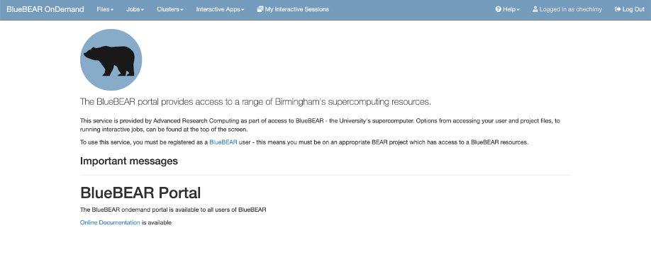

# Accessing BlueBEAR and the BEAR Portal

Before you start with any workshop materials, you will need to familiarise yourself with the CHBH’s primary computational resource, BlueBEAR. The following pages are aimed at helping you get started. 

<b>To put these workshop materials into practical use you will be expected to understand what BlueBEAR is, what it is used for and to make sure you have access.</b>

!!! warning "Student Responsibility"
    If you are an MSc student taking the MRICN module, please note that while there will be help available during all in person workshops, in case you have any problems with using the BEAR Portal, it is your responsibility to make sure that you have access, and that you are familiar with the information provided in pre-workshop materials. Failing to gain an understanding of BlueBEAR and using the BEAR Portal will prevent you from participating in the practical sessions and completing the module’s main assessment (data analysis). 

## What are BEAR and BlueBEAR?

BEAR stands for [Birmingham Environment for Academic Research](https://www.birmingham.ac.uk/research/arc/bear) and is a collection of services provided specifically for researchers at the University of Birmingham. BEAR services are used by researchers at the Centre for Human Brain Health (CHBH) for various types of neuroimaging data analysis.

<b>BEAR services and basic resources - such as the ones we will be using for the purpose of the MRICN module - are freely available to the University of Birmingham research community.</b> Extra resources which may be needed for some research projects can be purchased e.g., access to dedicated nodes and extra storage. This is something your PI/MSc/PhD project supervisor might be using and will give you access to.

  

[BlueBEAR](https://www.birmingham.ac.uk/research/arc/bear/bluebear) refers to the Linux High Performance Computing (HPC) environment which:

1. Enables researchers to run jobs simultaneously on many servers (thus providing fast and efficient processing capacity for data analysis)
2. Gives easy access to multiple apps, software libraries (e.g., software we will be using in this module to analyse MRI data), as well as various software development tools

As computing resources on BlueBEAR rely on Linux, in [Workshop 1](https://chbh-opensource.github.io/mri-on-bear-edu/workshop1/workshop1-intro/) you will learn some basic commands, which you will need to be familiar with to participate in subsequent practical sessions and to complete the module’s main assessment (data analysis assessment). More Linux commands and basic principle of scriptings will be introduced in subsequent workshops.

There are two steps to gaining access to BlueBEAR:

- Being a member on an active BEAR project 
- Having a BEAR Linux account

!!! note "Gaining access to BEAR Projects"
    Only a member of academic staff e.g., your project supervisor or module lead, can apply for a BEAR project. <b>As a student you cannot apply for a BEAR project.</b> If you are registered as a student on the MRICN module, you should have already been added as member to the project `chechlmy-chbh-mricn`. If not please contact one of the teaching staff.

Even if you are already a member of a BEAR project giving you BlueBEAR access, you will still need to activate your BEAR Linux account via the self-service route or the service desk form. The information on how to do it and step-by-step instructions are available on the University Advanced Research Computing page, see the following [link](https://www.birmingham.ac.uk/research/arc/contact/bear-linux-account).

<b>Please follow these steps as above to make sure you have a BEAR Linux account before starting with workshop 1 materials.</b> To do this you will need to be on campus or using the [University Remote Access Service (VPN)](https://itservicedesk.bham.ac.uk/itportal?id=uob_kb_article&sysparm_article=KB13508). 

<h2>Signing in to the BEAR Portal</h2>

After you have activated your BEAR Linux account, you can now sign-in to the BEAR Portal.

- In a web browser navigate to [https://portal.bear.bham.ac.uk](https://portal.bear.bham.ac.uk) to access the BEAR Portal
- To log in, please use your university username and password 
- First select the ‘University of Birmingham’ button as below and next log in via the University’s Single Sign-On page 

!!! danger "BEAR Portal access requirements"
    Remember that the BEAR Portal is only available on campus or using the VPN!

  

If your log in is successful, you will be directed to the main BEAR Portal page as below. This means that you have successfully launched the BEAR Portal.

  

<b>If you get to this page, you are ready for Workshop 1. For now, you can log out.</b> If you have any problems logging on to BEAR Portal, please email [chbh-help@contacts.bham.ac.uk](mailto:chbh-help@contacts.bham.ac.uk) for help and advice. 

## BEAR Storage

The storage associated with each BEAR project is called the <b>BEAR Research Data Store (RDS)</b>. Each BEAR project gets 3TB of storage space for free, but researchers (e.g., your MSc project supervisor) can pay for additional storage if needed. The RDS should be used for all data, job scripts and output on BlueBEAR.

  

If you are registered as a student on the MRICN module, all the data and resources you will need to participate in the MRICN workshops and to complete the module’s main assessment have been added to the MRICN module RDS, and you have been given access to the folder `/rds/projects/c/chechlmy-chbh-mricn`. When working on your MSc project using BEAR services, your supervisor will direct you to the relevant RDS project.

!!! info "External access to data"
    If you are not registered on the module and would like access to the data, please contact one of the teaching staff members.

## Finding additional information

There is extensive BEAR technical documentation provided by the University of Birmingham BEAR team (see links below). While for the purpose of this module, you are not expected to be familiar with all the provided there information, you might find it useful if you want to know more about computing resources available to researchers at CHBH via BEAR services, especially if you will be using BlueBEAR for other purposes (e.g., for your MSc project).

You can find out more about BEAR, BlueBEAR and RDS on the dedicated BEAR webpages: 

- [University of Birmingham BEAR Homepage](https://www.birmingham.ac.uk/research/arc/bear?_ga=2.254446344.1685318850.1729004469-1655917096.1696437021)

- [More information on BlueBEAR](https://www.birmingham.ac.uk/research/arc/bear/bluebear?_ga=2.77325077.1685318850.1729004469-1655917096.1696437021)

- [More information on Research Data Storage](https://www.birmingham.ac.uk/research/arc/bear/rds/research-data-store?_ga=2.77325077.1685318850.1729004469-1655917096.1696437021)