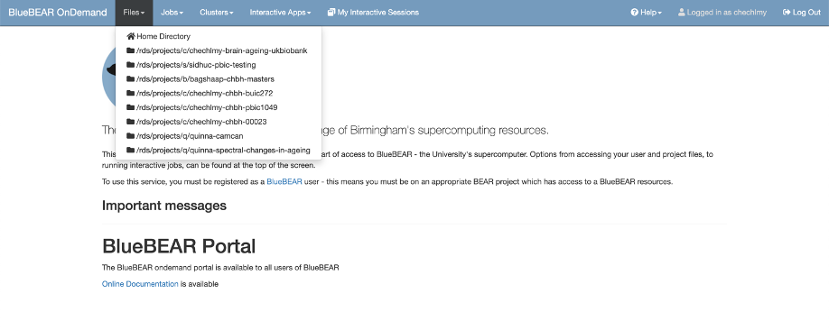
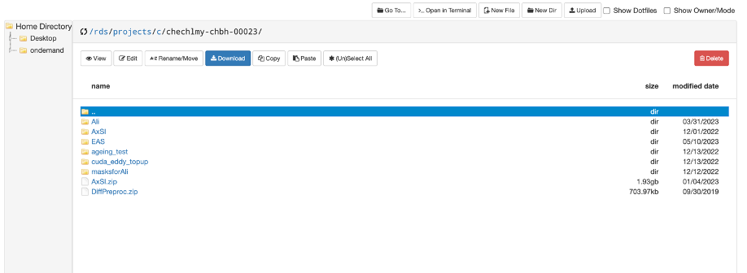
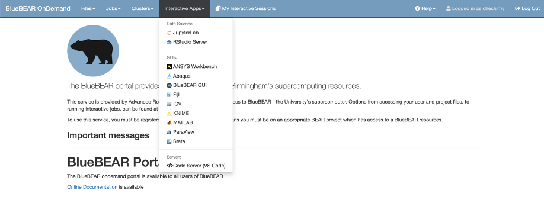
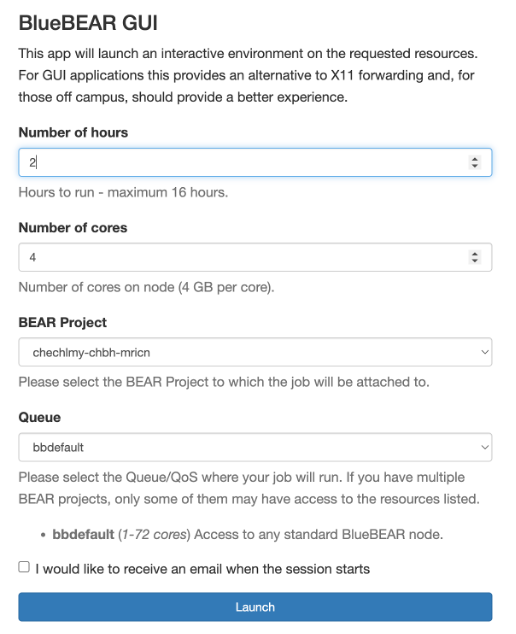
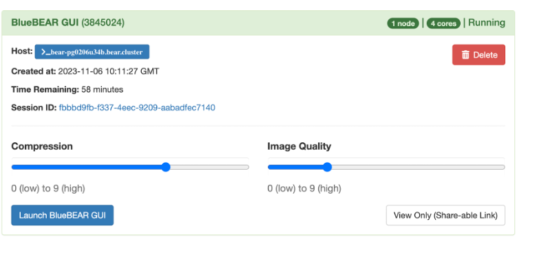

# Introduction to the BlueBEAR portal

At this point you should know how to log in and access the main BEAR Portal page. Please navigate to [https://portal.bear.bham.ac.uk](https://portal.bear.bham.ac.uk), log in and launch the BEAR Portal; you should get to the page as below.

  

BlueBEAR Portal is a web-based interface enabling access to various BEAR services and BEAR apps including:

-	Files in RDS storage
- Data science apps and software
- BlueBEAR GUI 
- Code Server Editor
- Submitting jobs to run on BlueBEAR cluster
- Information on currently running jobs and interactive sessions.

 
BlueBEAR portal is basically a user friendly alternative to using the command line interface, your computer terminal.

  

To view all files and data you have access to on BlueBEAR, click on “Files” as illustrated above. You will see your home directory (your BEAR Linux home directory), which you will be able to access to from the Linux Desktop (see below) and all RDS projects you are member of. 

You should be able to see there `/rds/projects/c/chechlmy-chbh-mricn` (MRICN module’s RDS project). By selecting the “Home Directory” or any “RDS project” you will open a second browser tab, displaying the content. In the example below, you see the content of one of Magda's projects.

  

Inside the module’s RDS project, you will find that you have a folder labelled xxx, where xxx is your University of Birmingham ADF username.
If you navigate to that folder `rds/projects/c/chechlmy-chbh-mricn/xxx`, you will be able to perform various file operations from there. <b>However, for now, please do not move, download, or delete any files.</b>

!!! warning "Data confidentiality"
    Please also note that the MRI data you will be given to work with, should be used on BlueBEAR only and not downloaded on your personal desktop or laptop computer!

## Launching the BlueBEAR GUI

The BlueBEAR Portal options in the menu bar, “Jobs”, “Clusters” and “My interactive sessions” can be used to submit and edit jobs to run on the BlueBEAR cluster and to get information about your currently running jobs and interactive sessions. Some of these processes can be also executed using Code Server Editor (VS Code) accessible via Interactive Apps. We won’t explore these options in detail now but some of these will be introduced later when needed. 

  

For example, from the “Cluster” option you can jump directly on BlueBEAR terminal and by using this built-in terminal, submit data analysis jobs and/or employ own contained version of neuroimaging software rather than software already available on BlueBEAR. We will cover containers, scripting and submitting jobs in later workshops. <b>For now, just click on this option and see what happens; you can subsequently exit/close the terminal page.</b>

Finally, from the BlueBEAR Portal menu bar you can select the “Interactive Apps” and from there access various GUI applications you wish to use, including JupyterLab, RStudio, MATLAB and most importantly <b>BlueBEAR GUI</b>, which we will be using to analyse MRI data in the subsequent workshops. 

  

Please select 'BlueBEAR GUI'. This will bring up a page for you to specify options for your job to start BlueBEAR GUI. You can leave some of these options as default. But please <b>change “Number of Hours” to 2</b> (our workshops will last 2 hours; for some other analysis tasks you might need more time) and make sure that the selected “BEAR Project” is `chechlmy-chbh-mricn`. Next click on Launch.

  

It will take few minutes for the job to start. Once it’s ready you’ll see an option to connect to the BlueBEAR GUI. Click on Launch BlueBEAR GUI. 

  

Once you have launched the BlueBEAR GUI, you are now in a Linux environment, on a Linux Desktop. The following section will guide you on navigating and using this environment effectively.

!!! info "Re-launching the BlueBEAR GUI"
    In the main window of the BlueBEAR portal you will be able to see that you have an Interactive session running (the information above will remain there). This is important as if you close the Linux Desktop by mistake, you can click on Launch BlueBEAR GUI again to open it.
