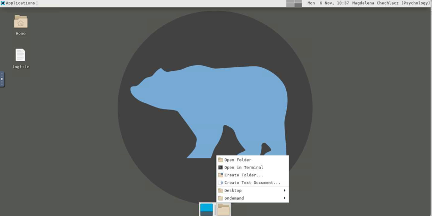
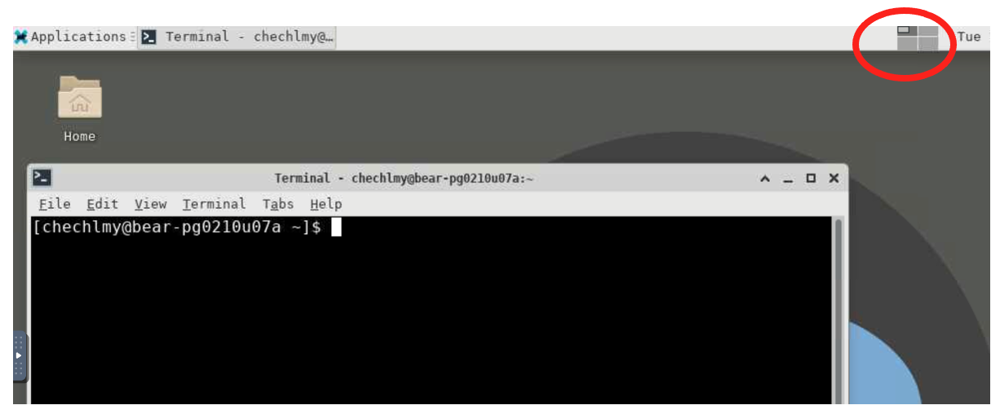
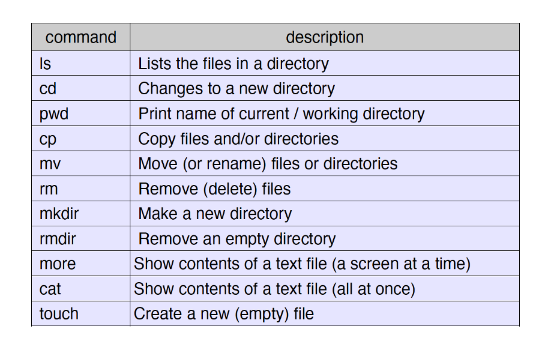
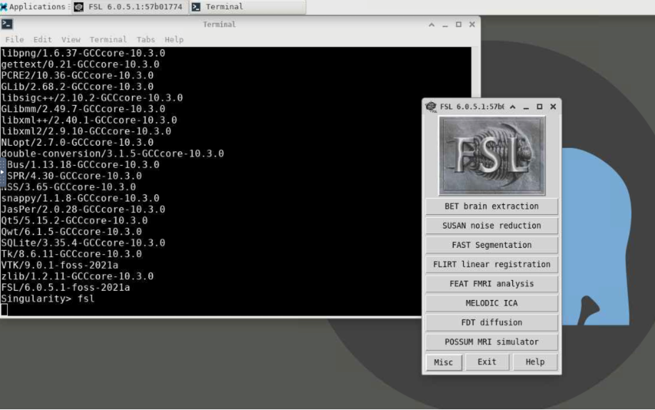

# Introduction to Linux

Linux is a computer Operating System (OS) like, but different from, Microsoft Windows or Mac OS. Linux is very widely used in the academic world especially in the sciences. It is derived from one of the oldest and most stable and used OS platforms around, Unix. We use Linux on BlueBEAR. Many versions of Linux are freely available to download and install, including CentOS (Community ENTerprise Operating System) and Debian, which you might be familiar with. You can also use these operating systems with Microsoft Windows in Dual Boot Environment on your laptop or desktop computer. 

!!! info "Linux and neuroimaging"
    Linux is particularly suited for clustering computers together and for efficient batch processing of data. All major neuroimaging software runs on Linux. This includes [FSL](https://fsl.fmrib.ox.ac.uk/fsl/docs/#/), [SPM](https://www.fil.ion.ucl.ac.uk/spm/docs/), [AFNI](https://afni.nimh.nih.gov/pub/dist/doc/htmldoc/), and many others. Linux, or some version of Unix, is used in almost all leading neuroimaging centres. Both MATLAB and Python also run well in a Linux environment.

<b>If you work in neuroimaging, it is to your advantage to become familiar with Linux. The more familiar you are, the more productive you will become.</b> For some of you, this might be a challenge. The environment will present a new learning experience, one that will take time and effort to learn. But in the end, you should hopefully realize that the benefits of learning to work in this new computer environment are indeed worth the effort. Linux is not like the Windows or Mac OSX environments. It is best used by typing commands into a Terminal client and by writing small batch command programs. Frequently you may not need to use the mouse. Some parts of Linux may seem old-fashioned or counter intuitive. Using the Linux environment alone may take some getting used to. We will now explore using the Linux terminal.

## Using the Linux Terminal

BlueBEAR GUI enables to load various apps and applications by using the Linux environment and a built-in Terminal client. Once you have launched the BlueBEAR GUI, you will see a new window and from there you can open the Terminal client. There are different ways to open Terminal in BlueBEAR GUI window as illustrated below.

Either by selecting from the drop-down menu:

<p align="center">
  
</p>
<br>
Or by selecting the folder at the bottom of the screen:

<p align="center">
  
</p>
<br>
In either case you will load the terminal:

<p align="center">
  
</p>
<br>
Once you have started the terminal you, you will be able to load required applications (e.g., to start the FSL GUI). <b>FSL (FMRIB Software Library)</b> is a neuroimaging software package we will be using in our workshops for MRI data analysis. 

When using the BlueBEAR GUI Linux desktop, you can simultaneously work in four separate spaces/windows. For example, if you are planning on using multiple apps, rather than opening multiple terminals and apps in the same space, you can move to another space. You can do that by clicking on “workspace manager” in Linux desktop window.

<p align="center">
  
</p>

Linux is fundamentally a command line-based operating system, so although you can use the GUI interface with many applications, <b>it is essential you get used to issuing commands through the Terminal interface to improve your work efficiency.</b> 

Make sure you have an open Terminal as per instructions above. Note that a Terminal is a text-based interface, so generally the mouse is not much use. You need to get used to taking your hand off the mouse and letting go of it. Move it away, out of reach. You can then get used to using both hands to type into a Terminal client. 

`[chechlmy@bear-pg0210u07a ~]$` as shown above in the Terminal Client is known as the system prompt. The prompt usually identifies the user and the system hostname. You can type commands at the system prompt (press the Enter key after each command to make it run). The system then returns output based on your command to the same Terminal. <b>Try typing `ls` in the Terminal.</b>

This command tells Linux to print a list of the current directory contents. We will get back later to basic Linux commands, which you should learn to use BlueBEAR for neuroimaging data analysis. You may wonder why you should invest the time to learn the names of the various commands needed to copy files, change directories and to do general things such as run image analysis programs via the command line. This may seem rather clunky. However, the commands you learn to run on the command line in a terminal can alternatively be written in a text file. This text file can then be converted to a batch script that can be run on data sets using the BlueBEAR cluster, potentially looping over hundreds or thousands of different analyses, taking many days to run. This is vastly more efficient and far less error prone than using equivalent graphical tools to do the same thing, one at a time.

When you open a new terminal window it opens in a particular directory. By default, this will be your home directory: 

`/rds/homes/x/xxx` 

or the Desktop folder in your home directory:

`/rds/homes/x/xxx/Desktop`(where x is the first letter of your last name and xxx is your University of Birmingham ADF username).

On BlueBEAR files are stored in directories (folders) and arranged into a tree hierarchy. 

Examples of directories on BlueBEAR:

- `/rds/homes/x/xxx` (your home directory) 
- `/rds/projects/c/chechlmy-chbh-mricn` (our module RDS project directory) 

!!! note "Directory separators on Linux and Windows"
    / (forward slash) is the Linux directory separator. Note that this is different from Windows (where the backward slash \ is the directory separator).

The current directory is always called `.` (i.e. a single dot) 
The directory above the current directory is always called `..` (i.e. dot dot) 
Your home directory can always be accessed using the shortcut `~` (the tilde symbol). Note that this is the same as `/rds/homes/x/xxx`.

<b>You need to remember this to use and understand basic Linux Commands.</b>

## Basic Linux Commands

<p align="center">
  
</p>

<b>pwd (Print Working Directory) </b>

In a Terminal type `pwd` followed by the return (enter) key to find out the name of the directory where you are. 
You are always in a directory and can (usually) move to directories above you or below to subdirectories. 

For example if you type `pwd` in your terminal you will see: `/rds/homes/x/xxx`    (e.g., `/rds/homes/c/chechlmy`)

<b>cd (Change Directory) </b>

In a Terminal window, type `cd` followed by the name of a directory to gain access to it. Keep in mind that you are always in a directory and normally are allowed access to any directories hierarchically above or below.

Type in your terminal the examples below:

`cd /rds/projects`

`cd /rds/homes/`

`cd ..` (to change to the directory above using .. shortcut) 

To find out where you are now, type `pwd`:

(answer: `/rds`)

If the directory is not located above or below the current directory, then it is often less confusing to write out the complete path instead. 
Try this in your terminal:

`cd /rds/homes/x/xxx/Desktop` (where x is the first letter of your last name and xxx is your ADF username)

!!! note "Changing directories with full paths"
    Note that it does not matter what directory you are in when you execute this command, the directory will always be changed based on the full pathway you specified. 

Remember that the tilde symbol `~` is a shortcut for your home directory. Try this: 

```bash
cd /rds/projects 
cd ~ 
pwd
```
You should be now back in your home directory.

<b>ls (List Files) </b>

The ls command (lowercase L, S) allows you to see a summary list of the files and directories located in the current directory. Try this: 

```bash
cd /rds/projects/c
ls
```
(you should now see a long list of various BEAR RDS projects)

Before moving to the next section, please close your terminal by clicking on “x” in the top right of the Terminal.

<b>cp (Copy files/directories) </b>

The `cp` command will copy files and/or directories FROM a source TO a destination in the current working directory. This command will create the destination file if it doesn't exist. In some cases, to do that you might need to specify a complete path to a file location.

Here are some examples (please do not type them, they are only examples):

| Command | Function |
|---------|----------|
| `cp myfile yourfile` | Basic file copy (in current directory) |
| `cp data data_copy` | Copy a directory (but not subdirs) |
| `cp -r ~fred/data .` | Recursively copy fred' dir to current dir |
| `cp ~fred/fredsfile myfile` | Copy remote file and rename it |
| `cp ~fred/* .` | Copy all files from fred's dir to current dir |
| `cp ~fred/test* .` | Copy all files that begin with test e.g. test, test1.txt |

In the subsequent workshops we will practise using the `cp` command. For now, looking at the examples above to understand its usage. There are also some exercises below to check your understanding.

<b>mv, rmdir and mkdir (Moving, removing and making files/directories) </b>

The `mv` command will move files FROM a source TO a destination. It works like copy, except the file is actually moved. If applied to a single file, this effectively changes the name of the file. (Note there is no separate renaming command in Linux). The command also works on directories. 

Here are some examples (again please do not type these in): 

| Command | Function |
|---------|----------|
| `mv myfile yourfile` | renames file |
| `mv ~/data/somefile somefile` | moves file |
| `mv ~/data/somefile yourfile` | moves and renames |
| `mv ~/data/* .` | moves multiple files |

There are also the `mkdir` and `rmdir` commands:

- `mkdir` – to make a new directory e.g.		`mkdir testdir` 
- `rmdir` – to remove an empty directory e.g.	`rmdir testdir` 

You can try these two commands. Open new Terminal and type:

```bash
mkdir testdir
ls
```
In your home directory you will see now a new directory `testdir`. Now type:

```bash
rmdir testdir
ls
```
You should notice that the `testdir` has been removed from your home directory.

To remove a file you can use `rm` command. Note that once files are deleted at the command line prompt in a terminal window, unlike in Microsoft Windows, you cannot get files back from the wastebin.

e.g. 	`rm junk.txt`
(this is an example do not type it in your terminal)

!!! note "Clearing your terminal"
    Often when running many commands, your terminal will be full and difficult to understand. To clear the terminal screen type `clear`. This is especially helpful command when you have been typing lots of commands and need a clean terminal to help you focus.

<h3>Linux commands in general </h3>

Note that most commands in Linux have a similar syntax: 
`command name [modifiers/options] input output`

The syntax of the command is very important. There must be spaces in between the different parts of the command. You need to specify input and output. The modifiers (in brackets) are optional and may or may not be needed depending on what you want to achieve. 

For example, take the following command: 

`cp -r /rds/projects/f/fred/data ~/tmp` 
(This is an example, do not type this) 

In the above example `-r` is an option meaning 'recursive' often used with `cp` and other commands, used in this case to copy a directory including all its content from one directory to another directory.

## Opening FSL on the BlueBEAR GUI

FSL (FMRIB Software Library; [https://fsl.fmrib.ox.ac.uk/fsl/docs](https://fsl.fmrib.ox.ac.uk/fsl/docs/#/)) is a software library containing multiple tools for processing, statistical analyses, and visualisation of magnetic resonance imaging (MRI) data. Subsequent workshops will cover usage of some of the FSL tools for structural, functional and diffusion MRI data. <b>This workshop only covers how to start FSL app on BlueBEAR GUI Linux desktop, and some practical aspects of using FSL, specifically running it in the terminal either in the foreground or in the background. </b>

There are several different versions of FSL software available on BlueBEAR. You can search which versions of FSL are available on BlueBEAR as well as all other available software using the following link: [https://bear-apps.bham.ac.uk](https://bear-apps.bham.ac.uk/)

From there you will also find information how to load different software. Below you will find an example of loading one of the available versions of FSL.

To open FSL in terminal, you first need to load the FSL app. To load the module for FSL, you need to type in the Terminal a specific command. First, either close the Terminal you have been previously using and open a new one, or simply clean it. Next, type:

`module load FSL/6.0.5.1-foss-2021a`

You will see various processes running the terminal. Once these stopped and you see system prompt in the terminal, type: 

`fsl`

This `fsl` command will initiate the FSL gui as shown below.

<p align="center">
  
</p>

Now try typing `ls` in the same terminal window and pressing return. 

Notice how nothing appears to happen (your keystrokes are shown as being typed in but no actual event seems to be actioned). <b>Indeed, nothing you type is being processed and the commands are being ignored.</b> That is because the `fsl` command is running in the foreground in the terminal window. Because of that it is blocking other commands from being run in the same terminal.

- Now close FSL by clicking on the 'Exit' button in the FSL GUI.  

Notice now that control has been returned to the Terminal and how commands you type are now being acted on. Try typing `ls` again.

- Go back to the terminal window again, but this time type `fsl &` at the system prompt and press return. Again, you should see the FSL GUI pop up. 

- Now try typing `ls` in the same Terminal. 

<b>Notice that your new commands are now being processed.</b> The `fsl` command is now running in the background in the Terminal allowing you to run other commands in parallel from the same Terminal. 

Typing the `&` after any command makes it run in the background and keeps the Terminal free for you to use. 

Sometimes you may forget to type `&` after a command. 

- Close all open windows, open a new terminal and type `fsl` (without the &) so that it is running in the foreground. 
- Now hold down the CTRL key and the z key together 'CTRL-z'. 

You should get a message like `“[1]+ Stopped fsl”`. You will notice that the FSL gui is now unresponsive (try clicking on some of the buttons). The `fsl` process has been suspended. 

- To make it run again in the background type `bg` in the terminal window (followed by pressing the return key). 

You should find the FSL GUI is now responsive again and input to the terminal now works once more. If you clicked the 'Exit' button when the FSL GUI was unresponsive, FSL might close now.

!!! note "Running and killing commands in the terminal"
    If, for some reason, you want to make the command run in the foreground then rather than typing `bg` (for background) instead type `fg` (for foreground). 
    If you want to kill (rather than suspend) a command that was running in the foreground, press CTRL-c (CTRL key and c key).


!!! tip "Linux: some final useful tips"
    **TIP 1:**

    When typing a command, or the name of a directory or file you never need to type everything out. The terminal will self-complete the command or file name if you type the TAB key as you go along. Try using TAB key when typing commands or complete path to specific directory.

    **TIP 2:**

    If you need help understanding what the options are, or how to use a command, try adding `--help` to the end of your command. For example, for better understanding of the `du` options, type: 

    `du --help [enter]`

    **TIP 3:**

    There are many useful online lists of these various commands, for example: [www.ss64.com/bash](https://www.ss64.com/bash/)


<h2>Linux Exercise</h2>

Please complete the following exercises, you should hopefully know which Linux commands to use!

(1) clean up your Terminal 

(2) `cd` back to your home directory 

(3) make sure you are in your home directory

(4) make new directory called `test`

(5) rename this directory to `test1` and make another directory called `test2`

(6) move or copy directory `test1` to your folder on modules’s RDS project (i.e., `rds/projects/c/chechlmy-chbh-mricn/xxx`)

(7) delete the `test1` and `test2` directories and confirm it.

<br>
The correct commands are provided below. (click to reveal)

??? question "Linux Commands Exercise (Answers)"

    1. `clear`

    2. `cd ~` or `cd /rds/homes/x/xxx`

    3. `pwd`

    4. `mkdir test`

    5. `mv test test1`  
       `mkdir test2`

    6. `cp -r test1 /rds/projects/c/chechlmy-chbh-mricn/xxx/` or `mv test1 /rds/projects/c/chechlmy-chbh-mricn/xxx/`

    7. `rm -r test1 test2`  
       `ls`