# MRI data visualization with FSLeyes

<b>FSL (FMRIB Software Library) is a comprehensive neuroimaging software library for the analysis of structural and functional MRI data.</b> FSL is widely used, freely available, runs on both Linux and Mac OS as well as on Windows via a Virtual Machine. 

<b>FSLeyes is the FSL viewer for 3D and 4D data.</b> FSLeyes is available on BlueBEAR, but you need to load it first. You can just load FSLeyes as a standalone software, but as it is often used with other FSL tools, you often want to load both (FSL and FSLeyes). 

In this session we will only be loading FSLeyes by itself, and not with FSL.

!!! info "FSL Wiki"
    Remember that the [FSL Wiki](https://fsl.fmrib.ox.ac.uk/fsl/docs/#/) is an important source for all things FSL!

## Getting started with FSLeyes

Assuming that you have started directly from the previous page, first close your previous terminal (to close `dcm2nii`). Then open a new terminal and to navigate to the correct folder, type in your terminal:

`cd /rds/projects/c/chechlmy-chbh-mricn/xxx/CHBH`

To open FSLeyes, type:

`module load FSL/6.0.5.1-foss-2021a-fslpython`

There are different version of FSL on BlueBEAR, however this is the one which you need to use it together with FSLeyes.

Wait for FSL to load and then type:

`module load FSLeyes/1.3.3-foss-2021a`

Again, wait for FSLeyes to load (it may take a few minutes). After this, to open FSLeyes, type in your terminal:

`fsleyes &`

!!! question "The importance of '&'"
    Why do we type `fsleyes &` instead of `fsleyes`?

<br>
You should then see the setup below, which is the default FSLeyes viewer without an image loaded.

<p align="center">
  
</p>

You can now load/open an image to view. Click 'File' → 'Add from file' (and then select the file in your directory e.g., `rds/projects/c/chechlmy-chbh-mricn/xxx/CHBH/visualization/T1.nii`).

You can also type directly in the terminal `fsleyes file.nii.gz` where you replace `file.nii.gz` with the name of the actual file you want to open. 
However, you will need to include the full path to the file if you are not in the same directory when you open the terminal window e.g. `fsleyes rds/projects/c/chechlmy-chbh-mricn/xxx/CHBH/visualization/T1.nii`

You should now see a T1 scan loaded in ortho view with three canvases corresponding to the sagittal, coronal, and axial planes.

<p align="center">
  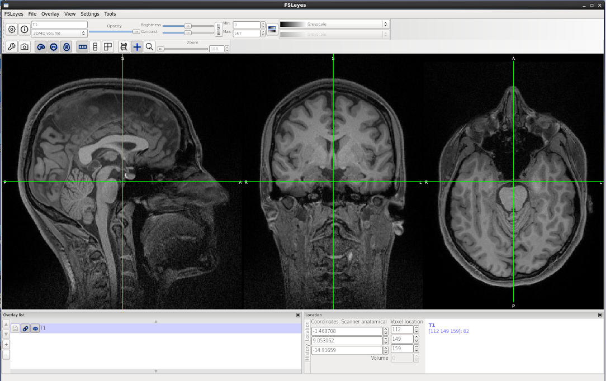
</p>

Please now explore the various settings in the ortho view panel:

<p align="center">
  
</p>

Also notice the abbreviations on the three canvases:

- L/R: Left/Right
- S/I: Superior/Inferior
- A/P: Anterior/Posterior

FSL comes with a collection of <b>NIFTI standard templates</b>, which are used for image registration and normalisation (part of MRI data analysis). You can also load these templates in FSLeyes.

To load a template, Click 'File' → 'Add Standard' (for example select the file named `MNI152_T1_2mm.nii.gz`. If you still have the `T1.nii` image open, first close this image (by selecting 'Overlay' → 'Remove') and then load the template.

The image below depicts the various tools that you can use on FSLeyes, give them a go!

<p align="center">
  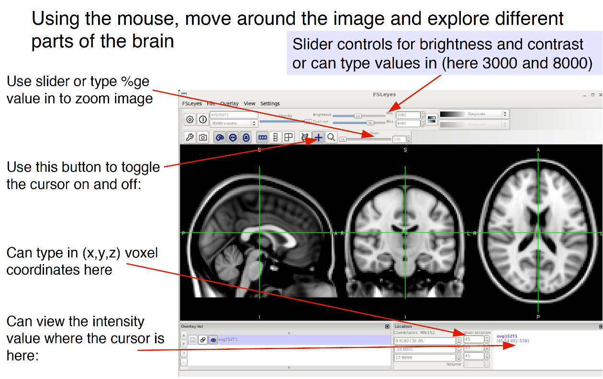
</p>

<br>
We will now look at fMRI data. First close the previous image ('Overlay' → 'Remove') and then load the fMRI image. To do this, click 'File' → 'Add from file'  and then select the file `rds/projects/c/chechlmy-chbhmricn/xxx/CHBH/visualization2.5mm_2000_fMRI.nii.gz`.

Your window should now look like this:

<p align="center">
  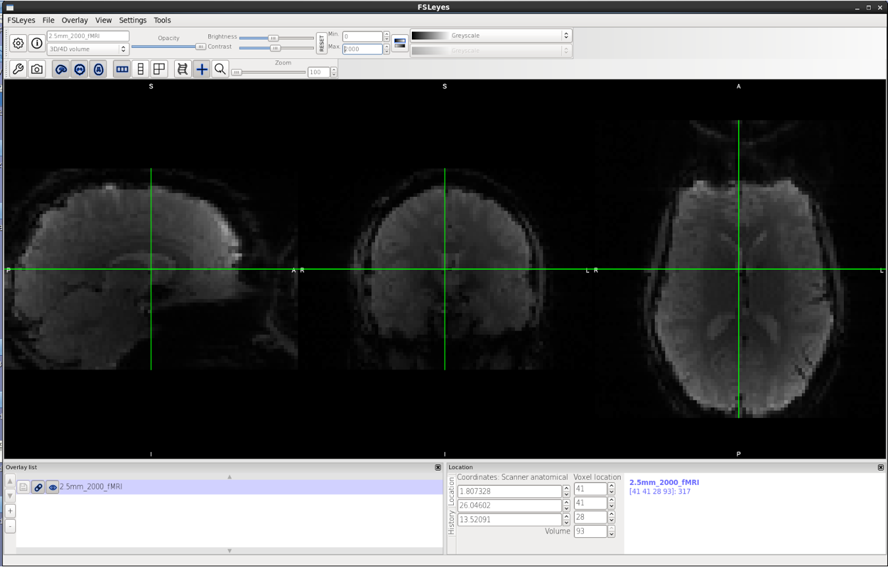
</p>

<b>Remember this fMRI data file is a 4D image</b> – a set of 90-odd volumes representing a timeseries. To cycle through volumes, use the up/down buttons or type in a volume in the 'Volume' box to step through several volumes.

<p align="center">
  
</p>

Now try playing the 4D file in 'Movie' mode by clicking this button. You should see some slight head movement over time. Click the button again to stop the movie.

<p align="center">
  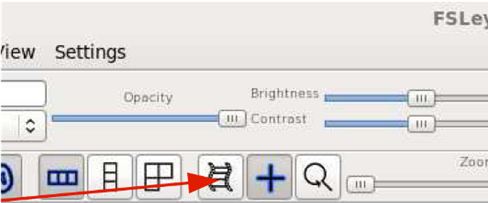
</p>

As the fMRI data is 4D, this means that every voxel in the 3D-brain has a timecourse associated with it. Let's now have a look at this. 

Keeping the same dataset open (`2.5mm_2000_fMRI.nii.gz`) and now in the FSLeyes menu, select 'View' → 'Time series'. 

FSLeyes should now look like the picture below. 

<p align="center">
  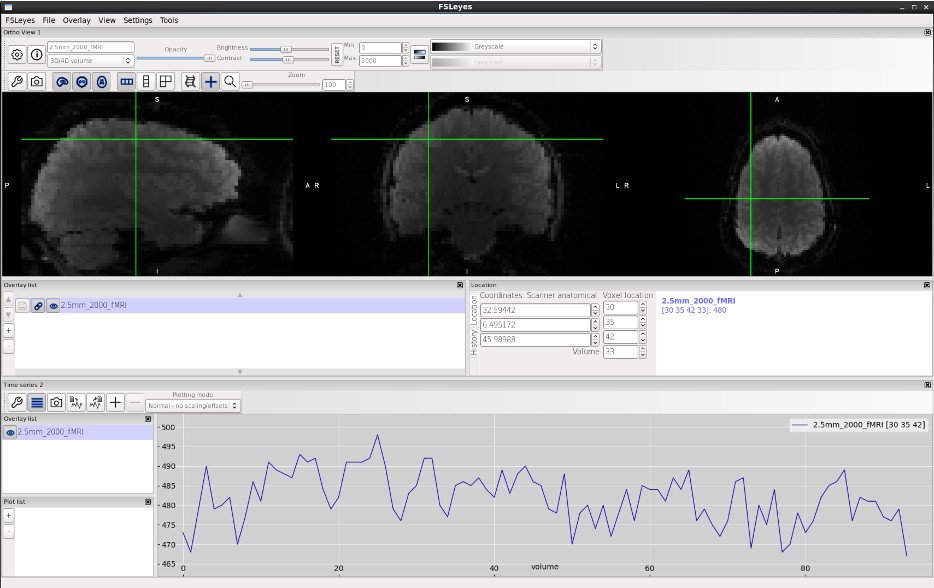
</p>

!!! info "What exactly are we looking at?"
    The functional image displayed here is the data straight from the scanner, i.e., raw, un-preprocessed data that has not been analyzed. In later workshops we will learn how to view analyzed data e.g., display statistical maps etc. 

You should see a timeseries shown at the bottom of the screen corresponding to the voxel that is selected in the main viewer. Move the mouse to select other voxels to investigate how variable the timecourse is. 

Within the timeseries window, hit the '+' button to show the 'Plot List' characteristics for this timeseries.

<p align="center">
  
</p>

Compare the timeseries in different parts of the brain, just outside the brain (skull and scalp), and in the airspace outside the skull. <b>You should observe that these have very different mean intensities.</b>

The timeseries of multiple different voxels can be compared using the '+' button. Hit '+' and then select a new voxel. Characteristics of the timeseries such as plotting colour can also be changed using the buttons on the lower left of the interface.

## Atlas tools

FSL comes not only with a collection of NIFTI standard templates but also with several built-in atlases, both probabilistic and histological (anatomical), comprising cortical, sub-cortical, and white matter parcellations. 
You can explore the full list of included atlases [here](https://open.win.ox.ac.uk/pages/fsl/fsleyes/fsleyes/userdoc/atlases.html).

We will now have a look at some of these atlases. 

Firstly, close all open files in FSLeyes (or close FSLeyes altogether and start it up again in your terminal by running `fsleyes &`).

In the FSLeyes menu, select 'File' → 'Add Standard' and then choose the file called `MNI152_T1_2mm.nii.gz`  (this is a template brain in MNI space).

!!! info "The MNI152 atlas"
    Remember that the MNI152 atlas is a standard brain template created by averaging 152 MRI scans of healthy adults widely used as a reference space in neuroimaging research.

Now select from the menu 'Settings' → 'Ortho View 1' and tick the box for 'Atlases' at the bottom.

<p align="center">
  
</p>

You should now see the 'Atlases' panel open as shown below.  

<p align="center">
  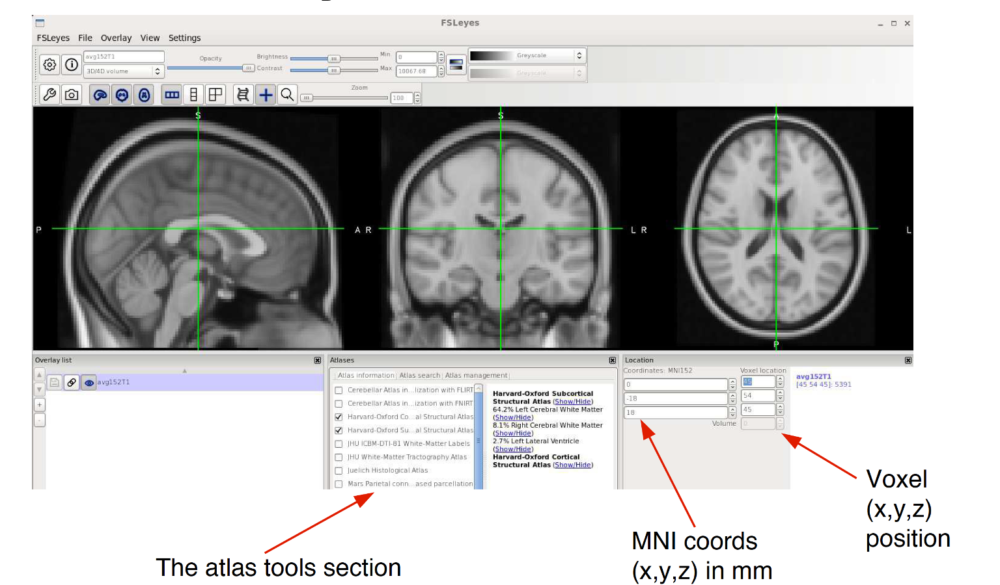
</p>

The 'Atlases' panel is organized into three sections: 

- Atlas information
- Atlas search
- Atlas management

The 'Atlas information' tab provides information about the current display location, relative to one or more atlases selected in this tab. We will soon see how to use this information.

<p align="center">
  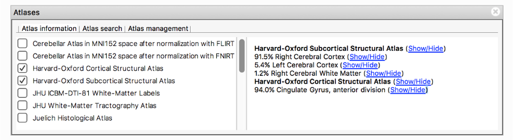
</p>

The 'Atlas search' tab can be used to search for specific regions by browsing through the atlases. We will later look how to use this tab to create region-of-interest (ROI) masks. 

<p align="center">
  
</p>

The 'Atlas management' tab can be used to add or delete atlases. This is an advanced feature, and we will not be using it during our workshops.

We will now have a look at how to work with FSL atlases. First we need to choose some atlases to reference. In the 'Atlases' → 'Atlas Information' window (bottom of screen in middle panel) make sure the following are ticked: 

- Harvard-Oxford Cortical Structural Atlas
- Harvard-Oxford Subcortical Structural Atlas
- Juelich Histological Atlas
- Talairach Daemon Labels

Now let's select a point in the standard brain. Move the cursor to the voxel position: **[x=56, y=61, z=27]** or enter the voxel location in the 'Location' window (2nd column). 

!!! note "MNI Co-ordinate Equivalent"
    Note that the equivalent MNI coordinates (shown in the 1st column/Location window) are **[-22,-4,-18]**.

It may not be immediately obvious what part of the brain you are looking at. Look at the 'Atlases' window. The report should say something like:

```bash
Harvard-Oxford Cortical Structural Atlas 
Harvard-Oxford Subcortical Structural Atlas 
98% Left Amygdala
```

!!! question "Checking the brain region with other atlases"
    What do the Juelich Histological Atlas & Talairach Daemon Labels report?

The Harvard-Oxford and Juelich are both probabilistic atlases. <b>They report the percentage likelihood that the area named matches the point where the cursor is.</b> 

The Talairach Atlas is a simpler labelling atlas. It is based on a single brain (of a 60-year-old French woman) and is an example of a deterministic atlas. <b>it reports the name of the nearest label to the cursor coordinates.</b> 

From the previous reports, particularly the Harvard-Oxford Subcortical Atlas and the Juelich Atlas, it should be obvious that we are most likely in the left amygdala. 

Now click the '(Show/Hide)' link after the Left Amygdala result (as shown below):

<p align="center">
  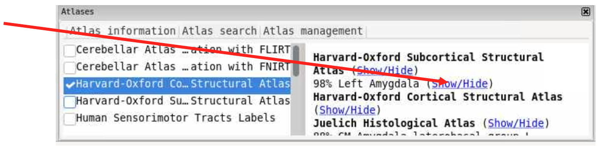
</p>

This shows the (max) volume that the probabilistic Harvard-Oxford Subcortical Atlas has encoded for the Left Amygdala. The cursor is right in the middle of this volume.

<p align="center">
  
</p>


In the 'Overlay list' click and select the top amygdala overlay. You will note that the min/max ranges are set to 0 and 100. If it’s not, change it to 0 and 100. <b>These reflect the % likelihood of the labelling being correct.</b>

<p align="center">
  
</p>

If you increase the min value from 0% to 50%, then you will see the size of the probability volume for the left amygdala will decrease. 

<b>It now shows only the volume where there is a 50% or greater probability that this label is correct.</b>

<p align="center">
  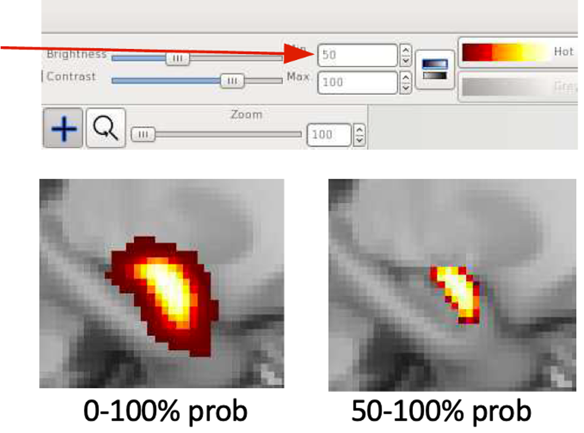
</p>

Click the (Show/Hide) link after the Left Amygdala; the amygdala overlay will disappear.

!!! example "Exercise: Coordinate Localization"
    Have a go at localizing exactly what the appropriate label is for these coordinates: 

    - Voxel coordinates **[40, 51, 40]** or MNI **[10, -24, 8]**
    - Voxel coordinates **[40, 51, 40]** or MNI **[10, -24, 8]**
    - Voxel coordinates **[65, 29, 20]** or MNI **[-41, -68, -32]**

    If unsure check your results with someone else, or ask for help! 

<b>Make sure all overlays are closed (but keep the `MNI152_T1_2mm.nii.gz` open) before moving to the next section.</b>


## Using atlas tools to find a brain structure

<b>It is often helpful to locate where a specific structure is in the brain and to visually assess its size and extent.</b>

Let's suppose we want to visualize where [Heschl's Gyrus](https://radiopaedia.org/articles/heschls-gyrus-1?lang=gb) is. In the bottom 'Atlases' window, click on the second tab ('Atlas search').

In the Search box, start typing the word 'Heschl…'. You should find that the system quickly locates an entry for Heschl's Gyrus in the Harvard-Oxford Cortical Atlas. Click on it to select.

Now if you now the tick box immediately below next to the Heschl's Gyrus, an overlay will be added to the 'Overlay' list on the bottom (see below). Heschl's Gyrus should now be visible in the main image viewer. 

Now click on the '+' button next to the tick box. This will centre the viewing coordinates to be in the middle of the atlas volume (see below).

<p align="center">
  
</p>

!!! example "Exercise: Atlas visualization"
    Now try this for yourself: 

    - <b>Remove the Heschl's Gyrus visualization.</b> You can tick it off in the 'Atlases' window, or select Heschl's Gyrus in the 'Overlay list' window, and then either toggle its visibility off (click the eye icon) or remove it ('Menu' → 'Overlay' → 'Remove').
    - <b>Visualize the Lingual Gyrus and Left Hippocampus.</b> To avoid confusion, change the colour of the Lingual Gyrus visualization from red/yellow to green and Left Hippocampus to blue.

You can change the colour of the overlays by selecting the option below:

<p align="center">
  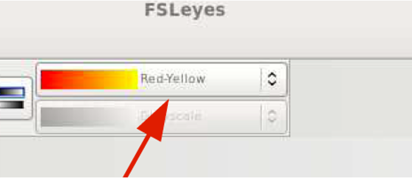
</p>

Other options also exist to help you navigate the brain and recognize the different brain structures and their relative positions. 

Make sure you have firstly closed/removed all previous overlays. Now, select the 'Atlas Search' tab in the 'Atlases' window again. 
This time, in the left panel listing different atlases, tick on the option for only one of the atlases, such as the Harvard-Oxford Cortical Structural Atlas, and make sure all others are unticked. 

<p align="center">
  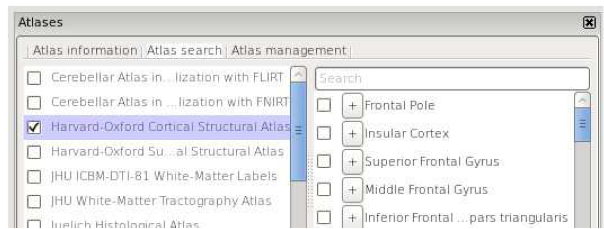
</p>

Now you should see all of the areas covered by the Harvard-Oxford cortical atlas shown on the standard brain. You can click around with the cursor, the labels for the different areas can be seen in the bottom right panel.

<p align="center">
  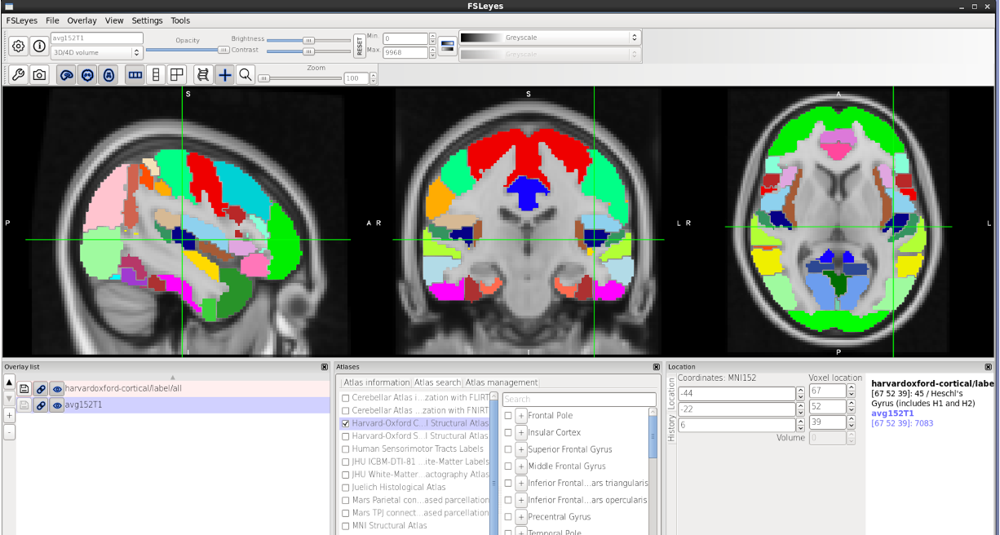
</p>

In addition to atlases covering various grey matter structures, <b>there are also two white matter atlases</b>: the JHU ICBM-DTI-81 white-matter labels atlas & JHU white-matter tractography atlas. 
If you tick (select) these atlases as per previous instructions (hint using the 'Atlas search' tab), you will see a list of all included white matter tracts (pathways) as shown below:

<p align="center">
  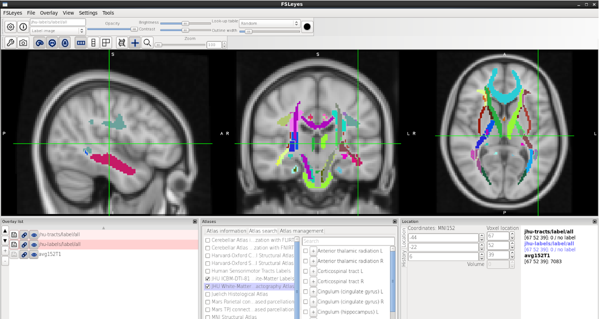
</p>

## Using atlas tools to create a region-of-interest mask

<b>You can also use atlas tools in FSLeyes to not only locate specific brain structures but also to create masks for ROI (region-of-interest) analysis.</b> We will now create ROI masks (one grey matter mask and one white matter) using FSL tools and built-in atlases.

To start, please close 'FSLeyes' entirely, either by clicking 'x' in the right corner of the FSLeyes window or by selecting 'FSLeyes' → 'Close'. Then close your current terminal and open a new terminal window. 

Then do the following:

- Navigate to your project directory and make a new directory called `ROImasks`. Navigate into this directory. 
- Then load `fsl` and open FSLeyes in the background.

Here are the commands to do this:

```bash
cd /rds/projects/c/chechlmy-chbh-mricn/xxx/
mkdir ROImasks
cd ROImasks
module load FSL/6.0.5.1-foss-2021a-fslpython 
module load FSLeyes/1.3.3-foss-2021a
fsleyes & 
```

Wait for FSLeyes to load, then:

- Load the MNI template by clicking 'File' → 'Add Standard' → 'MNI152_T1_2mm' and open the 'Atlases' panel. 
- Go to the 'Atlas search' tab, select the 'Harvard Oxford Cortical Atlas' and tick the 'Middle Frontal Gyrus' (from the list below 'Search' box) to add overlay to the 'Overlay list'. 
- Select the 'Middle Frontal Gyrus' (`harvardoxford-cortical_prob_Middle_Frontal_Gyrus`) from the 'Overlay' list and save it in your `ROImasks` directory as `MFG` (select 'Overlay' → 'Save' → Name: MFG).

You should now see the MFG overlay in the overlay list (as below) and have a `MFG.nii.gz` file in the `ROImasks` directory. You can check this by typing `ls` in the terminal.

<p align="center">
  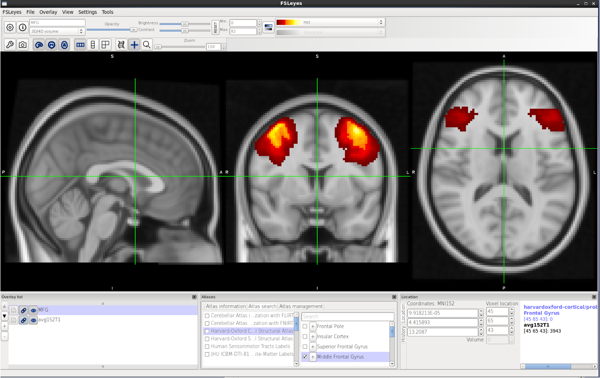
</p>

We will now create a white matter mask. Here are the steps:

- First, remove the MFG overlay ('Menu' → 'Overlay' → 'Remove').
- Then go to the 'Atlas search' tab, and select the 'JHU white-matter tractography' atlas and tick the 'Forceps minor' (from the list below 'Search' box) to add overlay to the 'Overlay' list. 
- Finally, select the added 'Forceps minor' overlay from the 'Overlay' list and save it in your `ROImasks` directory as FM ('Overlay' → 'Save' → Name: FM). 

You should now see the FM overlay in the overlay list (as below) and also have a `FM.nii.gz` file in the `ROImasks` directory. 

<p align="center">
  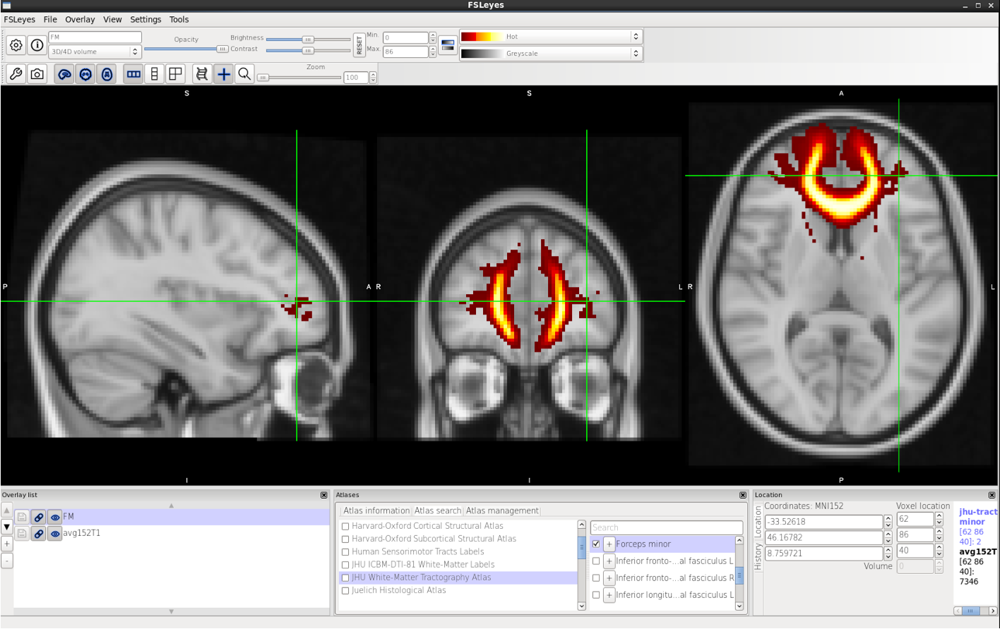
</p>

You now have two “probabilistic ROI masks”. To use these masks for various analyses, you need to first binarize these images.

!!! question "Why binarize?"
    Why do you think we need to binarize the mask first? There are several reasons, but primarily it creates clear boundaries between regions which simplifies our statistical analysis and reduces computation.

To do this, first close FSLeyes. Make sure that you are in the `ROImasks` directory and check if you have the two masks. 
If you type `pwd` in the terminal, you should get the output `rds/projects/c/chechlmy-chbh-mricn/xxx/ROImasks` (where XXX=your ADF username) and when you type `ls`, you should see `FM.nii.gz` and `MFG.nii.gz`.

To binarize the masks, you can use one of the FSL tools for image manipulation, `fslmaths`. The basic structure of an `fslmaths` command is: 

`fslmaths input image [modifiers/options] output`

Type in your terminal:

```bash
fslmaths FM.nii.gz -bin FM_binary
fslmaths MFG.nii.gz -bin MFG_binary
```

This simply takes your ROI mask, binarizes it and saves the binarized mask with the `_binary` name.

<b>You should now have 4 files in the ROImasks directory.</b>

Now open FSLeyes and examine one of the binary masks you just created. First load a template (Click 'File' → 'Add Standard' → 'MNI152_T1_2mm') and add the binary mask (e.g., Click 'File' → 'Add from file' → 'FM_binary.nii.gz'). 

You can see the difference between the probabilistic and binarized ROI masks below:

<div style="display: flex; justify-content: center; gap: 20px;">
   <div style="text-align: center;">
       <p><strong>Probabilistic ROI mask</strong></p>
       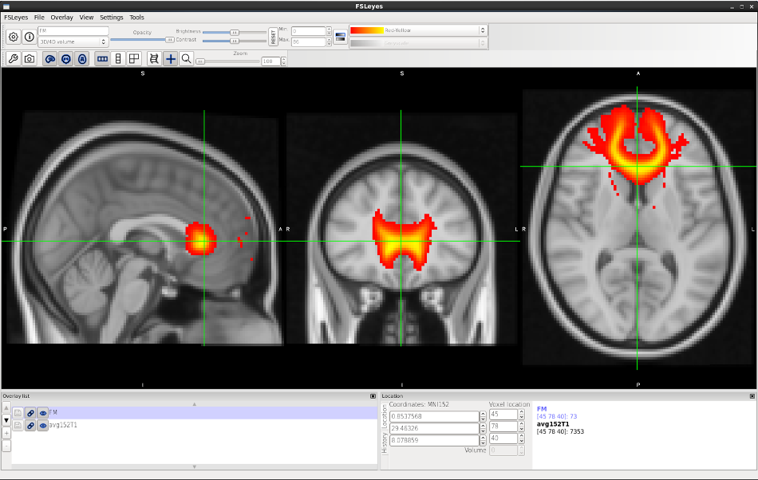
   </div>
   <div style="text-align: center;">
       <p><strong>Binary ROI mask</strong></p>
       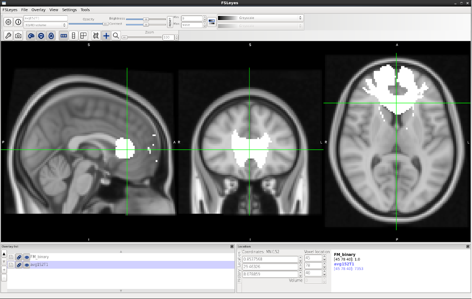
   </div>
</div>

<b>To use ROI masks in your analysis, you might also need to threshold it</b> i.e., to change/restrict the probability of the volume. We previously did this for the amygdala manually (e.g., from 0-100% to 50%-100%). 
The choice of the threshold might depend on the type of analysis and the type of ROI mask you need to use. The instructions below explain how to threshold and binarize your ROI image in one single step using `fslmaths`.

Open your terminal and make sure that you are in the `ROImasks` directory (`pwd`). To both threshold and binarize the MFG mask, type:

`fslmaths MFG.nii.gz -thr 25 -bin MFGthr_binary`

(option `-thr` is used to threshold the image below a specific number, in this case 25 corresponding to 25% probability)

Now let's compare the thresholded and unthresholded MFG binarized masks.

- Go back to FSLeyes and add the unthresholded MFG binary mask (e.g., Click 'File' → 'Add from file' → 'MFG_binary.nii.gz'). 
- Add the second, thresholded and binarized MFG mask (`MFGthr_binary.nii.gz`), and to avoid confusion, change the colour of the second mask to blue. You can either toggle its visibility on and off (click the eye icon) to compare mask or use the 'Opacity' button. 

You can see the difference in size between the two below:

<div style="display: flex; justify-content: center; gap: 20px;">
   <div style="text-align: center;">
       <p><strong>Binarized MFG mask</strong></p>
       
   </div>
   <div style="text-align: center;">
       <p><strong>Binarized and thresholded MFG mask</strong></p>
       
   </div>
</div>

!!! example "Exercise: Atlases and masks"
    Have a go at the following exercises:

    - Explore different atlases to localize various cortical, subcortical or white matter structures (take inspiration from your MSc project, recent papers or seminars)
    - Using atlas tools, create binary (un-thresholded) masks for the left and right Superior longitudinal fasciculus (hint: use JHU white-matter tractography atlas)
    - Using atlas tools, create binary and thresholded (at different levels of probability 5, 25 and 75%) masks for the right thalamus (hint: use Harvard-Oxford Subcortical Structural Atlas)

    If unsure, check your results with someone else or ask for help!

!!! info "Workshop 2: Further Reading and Reference Material"
    FSLeyes is not the only MRI visualization tool available. Here are some others:

    - fslview (older version of FSL viewer) 
    - [MRIcroGL](https://www.nitrc.org/plugins/mwiki/index.php/mricrogl:MainPage) (for high quality images)
    - [AFNI](https://afni.nimh.nih.gov/) - Analysis of Functional NeuroImages
    - Mango/Papaya

    More details of what is available on BEAR at the CHBH can be found at the [BEAR Technical Docs website](https://chbh-opensource.github.io/chbh-on-bear/).
