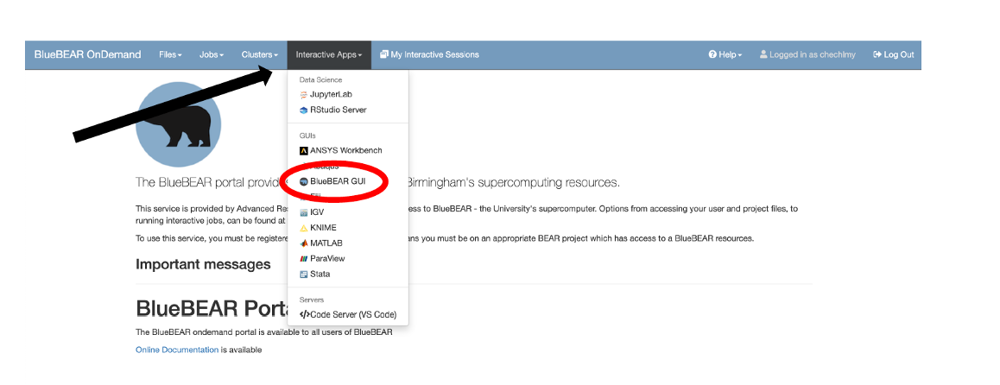

# Workshop 2 - MRI data formats, data visualization and atlas tools

Welcome to the second workshop of the MRICN course! Prior lectures introduced you to the basics of the physics and technology behind MRI data acquisition. 
In this workshop we will explore, MRI image fundamentals, MRI data formats, data visualization and atlas tools. 

!!! success "Overview of Workshop 2"
    Topics for this workshop include:

    - The fundamentals of MRI data, including file types and formats
    - Converting between different MRI data files (e.g., DICOM to NIFTI)
    - Introduction to FSLeyes and basic navigation
    - Loading atlases and creating regions-of-interest (ROIs)
    - Binarizing and thresholding ROIs

<b>You will need this information before you can analyse data, regardless if using structural or functional MRI data.</b>

For the purpose of the module we will be using BlueBEAR. You should remember from [Workshop 1](https://chbh-opensource.github.io/mri-on-bear-edu/workshop1/intro-to-bluebear/), how to access the BlueBEAR Portal and use the BlueBEAR GUI. 

  

You have already been given access to the RDS project, `rds/projects/c/chechlmy-chbh-mricn`. Inside the module’s RDS project, you will find that you have a folder labelled `xxx` (`xxx` = University of Birmingham ADF username). 

If you navigate to that folder `(rds/projects/c/chechlmy-chbh-mricn/xxx)`, you will be able to perform the various file operations from there during workshops.

<b>The copy of this workshop notes can be found on Canvas 39058 - LM Magnetic Resonance Imaging in Cognitive Neuroscience in Week 02 workshop materials.</b>