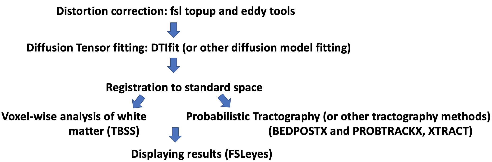
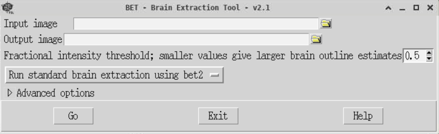

# Diffusion MRI basics - visualization and preprocessing 

In this workshop and the workshop next week, we will follow some basic steps in the diffusion MRI analysis pipeline below. 
<b>The instructions here are specific to tools available in FSL,</b> however other neuroimaging software packages can be used to perform similar analyses. 
You might also recall from lectures that models other than diffusion tensor and methods other than probabilistic tractography are also often used. 

<h2><div align="center"><b>FSL diffusion MRI analysis pipeline</b></div></h2>

<p align="center">
 
</p>
<br>

<b>First, if you have not already, log in into the BlueBEAR Portal and start a BlueBEAR GUI session (2 hours).</b> You should know how to do it from the previous workshops. 
Open a new terminal window and navigate to your MRICN project folder:

`cd /rds/projects/c/chechlmy-chbh-mricn/xxx` [where XXX=your ADF username] 

Please check your directory by typing `pwd`. This should return: `/rds/projects/c/chechlmy-chbh-mricn/xxx`.

!!! warning "Where has all my data gone?"
    Before this workshop, any old directories and files from previous workshops have been removed (you will not need it for subsequent workshops and storing unnecessary data would result in exceeding allocated quota). 
    Your XXX directory should therefore be empty. 

Next you need to copy over the data for this workshop.

`cp -r /rds/projects/c/chechlmy-chbh-mricn/module_data/diffusionMRI/ .`    (make sure you do not omit spaces and .)

This might take a while, but once it has completed, change into that downloaded directory:

`cd diffusionMRI` (your `XXX` subdirectory you should now have the folder `diffusionMRI`)

Type `ls`. You should now see three subdirectories/folders (`DTIfit`, `TBSS` and `tractography`). Change into the `DTIfit` folder:

`cd DTIfit`

## Viewing diffusion data using FSLeyes

<b>We will first look at what diffusion images look like and explore text files which contain information about gradient strength and gradient directions.</b>

In your terminal type `ls`. This should return:

```bash
p01/
p02/
```

So, the folder `DTIfit` contains data from two participants contained within the `p01` and `p02` folders. 

Inside each folder (`p01` and `p02`) you will find a T1 scan, uncorrected diffusion data (`blip_up.nii.gz`, `blip_down.nii.gz`) acquired with two opposing PE-directions (`AP/blip_up` and `PA/blip_down`) and corresponding `bvals` (e.g., `blip_up.bval`) and `bvecs` (e.g., `blip_up.bvec`) files. 

- The `bvals` files contain b-values (scalar values for each applied gradient). 
- The `bvecs` files contain a list of gradient directions (diffusion encoding directions), including a [3x1] vector for each gradient. 

The number of entries in `bvals` and `bvecs` files equals the number of volumes in the diffusion data files. 

Finally, inside `p01` and `p02` there is also subdirectory data with distortion-corrected diffusion images.

<b>We will start with viewing the uncorrected data.</b> Please navigate inside the `p01` folder, open FSLeyes and then load one of the uncorrected diffusion images:

```bash
cd p01
module load FSL/6.0.5.1-foss-2021a-fslpython
module load FSLeyes/1.3.3-foss-2021a
fsleyes &
```

The image you have loaded is 4D and consists of 64 volumes acquired with different diffusion encoding directions. Some of the volumes are non-diffusion images (b-value = 0), while most are diffusion weighted images. 
The first volume, which you can see after loading the file, is a non-diffusion weighted image as demonstrated below. 

<p align="center">
  
</p>

!!! note "Viewing separate volumes"
    You can view the separate volumes by changing the number in the Volume box or playing movie mode. Note that the volume count starts from 0. 
    You should also note that there are significant differences in the image intensity between different volumes. 

Now go back to volume 0 and - if needed - stop movie mode. In the non-diffusion weighted image, the ventricles containing CSF are bright and the rest of the image is relatively dark. 
Now change the volume number to 2, which is a diffusion weighted image (with a b-value of approximately 1500). 

The intensity of this volume is different. To see anything, please change max. intensity to 400. Now the ventricles are dark and you can see some contrast between different voxels. 

<p align="center">
  
</p>

Let's view the content of the `bvals` and `bvecs` files by using the `cat` command. In your terminal type:

`cat blip_down.bval`

<p align="center">
  
</p>

The first number is 0. This indicates that indeed the first volume (volume 0) is a non-diffusion weighted image and the third volume (volume 2) is diffusion weighted volume with b=1500. 
Based on the content of this `bval` file, you should be able to tell how many diffusion-weighted volumes were acquired and how many without any diffusion weighting (b0 volumes). 

!!! example "Comparing diffusion-weighted volumes"
    Please compare this with the file you loaded into FSLeyes. 

Now type:

`cat blip_down.bvec`

<p align="center">
  
</p>

You should now see 3 separate rows of numbers representing the diffusion encoding directions (3x1 vector for each acquired volume; x,y,z directions) and that for volume 2 the diffusion encoding is represented by the vector **[0.578, 0.671, 0.464]**. 

<h3>Distortion correction</h3>

As explained in the lectures, diffusion imaging suffers from various distortions (susceptibility, eddy-currents and movement induced distortions). <b>These need to be corrected before further analysis.</b> 
The most most noticeable geometric distortions are susceptibility-induced distortions caused by field inhomogeneities, and so we will have a closer look at these.

All types of distortions need correction during pre-processing steps in diffusion imaging analysis. FSL includes two tools used for distortion correction, topup and eddy. 
The processing with these two tools is time and computing intensive. <b>Therefore we will not run the distortion correction steps in the workshop but instead explore some principles behind it.</b> 

<p align="center">
  
</p>

For this, you are given distortion corrected data to conduct further analysis, diffusion tensor fitting and probabilistic tractography.  

First close the current image in FSLeyes ('Overlay' → 'Remove') and load both uncorrected images (`blip_up.nii.gz`, `blip_down.nii.gz`) acquired with two opposing PE-directions (PE=phase encoding). 

<b>Compare the first volumes in each file.</b> To do that you can either toggle the visibility on and off (click the eye icon) or use the 'Opacity' button (you should remember from the previous workshop how to do this). 

<p align="center">
  
</p>

The circled area indicates the differences in susceptibility-induced distortions between the two images acquired with two opposing PE-directions. 

Now change the max. intensity to 400 and compare the third volumes in each file. Again, the circled area indicate the differences in distortions between the two images acquired with the two opposing PE-directions. 

<p align="center">
  
</p>

<b>Finally, we will look at distortion corrected data.</b> First close the current image ('Overlay' → 'Remove').

Now in FSLeyes load `data.nii.gz` (the distortion-corrected diffusion image located inside the data subdirectory) and have a look at one of the the non-diffusion weighted and diffusion-weighted volumes. 

<p align="center">
  
</p>

!!! question "Comparing corrected to uncorrected diffusion-weighted volumes"
    Can you tell the difference in the corrected compared to the uncorrected diffusion images?

!!! example "Further examining the difference between uncorrected and corrected diffusion data"
    In your own time (outside of this workshop as part of independent study), load both the corrected and uncorrected data for `p01` and compare using the 'Volume' box or 'Movie' mode. Also explore the data in `p02` folder using the instructions above. 

## Creating a binary mask using FSL's Brain Extraction Tool

In the next part of the workshop, we will look FSL's Brain Extraction Tool (BET).

Brain extraction is a necessary pre-processing step, which removes non-brain tissue from the image. <b>It is applied to structural images prior to tissue segmentation and is needed to prepare anatomical scans for registration of functional MRI or diffusion scans to MNI space.</b> BET can be also used to create binary brain masks (e.g., brain masks needed to run diffusion tensor fitting, DTIfit). 

<b>In this workshop we will look at only at creating a binary brain mask as required for DTIfit.</b> In subsequent workshops we will look at using BET for removing non-brain tissues from diffusion and T1 scans (“skull-stripping”) in preparation for registration.

First close FSLeyes and to make sure you do not have any processes running in the background, close your current terminal.

Open a new terminal window, navigate to the `p02` subdirectory, and load FSL and FSLeyes again:

``` bash
cd /rds/projects/c/chechlmy-chbh-mricn/xxx/diffusionMRI/DTIfit/p02
module load FSL/6.0.5.1-foss-2021a-fslpython
module load FSLeyes/1.3.3-foss-2021a 
```
 
Now check the content of the `p02` subdirectory by typing `ls`. You should get the response `bvals`, `bvecs` and `data.nii.gz`.

From the `data.nii.gz` (distortion corrected diffusion 4D image) we will extract a single volume without diffusion weighting (e.g. the first volume). You can extract it using one of FSL's utility commands, `fslroi`. 

!!! info "What is `fslroi` used for?"
    `fslroi`is used to extract a region of interest (ROI) or subset of data from a larger 3D or 4D image file.

In the terminal, type:

`fslroi data.nii.gz nodif 0 1`

where: 

- `data.nii.gz` is your input image, 
- `nodif` is your output image (3D non-diffusion weighted volume), 
- 0 and 1 indicate that you are extracting volume 0 and the you only want to extract one (1) volume

You should have a new file `nodif.nii.gz` (type `ls` to confirm) and can now create a binary brain mask using BET.

To do this, first open BET in terminal. You can open the BET GUI directly in a terminal window by typing:

`Bet &`

Or by runnning FSL in a terminal window and accessing BET from the FSL GUI. To do it this way, type:

`fsl &`

and then open the 'BET brain extraction tool' by clicking on it in the GUI.

In either case, once BET is opened, click on advanced options and make sure the first two outputs are selected ('brain extracted image' and 'binary brain mask') as below. Select as the 'Input' image the previously created `nodif.nii.gz` and change 'Fractional Intensity Threshold' to 0.4. Then click the 'Go' button. 

<p align="center">
  
</p>

<p align="center">
  
</p>

!!! tip "Completing BET in the terminal"
    After running BET you may need to hit return to get a visible prompt back after seeing "Finished” in the terminal!

You will see 'Finished' in the terminal when you are ready to inspect the results. Close BET and open FSLeyes and load three files (`nodif.nii.gz`, `nodif_brain.nii.gz` and `nodif_brain_mask`). <b>Compare the files.</b> To do that you can either toggle the visibility on and off (click the eye icon) or use 'Opacity button' (you should remember from previous workshop how to do it).

The `nodif_brain_mask` is a single binarized image with ones inside the brain and zeroes outside the brain. You need this image both for DTIfit and tractography.

!!! question "Comparing between BET and normal images"
    Can you tell the difference between `nodif.nii.gz` and `nodif_brain.nii.gz`? It might be easier to compare these images if you change max intensity to 1500 and `nodif_brain` colour to green.
