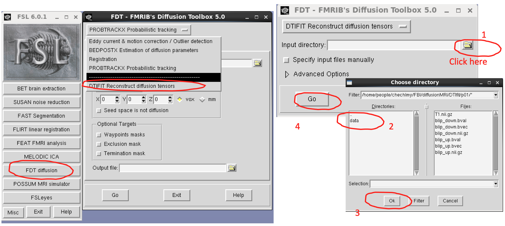
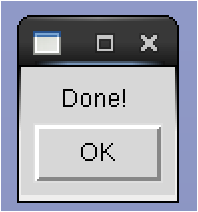
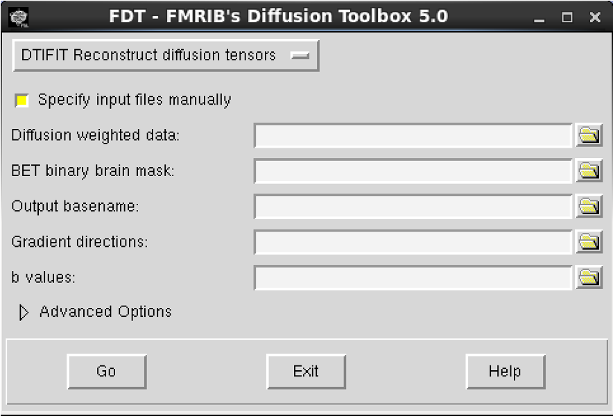
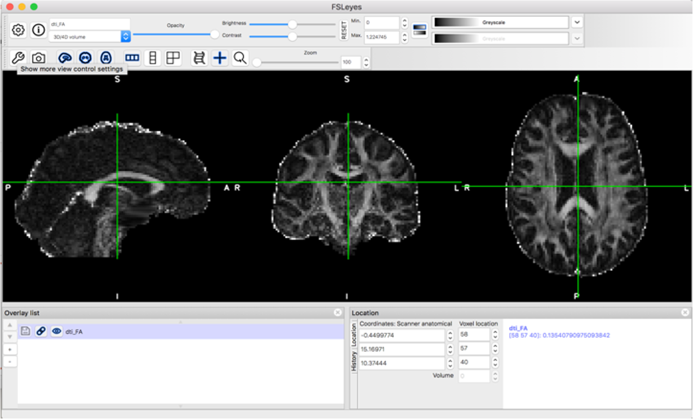
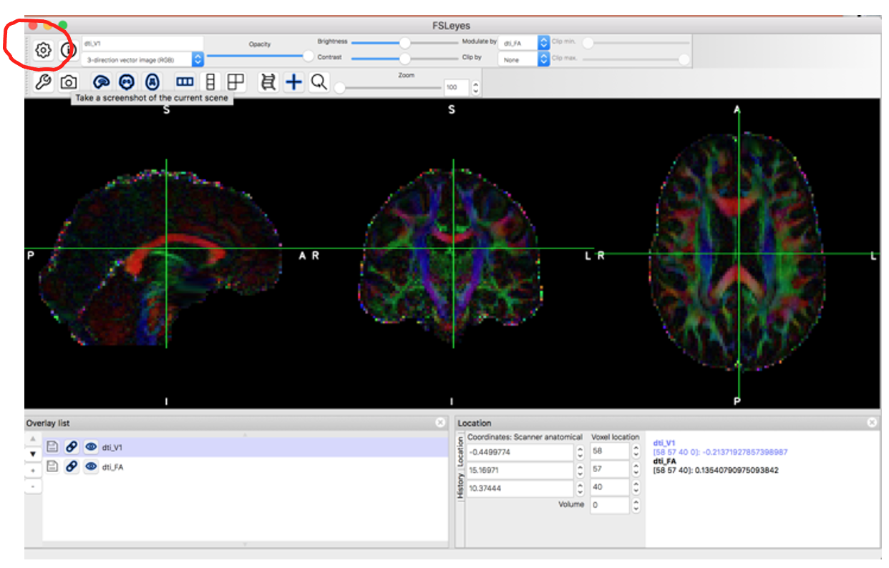
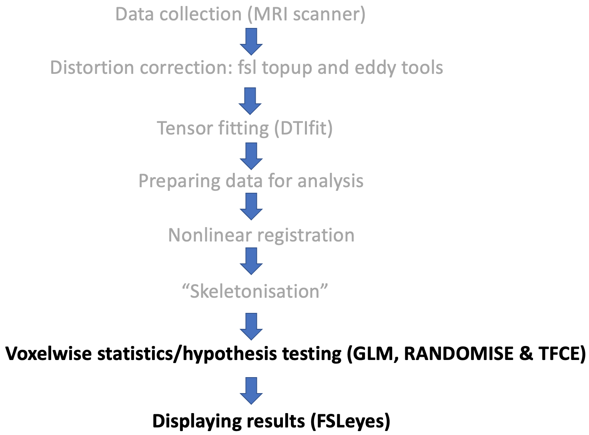
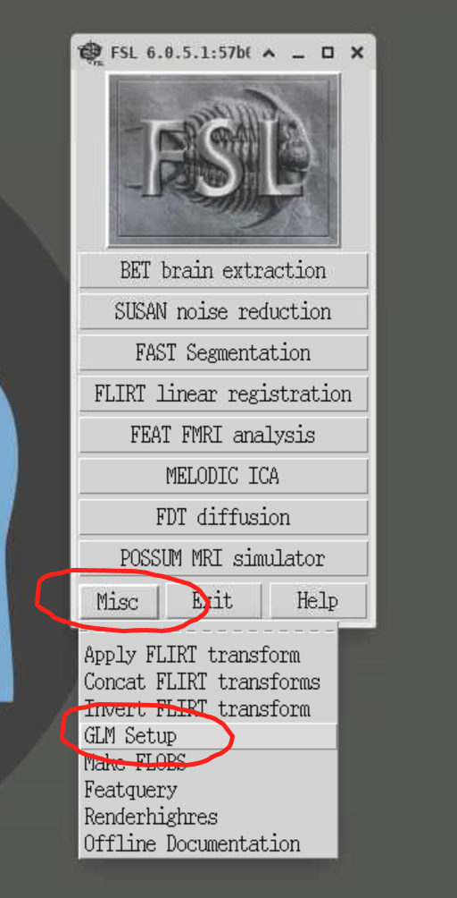
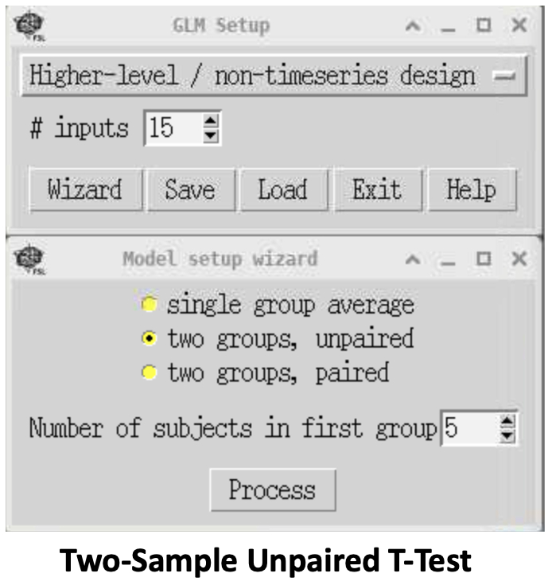
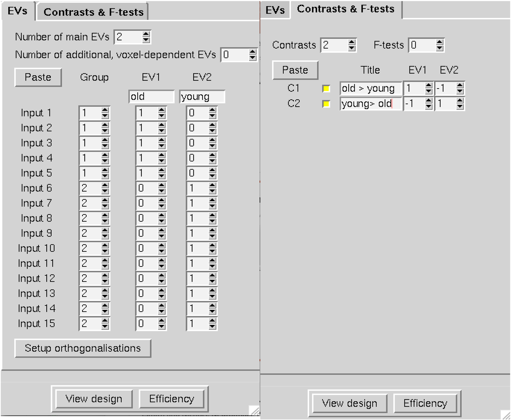
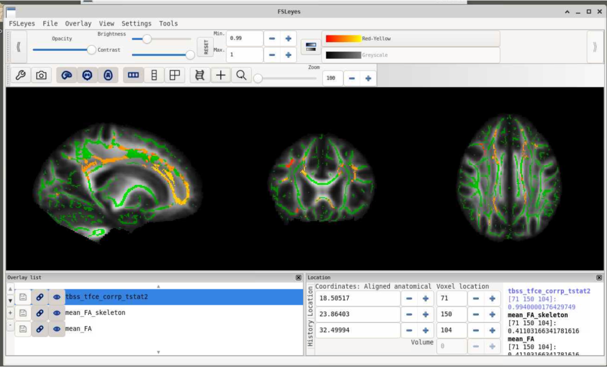

# Diffusion tensor fitting and Tract-Based Spatial Statistics

## Diffusion tensor fitting (DTIfit)

<b>The next thing we will do is to look at how to run and examine the results of diffusion tensor fitting. </b>

First close FSLeyes, and to make sure you do not have any processes running in the background, close the current terminal.

Open a new terminal window, navigate to the `p01` subdirectory, load FSL and FSLeyes again, and finally open FSL (with & to background it):

```bash
cd /rds/projects/c/chechlmy-chbh-mricn/xxx/diffusionMRI/DTIfit/p01
module load FSL/6.0.5.1-foss-2021a-fslpython
module load FSLeyes/1.3.3-foss-2021a
fsl & 
```

To run the diffusion tensor fit, you need 4 files as specified below:

1. Distortion corrected diffusion data: `data.nii.gz`
2. Binary brain mask: `nodif_brain_mask.nii.gz`
3. Gradient directions: `bvecs` (test file with gradient directions)
4. b-values: `bvals` (text file with list of b-values)

<b>All these files are included inside the data subdirectory `p01/data`.</b> You will later learn how to create a binary brain mask but first we will run DTIfit.

In the FSL GUI, first click on 'FDT diffusion', and in the FDT window, select 'DTIFIT Reconstruct diffusion tensors'. Now choose as 'Input directory' the `data` subdirectory located inside `p01` and click 'Go'. 

<p align="center">
  
</p>

You should see something happening in the terminal and once you see 'Done!' you are ready to view the results.

<p align="center">
  
</p>

Click 'OK' when the message appears.

<h3>Different ways of running DTIfit</h3>

Instead of running DTIfit by choosing the 'Input' directory, you can also run it by specifying the input file manually. If you click it now, the files would be auto-filled but otherwise you would need to provide inputs as below. 	   

<p align="center">
  
</p>

<br>

!!! warning "Running DTIfit in your own time"
    Please do NOT run it now, but instead try it in your own time with data in the `p02` folder.

Finally, you can also run DTIfit directly from the terminal. To do this, you would need to type `dtifit` in the terminal and choose the `dtifit` compulsory arguments:

| Argument | Description |
|-------|------------|
| -k, --data | dti data file |
| -o, --out | Output basename |
| -m, --mask | Bet binary mask file |
| -r, --bvecs | b vectors file |
| -b, --bvals | b values file |

To run DTIfit from the terminal, you would need to navigate inside the `subdirectory/folder` with all the data and type the full `dtifit` command, specifying compulsory arguments as below:

`dtifit --data=data --mask=nodif_brain_mask --bvecs=bvecs --bvals=bvals --out=dti`

This command only works when running it from inside a folder where all the data is located, otherwise you will need to specify the full path with the data location. 
This would be useful if you want to write a script; we will look at it in the later workshops.

!!! warning "Running DTIfit from the terminal in your own time"
    Again, please do NOT run it now but try it in your own time with data in the `p02` folder.

The results of running DTIfit are several output files as specified below. <b>We will look closer at the highlighted files in bold.</b> 
All of these files should be located in the `data` subdirectory, i.e. within `/rds/projects/c/chechlmy-chbh-mricn/xxx/diffusionMRI/DTIfit/p01/data/`.

| Output File | Description |
|------------|-------------|
| **dti_V1** (V2, V3) | 1st, 2nd, 3rd eigenvectors |
| dti_L1 (L2, L3) | 1st, 2nd, 3rd eigenvalues |
| **dti_FA** | **Fractional Anisotropy map** |
| **dti_MD** | **Mean Diffusivity map** |
| dti_MO | Mode of anisotropy (linear versus planar) |
| dti_SO | Raw T2 signal with no diffusion weighting |

To do this, firstly close the FSL GUI, open FSLeyes and load the FA map ('File' → 'Add from file' → `dti_FA`)

<p align="center">
  
</p>

Next add the principal eigenvector map (`dti_V1`) to your display ('File' → 'Add from file' → `dti_V1`).

FSLeyes will open the image `dti_V1` as a 3-direction vector image (RGB) with diffusion direction coded by colour. 
To display the standard PDD colour coded orientation map (as below), you need to modulate the colour intensity with the FA map so that the anisotropic voxels appear bright. 

In the display panel (click on 'Settings' (the Cog icon)) and change 'Modulate' by setting it to `dti_FA`.

<p align="center">
  
</p>

Finally, compare the FA and MD maps (`dti_FA` and `dti_MD`). To do this, load the FA map and add the MD map. 
By contrast to the FA map, the MD map appears uniform in both gray and white matter, plus higher intensities are in the CSF-filled ventricles and indicate higher diffusivity. This is opposed to dark ventricles in the FA map. 

!!! question "Differences between the FA and MD maps"
    Why are there such differences?

## Tract-Based Spatial Statistics (TBSS)

In the next part of the workshop, we will look at running TBSS, Tract-Based Spatial Statistics.

<b>TBSS is used for a whole brain “voxelwise” cross-subject analysis of diffusion-derived measures, usually FA (fractional anisotropy).</b>

We will look at an example TBSS analysis of a small dataset consisting of FA maps from ten younger (y1-y10) and five older (o1-o5) participants. 
<b>Specifically, you will learn how to run the second stage of TBSS analysis, “voxelwise” statistics, and learn how to display results using FSLeyes.</b> 
The statistical analysis that you will run <b>aims to examine where on the tract skeleton younger versus older (two groups) participants have significantly different FA values.</b>

Before that, let's shortly recap TBSS as it was covered in the lecture. 

The steps for Tract-Based Spatial Statistics are:

1. Fitting the diffusion tensor (DTIfit)
2. Alignment of  all study participants’ FA maps to standard space using non-linear registration
3. Merging all participants’ nonlinearly aligned FA maps into a single 4D image file and creating the mean FA image 
4. FA “skeletonization” (the mean FA skeleton representing the centres of major tracts specific to all participants is created)
5. Each participant’s aligned FA map is then projected back onto the skeleton prior to statistical analysis 
6. Hypothesis testing (voxelwise statistics)

To save time, some of the pre-processing stages including generating FA maps (tensor fitting), preparing data for analysis, registration of FA maps and skeletonization have been run for you and all outputs are included in the `data` folder you have copied at the start of this workshop. 

<h2><div align="center"><b>Tract-Based Spatial Statistics analysis pipeline</b></div></h2>

<p align="center">
 
</p>

<b>You will only run the TBSS statistical analysis to explore group differences in FA values based upon age (younger versus older participants).</b>

First close FSLeyes (if you still have it open) and make sure that you do not have any processes running in the background by closing your current terminal.

Then open a new terminal window, navigate to the subdirectory where pre-processed data are located and load both FSL and FSLeyes:

```bash
cd /rds/projects/c/chechlmy-chbh-mricn/xxx/diffusionMRI/TBSS/TBSS_analysis_p2/
module load FSL/6.0.5.1-foss-2021a-fslpython
module load FSLeyes/1.3.3-foss-2021a 
```

Once you have loaded all the required software, <b>we will start with exploring the pre-processed data.</b> If you correctly followed the previous steps, you should be inside the subdirectory `TBSS_analysis_p2`. 
Confirm that, and then check the content of that subdirectory by typing:

`pwd` (answer `/rds/projects/c/chechlmy-chbh-mricn/xxx/diffusionMRI/TBSS/TBSS_analysis_p2/`)

`ls` (you should see 3 data folders listed: `FA`, `origdata`, `stats`)

We need to firstly check if all the pre-processing steps have been run correctly and that we have all the required files. 

Navigate inside the `stats` folder and check the files inside by typing in your terminal:

```bash
cd stats
ls
```

You should find inside the files listed below. 

- `all_FA` (4D image file with all participants’ FA maps registered into standard space)
- `mean_FA` (3D image file mean of all participants FA maps)
- `all_FA_skeletonised` (4D image file with all participants skeletonised FA data)
- `mean_FA_skeleton` (3D image file mean FA skeleton)

!!! example "Exploring the data"
    If this is the case, open FSLeyes and explore these files one by one to make sure you understand what each represents. You might need to change the colour to visualise some image files. 

!!! tip "Remember to ask for help!"
    If you are unsure about something, or need help, please ask!
    
Once you have finished taking a look, close FSLeyes.

Before using the General Linear Model (GLM) GUI to set up the statistical model, you need to determine the order in which participants’ files have been entered into the single 4D skeletonized file (i.e., the data order in the `all_FA_skeletonised` file). 
The easiest way to determine the alphabetical order of participants in the the final 4D file (`all_FA_skeletonised`), is to check in which order FSL lists the pre-processed FA maps inside the FA folder. You can do this in the terminal with the commands below

```bash
cd .. 
cd FA 
imglob *_FA.*
```

You should see data from the 5 older (o1-o5) followed by data fromthe  10 (y1-y10) younger participants.

Next navigate back to the `stats` folder and open FSL:

```bash
cd ..
cd stats
fsl &
```

Click on 'Miscellaneous tools' and select 'GLM Setup' to open the GLM GUI. 

<p align="center">
  
</p>

<b>In the workshop we will set up a simple group analysis (a two sample unpaired t-test).</b>

!!! info "How to set up more complex models"
    To find information re how to set up more complex models, using GUI, click on this link: [https://fsl.fmrib.ox.ac.uk/fsl/docs/#/statistics/glm](https://fsl.fmrib.ox.ac.uk/fsl/docs/#/statistics/glm)

In the 'GLM Setup' window, change 'Timeseries design' to 'Higher-level/non-timeseries design' and '# inputs' to 15.

Then click on 'Wizard' and select 'two groups, unpaired' and set 'Number of subjects in first group' to 5. Then click 'Process'.

<p align="center">
  
</p>

In the 'EVs' tab, name 'EV1' and 'EV2' as per your groups (old, young).

In the contrast window set number of contrasts to 2 and re-name them accordingly to the image below: 

<b>(C1: old > young, [1 -1]) (C2: young > old, [-1 1])</b>

<p align="center">
  
</p>

Click 'View Design', close the image and then go back to the GLM set window and save your design with the filename `design`. Click 'Exit' and close FSL.

To run the TBSS statistical analysis FSL's `randomise` tool is used.

!!! info "FSL's randomise"
    Randomise is FSL's tool for nonparametric permutation inference on various types of neuroimaging data (statistical analysis tool). For more information click on this link: [https://fsl.fmrib.ox.ac.uk/fsl/docs/#/statistics/randomise](https://fsl.fmrib.ox.ac.uk/fsl/docs/#/statistics/randomise)

The basic command line to use this tool is:

`randomise -i <input> -o <input> -d <design.mat> -t <design.con> [options]`

You can explore options and the set up by typing `randomise` in your terminal.

The basic command line to use randomise for TBSS is below:

`randomise -i all_FA_skeletonised -o tbss -m mean_FA_skeleton_mask -d design.mat -t design.con -n 500 --T2`

Check if you are inside the `stats` folder and run the command above in terminal to run your TBSS group analysis:

The elements of this command are explained below:

| Argument | Description |
|----------|-------------|
| -i | input image |
| -o | output image basename |
| -m | mask |
| -d | design matrix |
| -t | design contrast |
| -n | number of permutations |
| --T2 | TFCE |

!!! info "Why so few permutations?"
    To save time we only run 500 permutations; this number will vary depending on the type of analysis, but usually it is between 5,000 to 10,000 or higher.

<b>The output from `randomise` will include two raw (unthresholded) tstat images, `tbss_tstat1` and `tbss_tstat2`. </b>

The TFCE p-value images (fully corrected for multiple comparisons across space) will be `tbss_tfce_corrp_tstat1` and `tbss_tfce_corrp_tstat2`.

Based on the set up of your design, contrast 1 gives the **older > young** test and contrast 2 gives the **young > older** test; the contrast which will likely give significant results is the 2nd contrast i.e., we are expecting higher FA in younger participants (due to the age related decline in FA).

To check that, use FSLeyes to view results of your TBSS analysis. Open FSLeyes, load `mean_FA` plus the `mean_FA_skeleton` template and add your display TFCE corrected stats-2 image:

1. 'File' -> 'Add from file' -> `mean_FA.nii.gz`
2. File -> 'Add from file' -> `mean_FA_skeleton.nii.gz` (change greyscale to green)
3. File -> 'Add from file' -> `tbss_tfce_corrp_tstat2.nii.gz` (change greyscale to red-yellow and set up Max to 1, and Min to 0.95 or 0.99)

<b>Please note that TFCE-corrected images, are actually 1-p for convenience of display, so thresholding at 0.95 gives significant clusters at p corrected < 0.05, and 0.99 gives significant clusters at p corrected < 0.01.</b>

You should see the same results as below:

<p align="center">
  
</p>

!!! question "Interpreting the results"
    Are the results as expected? Why/why not?

!!! example "Reviewing the tstat1 image"
    Next review the `tbss_tfce_corrp_tstat1.nii.gz` 

!!! info "Further information on TBSS"
    More information on TBSS, can be found on the 'TBSS' section of the FSL Wiki: [https://fsl.fmrib.ox.ac.uk/fsl/docs/#/diffusion/tbss](https://fsl.fmrib.ox.ac.uk/fsl/docs/#/diffusion/tbss)