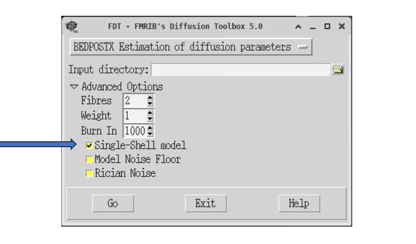
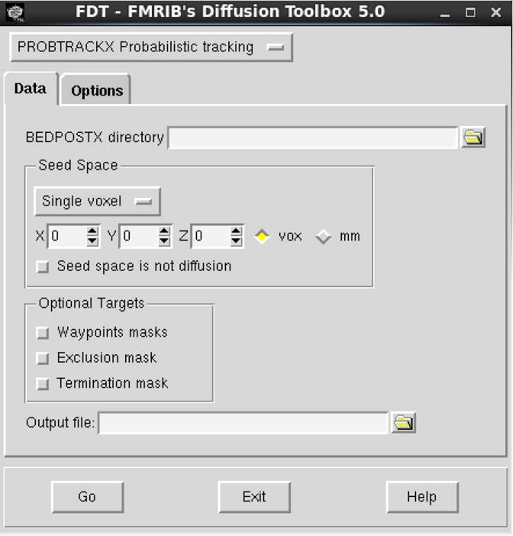

# Probabilistic Tractography

In the first part of the workshop, we will look again at BET, FSL's Brain Extraction Tool.

Brain extraction is a necessary pre-processing step which allows us to remove non-brain tissue from the image. 
It is applied to structural images prior to tissue segmentation and is needed to prepare anatomical scans for the registration of functional MRI or diffusion scans to MNI space. 
BET can be also used to create binary brain masks (e.g., brain masks needed to run diffusion tensor fitting, DTIfit). 

## Skull-stripping our data using BET

<b>In this workshop we will first look at a very simple example of removing non-brain tissues from diffusion and T1 scans (“skull-stripping”) in preparation for the registration of diffusion data to MNI space.</b>

Log into the BlueBEAR Portal and start a BlueBEAR GUI session (2 hours). 

In your session, open a new terminal window and navigate to the `diffusionMRI` data in your `MRICN` folder:

`cd /rds/projects/c/chechlmy-chbh-mricn/xxx/diffusionMRI`  [where XXX=your ADF username]

!!! warning "In case you missed the previous workshop"
    You were instructed to copy the `diffusionMRI` data in the previous workshop. If you have not completed last week's workshop, you either need to find details on how to copy the data in the ['Workshop 3: Basic diffusion MRI analysis'](https://chbh-opensource.github.io/mri-on-bear-edu/workshop3/diffusion-intro/) materials or work with someone who has completed the previous workshop.

Then load FSL and FSLeyes:

```bash
module load FSL/6.0.5.1-foss-2021a-fslpython
module load FSLeyes/1.3.3-foss-2021a
```

We will now look at how to ”skull-strip” the T1 image (remove skull and non-brain areas); this step is needed for the registration step in both fMRI and diffusion MRI analysis pipelines.  

We will do this using BET on the command line. The basic command-line version of BET is:

`bet <input> <output> [options]`

- input = the input image (e.g., T1 scan)
- output = the filename of BET output (e.g., T1_brain)
- options = enable to control how to run BET

In this workshop we will look at a simple brain extraction i.e., <b>performed without changing any default options.</b>

To do this, navigate inside the `p01` folder:

`cd /rds/projects/c/chechlmy-chbh-mricn/xxx/diffusionMRI/DTIfit/p01`

Then in your terminal type:

`bet T1.nii.gz T1_brain`

Once BET has completed (should only take a few seconds at most), open FSLeyes (with & to background it). 
Then in FSLeyes: 

- Load up `T1.nii.gz` and add the `T1_brain` image
- Change the colour for the `T1_brain` to 'Red' or 'Green'

This will likely show that in this case the default brain extraction was good. <b>The reason behind such a good brain extraction with default options is a small FOV and data from a young healthy adult.</b> This is not always the case e.g., when we have a large FOV or data from older participants. 

!!! note "More brain extraction to come? You BET!"
    In the next workshop (Workshop 5) we will explore different BET [options] and how to troubleshoot brain extraction.

## Preparing our data with BEDPOSTX

<b>BEDPOSTX is an FSL tool used for a step in the diffusion MRI analysis pipeline, which prepares the data for probabilistic tractography.</b> BEDPOSTX (Bayesian Estimation of Diffusion Parameters Obtained using Sampling Techniques, X = modelling Crossing Fibres) estimates fibre orientation in each voxel within the brain. BEDPOSTX employs Markov Chain Monte Carlo (MCMC) sampling to reconstruct distributions of diffusion parameters at each voxel.

<b>We will not run it during this workshop as it takes a long time. The data has been processed for you, and you copied it at the start of the previous workshop.</b>

To run it, you would need to open FSL GUI, click on FDT diffusion and from drop down menu select 'BEDPOSTX'. The input directory must contain the distortion corrected diffusion file (`data.nii.gz`), binary brain mask (`nodif_brain_mask.nii.gz`) and two text files with the b-values (`bvals`) and gradient orientations (`bvecs`). 

<p align="center">
  
  <br>
  <em><span style="font-size: 1.1em;">In case of the data being used for this workshop with a single b-value, we need to specify the single-shell model.</span></em>
</p>

After the workshop, in your own time, you could run it using the provided data (see Tractography Exercises section at the end of workshop notes).

BEDPOSTX outputs a directory at the same level as the input directory called `[inputdir].bedpostX` (e.g. `data.bedpostX`). 
It contains various files (including mean fibre orientation and diffusion parameter distributions) needed to run probabilistic tractography.

As we will look at tractography in different spaces, we also need the output from registration. The concept of different image spaces has been introduced in [Workshop 2](https://chbh-opensource.github.io/mri-on-bear-edu/workshop2/workshop2-intro/). 
The registration step can be run from the FDT diffusion toolbox after BEDPOSTX has been run. 
Typically, registration will be run between three spaces: 

1. Diffusion space (`nodif_brain` image) 
2. Structural space (T1 image for the same participant)
3. Standard space (the MNI152 template)

<b>This step has been again run for you.</b> To run it, you would need to open FSL GUI, click on 'FDT diffusion' and from the drop down menu select 'Registration'. 
The main structural image would be your ”skull-stripped” T1 (`T1_brain`) and non-betted structural image would be T1. Plus you need to select `data.bedpostX` as the 'BEDPOSTX directory'.

<br>

<p align="center">
 
</p>

After the workshop, you can try running it in your own time (see Tractography Exercises section at the end of workshop notes).

!!! tip "Registration output directory"
    The outputs from registration needed for probabilistic tractography are stored in the `xfms` subdirectory. 

## Probabilistic tractography using PROBTRACKX

PROBTRACKX (probabilistic tracking with crossing fibres) is an FSL tool used for probabilistic tractography. To run it, you need to open FSL GUI, click on FDT diffusion and from the drop down menu select PROBTRACKX (it should default to it). 

PROBTRACKX can be used to run tractography either in diffusion or non-diffusion space (e.g., standard or structural). 
If running it in non-diffusion space you will need to provide a reference image. You can also run tractography from a single seed (voxel), single mask (ROI) or from multiple masks which can be specified in either diffusion or non-diffusion space. 

<b>We will look at some examples of different ways of running tractography.</b>

First close any processes still running and open a new terminal. Next navigate inside where all the files to run tractography have been prepared for you:

`cd /rds/projects/c/chechlmy-chbh-mricn/xxx/diffusionMRI/tractography/p01`

<b>As you may recall, on BlueBEAR there are different versions of FSL available.</b> These correspond to different FSL software releases and have been compiled in a different way. The different versions of FSL are suitable for different purposes i.e., used for different MRI data analyses. 

To run BEDPOSTX and PROBTRACKX, you need to use a specific version of FSL (FSL 6.0.7.6), which you can load by typing in your terminal:

```bash
module load bear-apps/2022b
module load FSL/6.0.7.6
source $FSLDIR/etc/fslconf/fsl.sh
```

Once you have loaded FSL using these commands, open the FDT toolbox from either the FSL GUI or directly typing in your terminal:

`Fdt &`

<b>We will start with tractography from a single voxel in diffusion space.</b> Specifically, we will run it from a voxel with coordinates **[47, 37, 29]** located within the forceps major of the corpus callosum, a white matter fibre bundle which connects the occipital lobes. 

!!! tip "Running tractography on another voxel"
    Later, you can use the FA map (`dti_FA` inside the `p01/data` folder) loaded to FSLeyes to check the location of the selected voxel, choose another voxel within a different white matter pathway, and run the tractography again. 

You should have the FDT Toolbox window open as below:

<p align="center">
 
</p>

From here do the following: 

1. Select `data.bedpostX` as the 'BEDPOSTX directory'
2. Enter voxel coordinates **[47, 37, 29]** (X, Y, Z)
3. Enter output file name 'corpus' - this we be the name of directory that contains the output files
4. Press Go (you will see something happening in the terminal, once you see window Done!/OK, you are ready to view results. Before proceeding click OK)

After the tractography has finished, check the contents of subdirectory `/corpus` with the tractography output files. It should contain:

- `probtrackx.log` with the `probtrackx` command that was run 
- `fdt_coordinates.text` with used coordinates  
- `corpus_47_37_29.nii.gz` (general structure `outputname_X_Y_Z.nii.gz`; where outputname = name of the subdirectory and X, Y, and Z = the seed voxel coordinates). This file contains for each voxel a count of how many of the streamlines intersected with that voxel. 

We will explore the results later. <b>First, you will learn how to run tractography in the standard (MNI) space.</b>

Close FDT toolbox and then open it again from the terminal to make sure you don’t have anything running in the background.

<b>We will now run tractography using a combination of masks (ROIs) in standard space to reconstruct tracts connecting the right motor thalamus (portion of the thalamus involved in motor function) with the right primary motor cortex.</b> The ROI masks have been prepared for you and put inside the mask subdirectory `~/diffusionMRI/tractography/masks`. The ROIs have been created using FSL's ATLAS tools (you’ve learnt in a previous workshop how to do this) and are in standard/MNI space, thus we will run tractography in MNI (standard) space and not in diffusion space.

<b>This is the most typical design of tractography studies.</b>

In the FDT Toolbox window - before you select your input in the 'Data' tab - go to the 'Options' tab (as below) and reduce the number of samples to 500 under 'Options'. You would normally run 5000 (default) but reducing this number will speed up processing and is useful for exploratory analyses.

<p align="center">
 
</p>

Now going back to the 'Data' tab (as below) do the following:

<p align="center">
 
</p>

1. Select `data.bedpostX` as 'BEDPOSTX directory'
2. In 'Seed Space', change 'Single voxel' to 'Single mask'
3. As 'Seed Image' choose `Thalamus_motor_RH.nii.gz` from the `masks` subdirectory
4. Tick both 'Seed space is not diffusion' and 'nonlinear'
5. You have to use the warp fields between standard space and diffusion space created during registration, which are inside the `data.bedpost/xfms` directory. Select `standard2diff_warp` as 'Seed to diff transform' and `diff2standard_warp` as 'diff to Seed transform'. These files are generated during registration.
6. As a waypoint mask choose `cortex_M1_right.nii.gz` from the `masks` subdirectory to isolate only those tracts that reach from the motor thalamus. Use this mask also as a termination mask to avoid tracking to other parts of the brain.
7. Enter output file name `MotorThalamusM1`
8. Press Go!

!!! warning "Specifying masks"
    Without selecting the waypoint and termination masks, you would also get other tracts passing via motor thalamus, including random offshoots with low probability (noise). This is expected for probabilistic tractography, as the random sampling without specifying direction can result in spurious offshoots into nearby tracts and give low probability noise. 

It will take significantly longer this time to run the tractography in standard space. However, once it has finished, you will see the window 'Done!/OK'. Before proceeding, click 'OK'. 

A new subdirectory will be created with the chosen output name `MotorThalamusM1`. Check the contents of this subdirectory. It contains slightly different files compared to the previous tractography output. The main output, the streamline density map is called `fdt_paths.nii.gz`. There is also a file called `waytotal` that contains the total number of valid streamlines runs.

<b>We will now explore the results from both tractography runs.</b> First close FDT and your terminal as we need FSLeyes, which cannot be loaded together with the current version of FSL.

Next navigate inside where all the tractography results have been generated and load/open FSLeyes:

```bash
cd /rds/projects/c/chechlmy-chbh-mricn/xxx/diffusionMRI/tractography/p01
module load FSLeyes/1.3.3-foss-2021a
fsleyes &
```

We will start with our results from tractography in seed space. In FSLeyes, do the following:

1. Load the FA map (`~/diffusionMRI/tractography/p01/data/dti_FA.nii.gz`) and tractography output file (`~/corpus/corpus_47_37_29.nii.gz`)
2. Change the colour of tractography output to 'Red-Yellow'
3. Change the 'Min' display thresholds to 50 to remove voxels with low probability of being in the tract. The displayed values denote a number of streamlines running through a voxel. If we use default settings, 5000 samples are generated, thus 50 represents a 1% probability, meaning that the voxels that are not shown when "Min" is set to 50 are voxels with a probability (of being part of the tract) of less than 1%. 

Your window should look like this:

<p align="center">
 
</p>

Once you have finished reviewing results of tractography in see space, close the results ('Overlay → Remove all').

We will now explore the results from our tractography ran in MNI space, but to do so we need a standard template. Assuming you have closed all previous images:

1. Load in the MNI template (`~/diffusionMRI/tractography/MNI152T1_brain.nii.gz`) and tractography output file (`/MotorThalamusM1/fdt_paths.nii.gz.`)
2. Change the colour of tractography output to 'Red-Yellow'
3. You might want to add/load the ROI masks ('motor thalamus' and 'M1')
4. Adjust the min and max display thresholds to explore the reconstructed tract. Change the Min display thresholds to 50 to remove voxels with low probability of being in the tract. There is no gold standard for thresholding tractography outputs. It will depend on study design, parameter set up and further analysis.

!!! example "Tractography exercises"
    In your own time, you should try the exercises below to consolidate your tractography skills. If you have any problems completing or any further questions, you can ask for help during one of the upcoming workshops.  

    - <b>Exercise 1:</b> Run tractography using only a single mask i.e., as during the workshop but without waypoint and termination masks (use only `Thalamus_motor_RH.nii.gz` mask as seed image). Compare the results to the output from our tractography we ran during the workshop.
    - <b>Exercise 2:</b> Run tractography with `cortex_M1_right.nii.gz` mask as the seed image and without `Thalamus_motor_RH.nii.gz` as waypoint and termination masks. Compare these results to previous outputs (from thw tractography we ran during the workshop). Are the results the same? Why not? 
    - <b>Exercise 3:</b> In the `mask` subdirectory, you will find two other masks: `LGN_left.nii.gz` and `V1_left.nii.gz`. You can use a combination of these two masks to reconstruct portion of the left hemispheric optic radiation connecting the left lateral geniculate nucleus (LGN) and left primary visual cortex (V1). Hint: use LGN as the seed image and the V1 mask as waypoint and termination masks. 
    - <b>Exercise 4:</b> Use FSL's ATLAS tools to create your own mask(s) and use them for tractography. 
    - <b>Exercise 5:</b> During the workshop there was not enough time to run BEDPOSTX. As suggested earlier try running it using the provided data for participant `p02` (`~/diffusionMRI/tractography/p02/`). It might take ~60-90 minutes to run.
    - <b>Exercise 6:</b> During the workshop there was also not enough time to run the registration needed to perform tractography in non-diffusion space. As suggested earlier try running it using the provided instructions and data for participant `p02` (`~/diffusionMRI/tractography/p02/`). To run it you first need to complete Exercise 5. It will take ~15min to complete registration.  

!!! info "Help and further information"
    As always, more information on diffusion analyses in FSL, can be found on the ['diffusion' section of the FSL Wiki](https://fsl.fmrib.ox.ac.uk/fsl/docs/#/diffusion/index) and this [practical course](https://fsl.fmrib.ox.ac.uk/fslcourse/2019_Beijing/lectures/FDT/fdt2.html) ran by FMRIB (the creators of FSL).