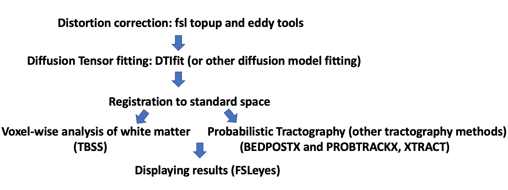

# Workshop 4 - Advanced diffusion MRI analysis

Welcome to the fourth workshop of the MRICN course! 

In the previous workshop we started exploring different elements of the FMRIB's Diffusion Toolbox (FDT).
This week we will continue with the different applications of the FDT toolbox and the use of Brain Extraction Tool (BET).

!!! success "Overview of Workshop 4"
    Topics for this workshop include:

    - Preparing MRI images for diffusion analysis by skull-stripping using BET
    - Using BEDPOSTX to estimate fiber orientations in each brain voxel
    - Running probabilistic tractography with PROBTRACKX to trace white matter pathways between brain regions
    - Visualizing and evaluating tractography results using FSLeyes

We will be working with various previously acquired datasets (similar to the data acquired during the CHBH MRI Demonstration/Site visit). 
We will not go into details as to why and how specific sequence parameters and specific values of the default settings have been chosen. 
Some values should be clear to you from the lectures or assigned on Canvas readings, please check there, or if you are still unclear, feel free to ask. 

Note that for your own projects, you are very likely to want to change some of these settings/parameters depending on your study aims and design. 

In this workshop we will follow basic steps in the diffusion MRI analysis pipeline, specifically with running tractography. 
<b>The instructions here are specific to tools available in FSL. Other neuroimaging software packages can be used to perform similar analyses.</b>

<h2>
<b>Example of Diffusion MRI analysis pipeline</b>
</h2>

 

<b>The copy of this workshop notes can be found on Canvas 39058 - LM Magnetic Resonance Imaging in Cognitive Neuroscience in Week 04 workshop materials.</b>