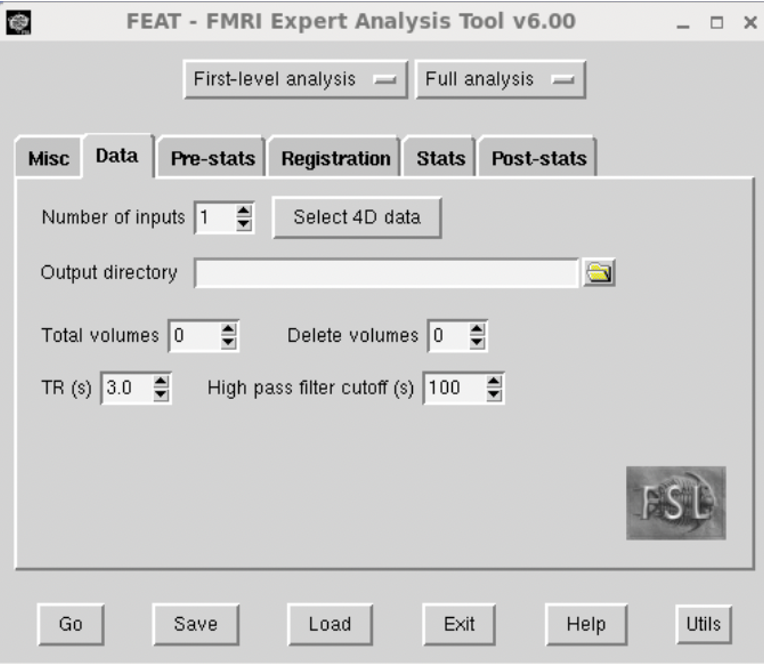
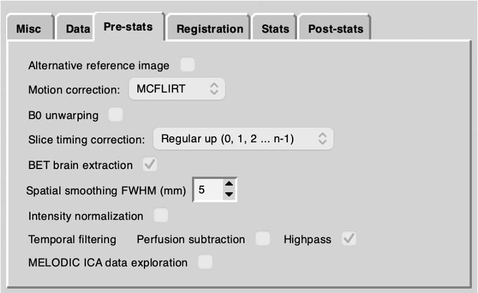
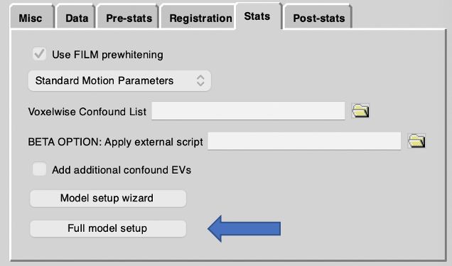
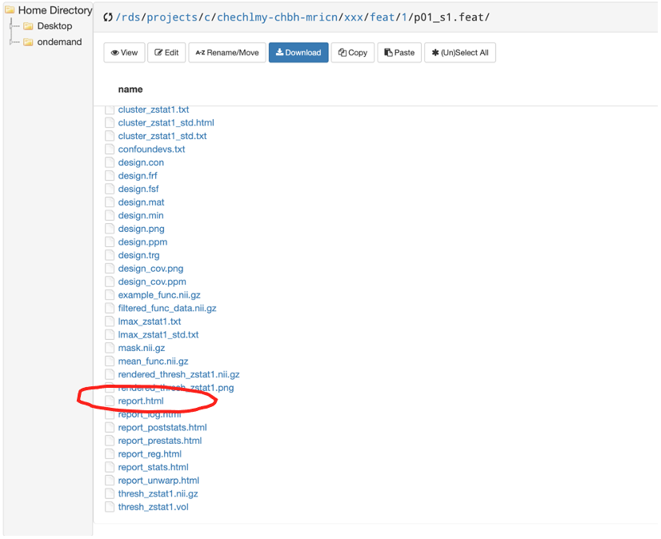
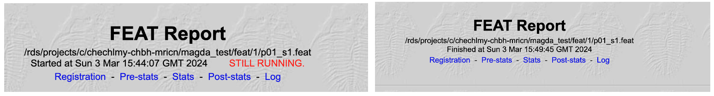
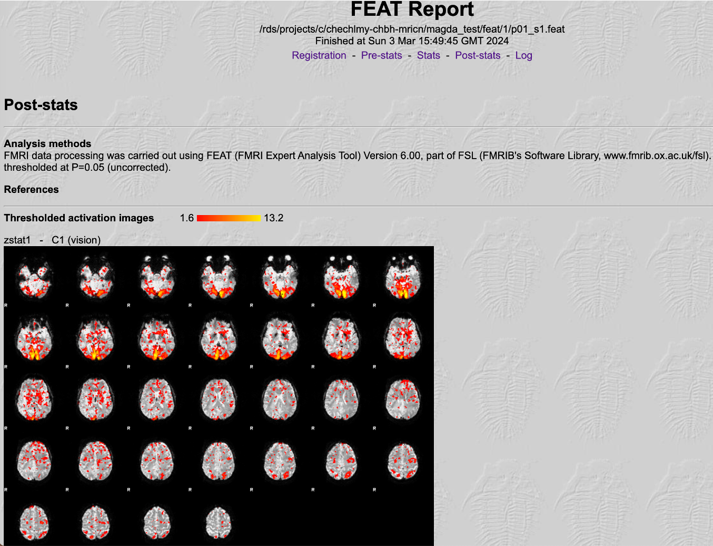
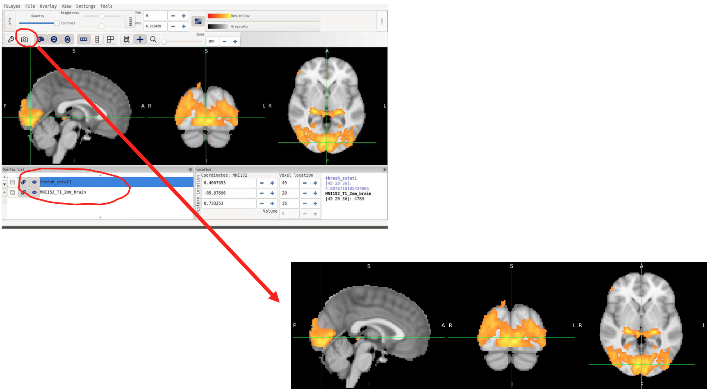

# Running the first-level fMRI analysis

We are now ready to proceed with running our fMRI analysis. We will start with the first dataset (first participant `/p01`) and our first step will be to skull-strip the data using BET.
<b>You should now be able by now to not only run BET but also to troubleshoot poor BET i.e., use different methods to run BET.</b>

The `p01` T1 scan was acquired with a large field-of-view (FOV) (you can check this using FSLeyes; it is generally a good practice to explore the data before the start of any analysis, especially if you were not the person who acquired the data). Therefore, we will apply an appropriate method using BET as per the example we explored earlier. <b>This will be likely the right method to be applied to all datasets in the `/recon` folder but please check.</b>

Open a terminal and use the commands below to skull-strip the T1:

```bash
cd /rds/projects/c/chechlmy-chbh-mricn/xxx/recon/p01
module load FSL/6.0.5.1-foss-2021a
module load FSLeyes/1.3.3-foss-2021a 
immv T1 T1neck 
robustfov -i T1neck -r T1 
bet T1.nii.gz T1_brain -R 
```

Remember that:

- The `immv` command renames the T1 image, and automatically takes care of the filename extensions
- The `robustfov` command crops the image and names it back to `T1.nii.gz`
- The `bet -R` command runs BET recursively

<b>It is very important that after running BET that you examine, using FSLeyes, the quality of the brain extraction process performed on each and every T1.</b>

A poor brain extraction will affect the registration of the functional data into MNI space giving a poorer quality of registered image. This in turn will mean that the higher-level analyses (where functional data are combined in MNI space) will be less than optimal. It will then be harder to detect small BOLD signal changes in the group. 

!!! tip "Re-doing inaccurate BETs"
    Whenever the BET process is unsatisfactory you will need to go back and redo the individual BET extraction by hand, by tweaking the “Fractional intensity threshold” and/or the advanced option parameters for the centre coordinates" and/or the “Threshold gradient”.

You should be still inside the `/p01` folder; please rename the fMRI scan by typing:

`immv fs005a001 fmri1`

## Setting up and running the first-level fMRI analysis using FEAT

We are now ready to proceed with our fMRI data analysis. To do that we will need a different version of FSL installed on BlueBEAR. Close your terminal and again navigate inside the `p01` folder:

`cd /rds/projects/c/chechlmy-chbh-mricn/xxx/recon/p01`

Now load FSL using the commands below:

```bash
module load bear-apps/2022b
module load FSL/6.0.7.6
source $FSLDIR/etc/fslconf/fsl.sh
```

Finally, open FEAT (from the FSL GUI or by typing `Feat &` in a terminal window).

On the menus, make sure 'First-level analysis' and 'Full analysis' are selected. Now work through the tabs, setting and changing the values for each parameter as described below. 
<b>Try to understand how these settings relate to the description of the experiment as provided at the start.</b>

<p align="center">
 
</p>

<h3>Misc Tab</h3>

Accept all the defaults.

<h3>Data Tab</h3>

<b>Input file</b>

The input file is the 4D fMRI data (the functional data for participant 1 should be called something like `fmri1.nii.gz` if you have renamed it as above). Select this using the 'Select 4D data' button. Note that when you have selected the input, 'Total volumes' should jump from 0.

!!! warning "Total volumes troubleshooting"
    If “Total volumes” is still set to 0, or jumps to 1, you have done something wrong. If you get this, stop and fix the error at this point. <b>DO NOT CARRY ON.</b> If “Total volumes” is still set to 0, that means you have not yet selected any data. Try again. If “Total volumes” is set to 1, that means you have most likely selected the T1 image, not the fMRI data. Try again, but selecting the correct file.

Check carefully at this point that the total number of volumes is correct (93 volumes were collected on participants 1-2, 94 volumes on participants 3-15). 

<b>Output directory</b>

Enter a directory name in the output directory. This needs to be something systematic that you can use for all the participants and which is comprehensible. 
It needs to make sense to you when you look at it again in a year or more in the future. It is important here to use full path names. 
It is also very important that you do not use shortened or partial path names and that you do not put any spaces in the filenames you use. 
If you do, these may cause some programs to crash with errors that may not seem to make much sense.

For example, use an output directory name like:

`/rds/projects/c/chechlmy-chbh-mricn/xxx/feat/1/p01_s1`

where:

- `/rds/projects/c/chechlmy-chbh-mricn/xxx/feat` is the top level directory where you intend to put all of your upcoming FEAT analyses for the experiment
- `/rds/projects/c/chechlmy-chbh-mricn/xxx/feat/1` is the sub-directory where you intend to put specifically only the 1st level (per session) FEAT analyses (and not the 2nd or higher level analyses). `p01` refers to participant 1 and `s1` refers to session/scan 1

Note that when FEAT is eventually run this will automatically create a new directory called `/rds/projects/c/chechlmy-chbh-mricn/xxx/feat/1/p01_s1.feat` for you containing the output of this particular analysis. If the directory structure does not exist, FEAT will try and make it. You do not need to make it yourself in advance.

<b>Repetition Time (TR)</b>

For this experiment make sure that the TR is set to 2.0s. If FEAT can read the TR from the header information it will try and set it automatically. If not you will need to set it manually.

<b>High pass filter cutoff</b>

Set 'High pass filter cutoff' to 60sec (i.e. 50% greater than OFF+ON length of time).

<h3>Pre-stats</h3>

<p align="center">
 
</p>

Set the following:

- <b>Alternative reference image checkbox:</b> OFF
- <b>Motion Correction:</b> Select McFLIRT
- <b>B0 unwarping checkbox:</b> OFF 
- <b>Slice timing:</b> Select “Regular up” (Some researchers advise against slice timing correction, however we will use it here to illustrate the process).
- <b>Bet brain extraction checkbox:</b> ON
- <b>Spatial smoothing:</b> 5mm
- <b>Intensity normalization:</b> OFF
- <b>Temporal filtering – Perfusion Subtraction checkbox:</b> OFF
- <b>Highpass checkbox:</b> ON 
- <b>Melodic ICA data exploration checkbox:</b> OFF

<h3>Stats</h3>

<p align="center">
 
</p>

Set the following:

- <b>Use FILM prewhitening checkbox:</b> ON
- <b>Motion parameters:</b> Select the option “Standard Motion Parameters”
- <b>Voxelwise confound List:</b> Leave empty
- <b>Apply external script:</b> Leave empty
- <b>Add additional confound EVs checkbox:</b> OFF 

Select the 'Full model setup' option (depicted on the blue arrow above); and then on the 'EVs' tab:

- <b>1 EV (Explanatory variable) name:</b> vision
- <b>Basic shape:</b> square
- <b>Skip:</b> 0s
- <b>OFF:</b> 20s 
- <b>ON:</b> 20s 
- <b>phase</b>: 0 
- <b>stop:</b> 180
- <b>Convolution:</b> select defaults (Gamma: 0,3,6)

On the Contrasts Tab: 

- We have 1 contrast, name it 'vision', and then click done

Check the plot of the design that will be generated and then click on the image to dismiss it.

<h3>Post-stats</h3>

Change the 'Thresholding' pull down option to be of type 'Uncorrected' and leave the P threshold value at p<0.05. 

!!! note "Thresholding and processing time"
    Note this is not the correct thresholding that you will want at the final (third stage) of processing (where you will probably want 'Cluster thresholding') but for the convenience of the workshop, at this stage it will speed up the processing per run. 

<h3>Registration</h3>

Set the following:

- Click the checkbox for 'Main structural image' and choose the BET’ed anatomical (i.e. participant 1's `T1_brain.nii.gz`) as the main structural image with 'Linear Options: Normal search, BBR'
- Accept the default as the standard brain with 'Linear Options: Normal search, 12 DOF'
- Make sure the 'Nonlinear' checkbox is set to 'OFF'

The model should now be set up with all the correct details and be ready to be analyzed.

<b>Hit the GO button!</b>

!!! tip "Running FSL on BlueBEAR"
    FSL jobs are now submitted in an automated way to a back-end high performance computing cluster on BlueBEAR for execution. Processing time for this analysis will vary but will probably be about 5 mins per run.

## Monitoring and viewing the results

FEAT has a built-in progress watcher, the 'FEAT Report', which you can open in a web browser. 

To do that, you need to navigate inside the `p01_s1.feat` folder from the BlueBEAR Portal as below and from there select the `report.html` file, and either open it in a new tab or in a new window. 

<p align="center">
 
</p>

Watch the webpage for progress. Refresh the page to update and click the links (the tabs near the top of the page) to see the results when available (the 'STILL RUNNING' message will disappear when the analysis has finished).

<p align="center">

</p>
<p align="center"><i style="font-size: 1.2em;">Example FEAT Reports for processes that are still running, and which have completed.</i></p>

After it has completed, first look at the webpage, click on the various links and try to understand what each part means.

<p align="center">
 
</p>

<b>Now let's use FSLeyes to look at the output in more detail.</b> To do that you will need to open a separate terminal and load FSLeyes:

```bash
cd /rds/projects/c/chechlmy-chbh-mricn/xxx/recon/p01
module load FSL/6.0.5.1-foss-2021a-fslpython
module load FSLeyes/1.3.3-foss-2021a
fsleyes &
```

Open the `p01_s1.feat` folder and select the `filtered_func_data` (this is the fMRI data after it has been preprocessed by motion correction etc). 

<b>Put FSLeyes into movie mode and see if you can identify areas that change in activity.</b>

<b>Now, add the `thresh_zstat1` image and try to identify the time course of the stimulation in some of the most highly activated voxels.</b> You should remember how to complete the above tasks from [previous workshops](https://chbh-opensource.github.io/mri-on-bear-edu/workshop2/visualizing-mri-data/). You can also use the “camera” icon to take a snapshot of the results.

<p align="center">
 
</p>

<h2>Seeing the effect of other parameters</h2>

Let's have a look and see the effects that other parameters have on the data. To do this, do the following steps:

- Open FEAT (either through the GUI or using the terminal by typing `Feat &`)
- Press the 'Load' button and open the `design.fsf` file in the `p01_s1.feat` directory for the first participant
- Change <b>any one</b> of the parameters – some make very little difference but ones that should have some difference are: 
    - Motion parameters: change from 'Standard Motion Parameters' to 'Don't Add Motion Parameters'
    - Spatial smoothing (previously set to 5mm): try increasing to 10mm
    - High pass filter: set to 30sec (i.e. 50% less than OFF+ON time period). 
- Hit 'Go'

<b>Note that each time you rerun FEAT, it creates a new folder with a '+' sign in the name.</b> So you will have folders rather messily named `p01_s1.feat`, `p01_s1+.feat`, `p01_s1++.feat`, and so on. This is rather wasteful of of your precious quota space, so you should delete unnecessary ones after looking at them. 

For example, if you wanted to remove all files and directories that end with '+' for participant 1:

```bash
cd /rds/projects/c/chechlmy-chbh-mricn/xxx/feat/1/ 
rm -rf *+
```

You might want also to change the previous output directory name to have a more meaningful name in order to make it more obvious what parameter has changed, e.g. `p01_s1_motion_off.feat`.

<h2>Analysing other participants' data</h2>

For participant 2, you will need to repeat the main steps above:

- Rename the files to be consistent with your naming scheme for participant `p01` 
- Skull strip the reoriented T1 scan (and check it is done properly)
- Run FEAT

To rerun a FEAT analysis, rather than re-entering all the model details:

- Open FEAT, press the 'Load' button and open the 'design.fsf' file in the FEAT directory from participant `p01`

Now change the input 4D file, the output directory name, and the registration details (the BET'ed reoriented T1 for participant 2), and hit 'Go'.

!!! note "Design files"
    You can also save the design files (`design.fsf`) using the 'Save' button on the FEAT GUI. You can then edit this in a text editor, which is useful when running large group studies. You can also run FEAT from the command line, by giving it a design file to use e.g., `feat my_saved_design.fsf`. We will take a look at modifying `design.fsf` files directly in the [Functional Connectivity workshop](https://chbh-opensource.github.io/mri-on-bear-edu/workshop8/functional-connectivity/).

!!! example "Running a first-level analysis on the remaining participants"
    In your own time, you should analyse the remaining participants as above. 

    Remember:

    - Participants 1-2 have only one fMRI run each (i.e. 2 people x 1 run each = 2 runs)
    - Participant 5 has 3 fMRI runs (i.e. 1 person x 3 runs = 3 runs)
    - Participants 3-4 and 6-15 have 2 fMRI runs each (i.e. 12 people x 2 runs = 24 runs)

    <b>There are therefore 29 separate analyses that need to be done.</b>
    
    Analyze each of these 29 fMRI runs independently and put the output of each one into a separate, clearly labelled directory as suggested above. 
    
    Try and get all these done before the next fMRI workshop in week 10 on higher level fMRI analysis as you will need this processed data for that workshop. You have two weeks to complete this task. 

!!! tip "Scripting your analysis"
    It will seem laborious to re-write and re-run 29 separate FEAT analyses; a much quicker way is by scripting our analyses using `bash`. If you would like, try scripting your analyses! We will learn more about `bash` scripting in [the next workshop](https://chbh-opensource.github.io/mri-on-bear-edu/workshop6/workshop6-intro/).

As always, help and further information is also available on the relevant section of the [FSL Wiki](https://fsl.fmrib.ox.ac.uk/fsl/docs/#/task_fmri/feat/index).
