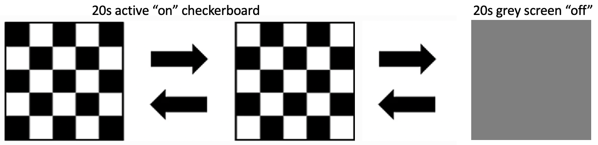
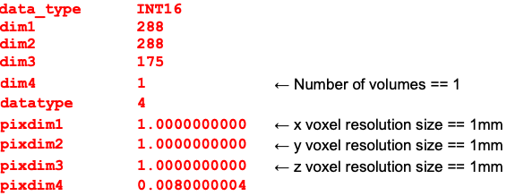

# Troubleshooting brain extraction with BET

In the first part of the workshop, you will learn the proper skull-stripping of T1 scans using FSL's Brain Extraction Tool (BET), including troubleshooting techniques for problematic cases, as well as organizing neuroimaging data files through proper naming conventions. 

<h2>Background and set-up</h2>

<b>The data that we will be using are data collected from 15 participants scanned on the same experimental protocol on the Phillips 3T scanner (our old scanner).</b>

The stimulus protocol was a visual checkerboard reversing at 2Hz (i.e., 500ms between each reversal) and was presented alternately (20s active “on” checkerboard, 20s grey screen “off”), 
starting and finishing with “off” and including 4 blocks of “on” (i.e., off, on, off, on, off, on, off, on, off) = 180 sec. 

A few extra seconds of “off” (6-8s) were later added at the very end of the run to match the number of volumes acquired by the scan protocol.

<p align="center">
 
</p>

Normally in any experiment it is very important to keep all the protocol parameters fixed when acquiring the neuroimaging data. 
However, in this case we can see different parameters being used which reflect slightly different “best choices” made by different operators over the yearly demonstration sessions:

- The repetition time and voxel size were the same for all scans: (TR = 2000 ms, voxel size 2.5 x 2.5 x 2.5mm).
- However, 93 volumes were collected on participants 1-2, 94 volumes on all later participants.
- The first 11 participants were scanned with an 8-channel head coil, acquiring 32 slices in ascending order, whilst participants 12-15 were scanned with a 32-channel head coil, acquiring 30 slices in ascending order. 
- Each participant always also had a planning scan (i.e., so called anatomical localizer, this was always scan 1 and can be ignored), a T1 anatomical scan and one or more fMRI scans. 
- Participants 1-2  performed only 1 functional sequence, participants 3-4 and 6-15 performed 2 functional sequences, and participant 5 performed 3 functional sequences. 

!!! note "Sequence order"
    Note that sometimes the T1 was the first scan acquired after the planning scan, sometimes it was the very last scan acquired.

Now that we know what the data is, let's start our analyses. Log in into the BlueBEAR Portal and start a BlueBEAR GUI session (2 hours). You should know how to do it by now from previous workshops. 

Open a new terminal window and navigate to your MRICN project folder:

`cd /rds/projects/c/chechlmy-chbh-mricn/xxx`  [where XXX=your ADF username] 

Please check that you are in the correct directory by typing `pwd`. This should return: 

`/rds/projects/c/chechlmy-chbh-mricn/xxx` (where XXX = your login username)

You now need to create a copy of the reconstructed fMRI data to be analysed during the workshop but in your own MRICN folder. To do this, in your terminal type:

`cp -r /rds/projects/c/chechlmy-chbh-mricn/module_data/recon/ .`

<b>Be patient as this might take few minutes to copy over.</b> In the meantime, we will revisit BET and learn how to troubleshoot the often problematic process of 'skull-stripping'.

## Skull-stripping T1 scans using BET on the command-line
We will now look at how to ”skull-strip” the T1 image (remove the skull and non-brain areas), as this step is needed as part of the registration step in the fMRI analysis pipeline. 
We will do this using FSL's BET on the command line. As you should know from previous workshops the basic command-line version of BET is: 

(do not type this command, this is just a reminder)

`bet <input> <output> [options]`

where:

- input = you need to specify input image (e.g., `T1_scan`)
- output = filename of BET output (e.g., `T1_brain`)
- options = controls how to run BET

<b>We will firstly explore the different options and how to troubleshoot brain extraction.</b>

If the fMRI data has finished copying over, you can use the same terminal which you have previously opened. 
If not, keep that terminal open and instead open a new terminal, navigating inside your MRICN project folder (i.e., `/rds/projects/c/chechlmy-chbh-mricn/xxx`)

Next you need to copy the data for this part of the workshop. As there is only 1 file, it will not take a long time. Type:

`cp -r /rds/projects/c/chechlmy-chbh-mricn/module_data/BET/ .`

And then load FSL and FSLeyes by typing:

```bash
module load FSL/6.0.5.1-foss-2021a
module load FSLeyes/1.3.3-foss-2021a
```

After this, navigate inside the copied BET folder and type:

`bet T1.nii.gz T1_brain1`

Open FSLeyes (`fsleyes &`), and when this is open, load up the T1 image, and add the `T1_brain1` image. Change the colour for the `T1_brain1` to Red. 

<b>This will likely show that the default brain extraction was not very good and included non-brain matter.</b> It may also have cut into the brain and thus some part of the cortex is missing. The reason behind the poor brain extraction is a large field-of-view (FOV) (resulting in the head plus a large amount of neck present). 

There are different ways to fix a poor BET output i.e., problematic ”skull-stripping”.

<b>First of all, you can use the `-R` option. </b>

This option is used to run BET in an iterative fashion which allows it to better determine the centre of the brain itself. 

In your terminal type:

`bet T1.nii.gz T1_brain2 -R`

!!! note "Running BET recursively from the BET GUI"
    Instead of using the `bet -R` command from the terminal, you can also use the BET GUI. To run it this way, you would need to select the processing option “Robust brain centre estimation (iterates bet2 several times)” from the pull down menu.

You will find that running BET with `-R` option takes longer than before because of the extra iterations. Reload the newly extracted brain (`T1_brain2`) into FSLeyes and check that the extraction now looks improved. 

In the case of T1 images with a large FOV, you can first crop the image (to remove portion of the neck) and run BET again. To do that you need to use command `robustfov` before applying BET. But first rename the original image. 

Type in your terminal:

``` bash
immv T1 T1neck` 
robustfov -i T1neck -r T1 
bet T1.nii.gz T1_brain3 -R 
```

- The first command renames the T1 image, and automatically takes care of the filename extensions.
- The second command crops the image and names it back to `T1.nii.gz`
- The third command runs BET again with the recursive `-R` option.

Reload the newly extracted brain (`T1_brain3`) into FSLeyes and compare it to `T1_brain1` and to check that the extraction looks improved. Also compare the cropped T1 image to the original one with a large FOV (`T1neck`). 

Another option is to leave the large FOV and to manually set the initial centre by hand via the `-c` option on the command line. 
To do that you need to firstly examine the T1 scan in FSLeyes to get a rough estimation (in voxels) of where the centre of the brain is. 

There is another BET option which can improve ”skull stripping”: the fractional intensity threshold, which by default is set to 0.5. 
You can change it from any value between 0-1. <b>Smaller values give larger brain outline estimates (and vice versa).</b>
Thus, you can make it smaller if you think that too much brain tissue has been removed. 

To use it, you would need to use the `-f` option (e.g., `bet T1.nii.gz T1_brain -f 0.3`). 

!!! example "Changing the fractional intensity"
    In your own time (after the workshop) you can check the effect of changing the fractional intensity threshold to 0.1 and 0.9 (however make sure you name the outputs accordingly, so you know which one is which).

<b>It is very important that after running BET you always examine (using FSLeyes) the quality of the brain extraction process performed on each and every T1. </b>

The strategy you might need to use could be different for participants in the same study. You might need to try different options. The general recommendation is to combine the cropping (if needed) and the `-R` option. 
<b>However, it may not work for all T1 scans, some types of T1 scans work better with one strategy than with another. Therefore, it is good to always try a range of options.</b>

Now you should be able to “skull-strip” T1 scans as needed for fMRI analyses!

## Exploring the data and renaming the MRI scan files
By now you should have a copy of the reconstructed fMRI data in your own folder. As described above, the `/recon` version of the directory contains the MRI data from 15 participants acquired over several years from various site visits. 

The datasets have been reconstructed into the NIFTI format. The T1 images in each directory are named `T1.nii.gz`. The first (planning) scan sequences (localisers) have been removed in each directory as these will not be needed for any subsequent analysis we are doing.

Navigate inside the `recon` folder and list the contents of these directories (using the `ls` command) to make sure they actually contain imaging files. Note that all the imaging data here should be in NIFTI format. 

You should see the set of  participant directories labelled `p01`, `p02` etc., all the way up to the final directory,`p15`.

The directory structure should look like this:

```bash
~/chechlmy-chbh-mricn/xxx/recon/
                              ├── p01/
                              ├── p02/
                              ├── p03/
                              ├── p04/
                              ├── p05/
                              ├── ...
                              ├── p13/
                              ├── p14/
                              └── p15/
```

!!! warning "Verifying the data structure"
    Please verify that you have this directory structure before proceeding!

Explore what’s inside each participant folder. Please note that each participant folder only contains reconstructed data. <b>It’s a good idea to store raw and reconstructed data separately.</b> At this point you should have access to reconstructed participants `p01` to `p15`. The reconstructed data should be in folders named `~/chechlmy-chbh-mricn/xxx/recon/p01` etc. 

However, apart from the T1 images that have been already renamed for you, the other reconstructed files in this directory will have unusual names, created automatically by the `dcm2nii` conversion program. 

You can see this by typing into your terminal:

```bash
cd /rds/projects/c/chechlmy-chbh-mricn/xxx/recon/p03 
ls
```

Which should list:

```bash
fs004a001.nii.gz
fs005a001.nii.gz
T1.nii.gz
```

<b>It is poor practice to keep with these names as they do not reflect the actual experiment and will likely be a source of confusion later on.</b> We should therefore rename the files to be something meaningful.
 For this participant (`p03`) the first fMRI scan is file 1 (`fs004001.nii.gz`) and the second fMRI scan is file 2 (`fs005a001.nii.gz`). Rename the files as follows (to do that you need to be inside folder `p03`):

```bash
immv fs004a001 fmri1 
immv fs005a001 fmri2
```

!!! example "Renaming files"
    Notes:

    - The 'immv' command is a special FSL Linux command that works just like the standard Linux `mv` command except that it automatically takes care of the filename extensions. It saves from having to write out:
    `mv fs004a001.nii.gz fmri1.nii.gz` which would be the standard Linux command to rename a file.
    - You can of course name these files to anything you want. In principle, you could call the fMRI scan `run1` or `fmri_run1` or `epi1` or whatever. <b>The important thing is that you need to be extremely consistent in the naming of files for the different participants.</b>

For this workshop we will use the naming convention above and call the files `fmri1.nii.gz` and `fmri2.nii.gz`.

As the experimenter you would normally be familiar with the order of acquisition of the different sequences and therefore the order of the resulting files created, including which one is the T1 image. You would write these down in your research log book whilst acquiring the MRI data. But sometimes, as here, if data is given to you later it may not be clear which particular file is the T1 image. 

There are several ways to figure this out:

1. The very first file will always (unless it has been deleted before it got to you) be a planning scan (localizer). This can be ignored. In general, the <b>T1 image is very likely to be either the second file or the very last file.</b>
2. If you look at the list of file sizes (using `ls -al`) you should be able to see that <b>the T1 image is smaller than most typical EPI fMRI images</b>. Also, if there are more than one fMRI sequences (as here with `p03` onwards) you will also see that several files have the same file size and the odd one out is the T1.
3. If you <b>load the images into FSLeyes and look at them individually</b> it should be very obvious which image is the T1. Remember the T1 image is a single volume, in high spatial resolution. It will also likely have a much larger field of view (showing all of the skull and part of the spine). The fMRI images will consist of many volumes (click through several volumes to check), be of lower spatial resolution (it will look coarser) and have a more limited field of view.

If you have access to the NIFTI format files (`.nii.gz` as we have here) then you can use one of the FSL command line tools (in a terminal window) called `fslinfo` to examine the protocol information on the file. 
This will show you the number of volumes in the acquisition (remember this is 1 volume for a T1 image) as well as other information about the number of voxels and the voxel size. 

Together this information is sufficient to work out which file is the T1 and which are the fMRI sequence(s). 

For example if you type the following in your terminal:

```bash
cd ..
cd p08 
fslinfo fs005a001.nii.gz
```

You should see something like the image below:

<p align="center">
 
</p>

Before proceeding to the next section on running a first-level fMRI analysis, close your terminal.