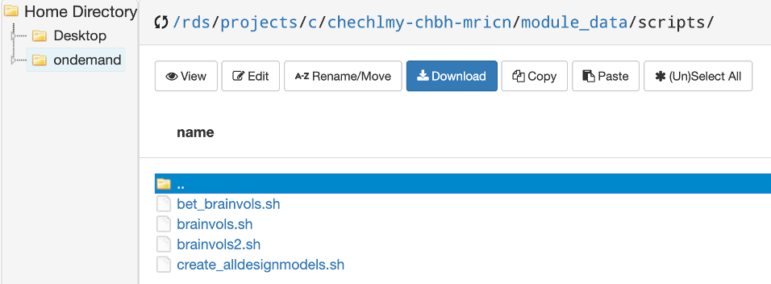
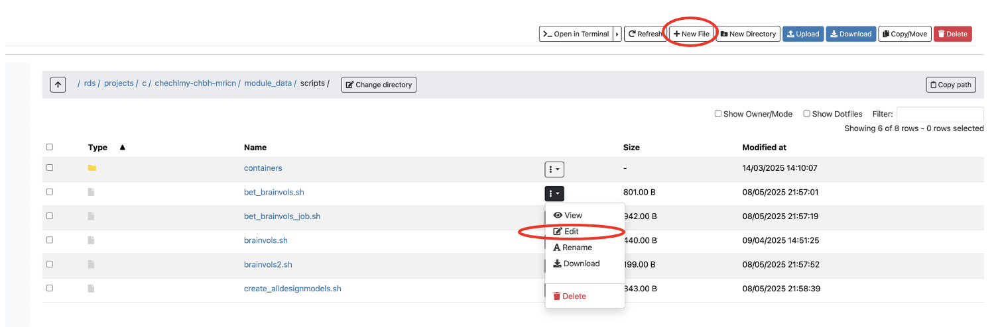
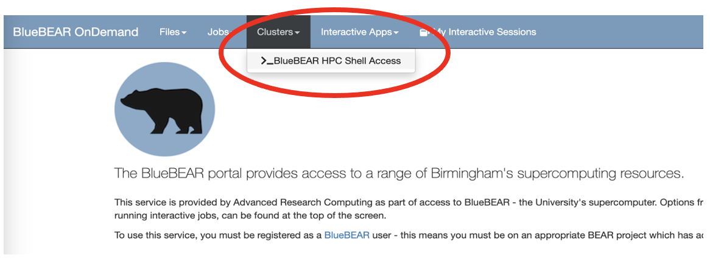

# Scripting analyses, submitting jobs on the cluster, and running containers

## Introduction to scripting

Script files are text files that contain Linux command-line instructions that are equivalent to typing a series of commands in the terminal or the equivalent using the software GUI (e.g., FSL GUI). <b>By scripting, it is possible to automate most of the FSL processing, including both diffusion MRI and fMRI analysis.</b> In the previous workshop you were learning how to set up a first level fMRI model for a single experimental run for one participant. Subsequently, in your own time, you were asked to repeat that process for other participants (15 participants in total), some participants with 2 or 3 experimental runs. 

The notes below provide a basic introduction to Linux (bash) scripting as well as some guidelines and examples on how to automate the first-level analysis as you might want to do when completing the Data Analysis assignment.

To do this, we have provided some basic info and script examples. You can use the examples when analysing the remaining participants' data (the task you were given to complete at the end of the previous workshop) if you have not done it already. If you have already done so, you can either repeat that process by scripting, or apply it to your assessment. But you can also complete all these tasks without scripting. 

All the example scripts shown below are in the folder:

```bash
/rds/projects/c/chechlmy-chbh-mricn/module_data/scripts
```

<p align="center">
 
</p>

To start please copy the entire folder into your module directory. <b>Please note that to run some of the scripts as per examples below, you will need to load FSL, something you should know how to do.</b>

A script can be very simple, containing just commands that you already know how to use, with each command put on a separate line. To create a script for automating FSL analysis, the most widely used language is `bash` (`shell`). To write a `bash` script you need a plain text editor (e.g., vim, nano). If you are not familiar with using a text editor in Linux terminal, there is a simple way of creating and/or editing scripts using the BlueBEAR portal.

You can start a new script by clicking on “New File” and naming it for example “`my_script.sh`” and next clicking on “Edit” to start typing commands you want to use. You can also use “Edit” to edit existing scripts. 

<p align="center">
 
</p>

!!! tip "The shebang"
    The first line of every `bash` script should be `#!/bin/bash`. This is the 'shebang' or 'hashbang' line. It tells the system which interpreter should be used to execute the script.

Suppose we want to create a very simple script repeatedly using one of the FSL command line tools. Let's say that we want to find out what is the volume for each of the T1 brains in our experiment. The FSL command that will tell us this is `fslstats`, together with the `-V` option which lists the number and volume of non-empty voxels. 

To create this script, you would type the text below as in the provided `brainvols.sh` script example. To view it, select this script and click on 'Edit'. Alternatively, you can start a new file and copy the commands as shown below. (In the actual script you would need to replace `xxx` with the name of your own directory).

```bash
#!/bin/bash

cd rds/projects/c/chechlmy-chbh-mricn/xxx/recon
fslstats p01/T1_brain -V
fslstats p02/T1_brain -V
fslstats p03/T1_brain -V
fslstats p04/T1_brain -V
fslstats p05/T1_brain -V
fslstats p06/T1_brain -V
fslstats p07/T1_brain -V
fslstats p08/T1_brain -V
fslstats p09/T1_brain -V
fslstats p10/T1_brain -V
fslstats p11/T1_brain -V
fslstats p12/T1_brain -V
fslstats p13/T1_brain -V
fslstats p14/T1_brain -V
fslstats p15/T1_brain -V
```

Whether you are editing or creating a new script, you need to save it. After saving, exit the editor. 

Next you need to make the script executable (as below) and remember the script will run in the current directory (`pwd`). You also need to make the script executable if you copied a script from someone else.

To make your script executable type in terminal: `chmod a+x brainvols.sh`

!!! warning "Running the script without permissions"
    If you try to run the script without making it executable, you will get a permission error. 

To run the script, type in your terminal `./brainvols.sh`

You can now tell which participant has the biggest brain.

The previous script hopefully worked. But it is not very elegant and is not much of an improvement over typing the commands one at a time in a terminal window. <b>However, the `bash` scripting language that we are using provides an extra layer of simple program commands that we can use in combination with the FSL commands we want to run.</b> In this way we can make our scripts more efficient:

- In the `brainvols.sh` script above it would be better to replace the above `fslstats` lines of code – which basically do the same thing but with a different participant – with a loop of some kind. 

- Also, it would be helpful to print out some text so that we know which line of output on the screen relates to which participant. 

Bash has a `for … do ... done` construct to do the former and an `echo` command to do the latter. So, let's use these to create an improved script with a loop. This is illustrated in the example `brainvols2.sh`:

```bash
#!/bin/bash

cd rds/projects/c/chechlmy-chbh-mricn/xxx/recon
for p in p01 p02 p03 p04 p05 p06 p07 p08 p09 p10 p11 p12 p13 p14 p15
do
    echo -n "Participant ${p}: "
    fslstats ${p}/T1_brain -V
done
```

Both examples above assume that you have already run BET (brain extraction) on T1 scans. But of course, you could also automate the process of brain extraction and complete both tasks, i.e., running bet and calculate volume, using a single script. This is illustrated in the example `bet_brainvols.sh`:

```bash
#!/bin/bash

# navigate to the folder containing the T1 scans
cd rds/projects/c/chechlmy-chbh-mricn/xxx/recon

# a for loop over participant data files
for participant_num in p01 p02 p03 p04 p05 p06 p07 p08 p09 p10 p11 p12 p13 p14 p15

# do the following ...
do
    # show the participant number 
    printf "Participant ${participant_num}: \n"
    
    # delete the old extracted brain image (we can see this
    # happen in real time in the file explorer)
    rm ${participant_num}/T1_brain.nii.gz
    
    # extract the brain from the T1 image
    bet ${participant_num}/T1.nii.gz ${participant_num}/T1_brain
    
    # list the number of non-empty brain voxels
    fslstats ${participant_num}/T1_brain -V
# end the loop
done

# ============================================================
# END OF SCRIPT
```

Some of the most powerful scripting comes when manipulating FEAT model files. <b>When you create a design for a first level fMRI analysis in the FEAT GUI and press the 'Go' button, FEAT writes out the model analysis file into the output directory.</b> The name for this saved file is `design.fsf`. Once you have created one of these files, you can load it back into FEAT and modify only the parts that are different between the different analyses and then resave it e.g., change parameters or change it for another participant (see workshop materials covering first level of fMRI analysis).

<b>Alternatively, since `design.fsf` is a text file it can also be opened (and edited) in a text editor.</b> Because the experiment – and therefore the model design – is almost the same for all participants, there is very little difference in the `design.fsf` files between the level one analyses for different participants. In fact, if following the directory structure naming convention suggested in the workshop, the only thing that changes for a particular run is the identifier of the participant. 

So, if we copy the design file for `p01`'s first scan (i.e. the file `feat/1/p01_s1.feat/design.fsf`), open it up in a text editor, search and replace every instance of `p01` with `p02` and then save it, we should have the model file for `p02`'s first scan. The only differences should be in:

- The 4d input EPI file: `/recon/p01/fmri1` → /recon/p02/fmri1

- The output directory: `/feat/1/p02_s1` → `/feat/1/p02_s1`

- The registration: `/recon/p01/T1_brain` → `/recon/p02/T1_brain`

In general, all the model files will only differ by the participant identifiers (`p01-p15`) the identifiers we've used for the particular scan number (`s1`, `s2` and `s3` for output directories, and `fmri1`, `fmri2` and `fmri3` in the input EPI file names). 

The special cases are the scans for the first two participants. These scans were only 93 volumes long, whereas all the rest of the scans following this are 94 volumes long. <b>However, given the above information and the model file for participant 1, scan 1, we can now create a script that will generate all other model files.</b> 

Firstly, let's create a new directory (`models`) where you will keep your model files. Navigate to your folder (`/rds/projects/c/chechlmy-chbh-mricn/xxx/`) and type:

`mkdir models`

Now copy the script `create_alldesignmodels.sh` into that folder. The script contains the following code:

```bash
#!/bin/bash

# Copy over the saved model file for p01 scan 1
cp /rds/projects/c/chechlmy-chbh-mricn/xxx/feat/1/p01_s1.feat/design.fsf p01_s1.fsf

# Create model file for p02 scan1
cp p01_s1.fsf p02_s1.fsf
perl -i -p -e 's/p01/p02/' p02_s1.fsf

# Create model files for p03-p15 scan 1
for p in p03 p04 p05 p06 p07 p08 p09 p10 p11 p12 p13 p14 p15
do
    cp p01_s1.fsf ${p}_s1.fsf
    perl -i -p -e "s/p01/${p}/" ${p}_s1.fsf
    perl -i -p -e 's/93/94/' ${p}_s1.fsf
done

# Create model files for p03-p15 scan 2
for p in p03 p04 p05 p06 p07 p08 p09 p10 p11 p12 p13 p14 p15
do
    cp ${p}_s1.fsf ${p}_s2.fsf
    perl -i -p -e 's/_s1/_s2/' ${p}_s2.fsf
    perl -i -p -e 's/fmri1/fmri2/' ${p}_s2.fsf
done

# Create model files for p05 scan 3
cp p05_s1.fsf p05_s3.fsf
perl -i -p -e 's/_s1/_s3/' p05_s3.fsf
perl -i -p -e 's/fmri1/fmri3/' p05_s3.fsf
```

Edit (hint: replace the `xxx`), and save the file, make it executable, and then run it. 

If it has worked you should now have a directory full of model files. Each of them can be run from the command line with a command such as `feat p01_s1.fsf` or with a script (you should be able to create such script using the earlier example).

!!! tip "FSL's scripting tutorial"
    You can find more information and other examples on [FSL's scripting tutorial](https://open.win.ox.ac.uk/pages/fslcourse/lectures/scripting/) webpage.

## Submitting jobs to the cluster

The first part of this workshop introduced you to running `bash` scripts using the terminal in the BlueBEAR GUI. However, in addition to running `bash` scripts in this way, you can also create scripts and run analysis jobs directly on the cluster with Slurm (BlueBEAR's high performance computing (HPC) scheduling system). 

!!! info "What is Slurm?"
    Understanding how Slurm works is beyond the scope of this course, and is not strictly necessary, but you can find out more by reading the official Slurm [documentation](https://slurm.schedmd.com/documentation.html).

In previous workshops we were using BlueBEAR Portal to launch BlueBEAR GUI Linux desktop and from there the built-in terminal. As mentioned in workshop 1, you can also use BlueBEAR Portal to jump directly on BlueBEAR terminal, to access one of the available login nodes and from there, run analysis jobs. 

<p align="center">
 
</p>

While the BEAR Portal provides a convenient web-based access to a range of BlueBEAR services, you don’t have to go via this portal, but can instead use the command line to access BlueBEAR through one of the multiple login nodes, available from the address [bluebear.bham.ac.uk](http://bluebear.bham.ac.uk/).

Exactly how you do that will depend on the type of the operating system your computer uses; you can find detailed information about Accessing BlueBEAR using the command line from [this link](https://docs.bear.bham.ac.uk/bluebear/accessing/).

The process of submitting and running jobs on the cluster is exactly the same whether using the BlueBEAR terminal via the “Clusters” tab on the BlueBEAR portal or using the command line. To run a job with Slurm (BlueBEAR HPC scheduling system) you first need to prepare a job script and then submit using the command `sbatch`.

In the first part of this workshop you have learned how to create `bash` scripts to automate FSL analyses; in order to turn these scripts into the job script for Slurm, you need to add a few additional command lines. This is illustrated in the example below: `bet_brainvols_job.sh`

```bash
#!/bin/bash

#SBATCH --qos=bbdefault
#SBATCH --time=60
#SBATCH --ntasks=5

module purge; module load bluebear
module load FSL/6.0.5.1-foss-2021a

set -e

# navigate to the folder containing the T1 scans
cd rds/projects/c/chechlmy-chbh-mricn/xxx/recon

# a for loop over participant data files
for participant_num in p01 p02 p03 p04 p05 p06 p07 p08 p09 p10 p11 p12 p13 p14 p15
do
    # do the following...

    # show the participant number
    printf "Participant ${participant_num}: \n"

    # delete the old extracted brain image (we can see this
    # happen in real time in the file explorer)
    rm ${participant_num}/T1_brain.nii.gz

    # extract the brain from the T1 image
    bet ${participant_num}/T1.nii.gz ${participant_num}/T1_brain

    # list the number of non-empty brain voxels
    fslstats ${participant_num}/T1_brain -V

# end the loop
done

# ============================================================
# END OF SCRIPT
```

This is a modified version of the `bet_brainvols.sh script`. If you compare the two, you will notice that after the `#!/bin/bash` line and before the start of the script loop, a few new lines have been added. <b>These define the BlueBEAR resources required to complete the analysis job.</b> 

These are explained below:

- `#SBATCH –qos=bbdefault` defines set of resources required, here default option)
- `#SBATCH –time=60` sets the run time
- `#SBATCH –ntasks=5` runs the job with five cores; by default, the amount of memory (RAM) that a job is allocated is (the `--ntasks` value) x 4096MB.
- `module purge; module load bluebear` resets the environment to ensure that the script hasn’t inherited anything from where it was submitted. This line is required and slurm will reject the script if it isn’t present – it must be included before any other `module load` statements.
- `module load FSL/6.0.5.1-foss-2021a` loads FSL
- `set -e` - makes the script fail on first error 

The task of setting up resources is not always straightforward and will often require several test and error trials as if you do not request sufficient resources and time, your job might fail and if you request too many resources, it might be either rejected or be put in a long queue till require resources become available.

You can find detailed guidelines re specifying required resources in the [BlueBEAR documentation](https://docs.bear.bham.ac.uk/bluebear/jobs/).

The script above can be run on the cluster using the BlueBEAR terminal or the command line. To do the latter, you need to use the `sbatch` command which submits your job to the BlueBEAR scheduling system based on the requested resources. Once submitted it will run on the first available node(s) providing the resources you requested in your script. 

For example, to submit your BET job as in the example script above, in the BlueBEAR terminal you would type:

`sbatch bet_brainvols_job.sh`

The system will return a job number, for example:

`Submitted batch job XXXXXX`

<b>You need this number to monitor or cancel your job.</b>

To monitor your job, you can use the `squeue` command by typing in the terminal:

`squeue -j XXXXXX`

This is a command for viewing the status of your jobs. It will display information including the job’s ID and name, the user that submitted the job, time elapsed and the number of nodes being used.

To cancel a queued or running job, you can use the `scancel` command by typing in the terminal:

`scancel XXXXXX`

## Containers

In previous workshops we have been using different pre-installed versions of FSL through different modules available on BEAR apps. Sometimes however, you might need a different (older or newer) version of FSL or a differently pre-compiled FSL. While you can request an up-to-date version of FSL - following the new release of the software it is added to BEAR apps (although it might take a while) - you cannot request to change how FSL is compiled on BEAR apps, as it would affect other BlueBEAR users or might not even be possible due to the BlueBEAR set up. 

<b>Instead, you can install FSL within a controlled container and use this contained version instead of what’s available on BEAR apps. </b>

<b>BlueBEAR supports containerisation using Apptainer.</b> Each BlueBEAR node has Apptainer installed, which means that the `apptainer` command is available without needing to first load a module. Apptainer can download images from any openly available container repository, for example Docker Hub or Neurodesk. Such sites will provide information re available software, software version and how to download a specific container.  

!!! warning "Downloading containers"
    Please do try to download any containers in this workshop!

In the folder `scripts`, which you copied at the start of this workshop, you will find the subdirectory `containers` with two FSL containers (two different versions of FSL) downloaded from [Neurodesk](https://www.neurodesk.org/):

`/rds/projects/c/chechlmy-chbh-mricn/module_data/scripts/containers`

The simplest way to use a container would be to load it and then use specific commands to run various FSL tools e.g., `bet`.

For example, you would type in your terminal:  

```shell
apptainer shell fsl_6.0.7.4_20231005.sing
bet T1.nii.gz T1_brain.nii.gz
```

You could also use a container in your job script to replace the BEAR apps version of FSL with the FSL container. To do that, you would need to add the line below to your script:

`apptainer exec [name of the container]`

Below is a very simple example of such a script, `example_job_fslcontainer.sh` which you can find inside the subdirectory `containers`:

```shell
#!/bin/bash
#SBATCH --qos=bbdefault
#SBATCH --time=30
#SBATCH --ntasks=5

module purge; module load bluebear

set -e

apptainer exec fsl_6.0.7.4_20231005.sing bet T1.nii.gz T1_brain.nii.gz
```
