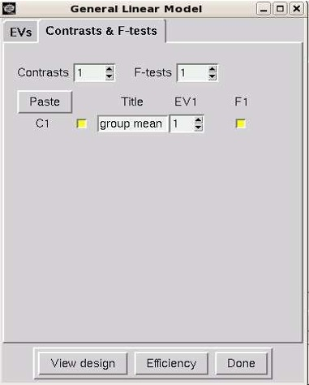
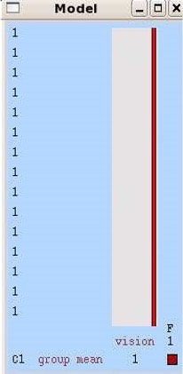
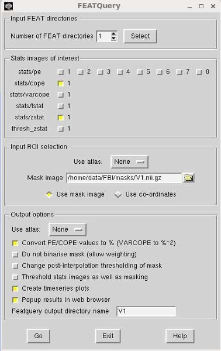

# Advanced fMRI analysis tools

The materials included in this worksheet follows on from the previous two FSL-specific fMRI workshops: in the first workshop you ran first level fMRI analysis, whilst in the second workshop you combined the data across scans within each participant (second level analysis) and across the group (third level analysis) in a couple of different ways. 

The information included in this page covers:

- The effect of changing threshold and correction methods
- T-tests vs F-tests
- Dealing with large motion artefacts (`fsl_motion_outliers`) 
- How to extract ROI statistics from specific regions of interest (using FEATquery)

<b>As in the other materials we will not discuss in detail why you might choose certain parameters.</b> The aim is to familiarise you with some of the available analysis tools. This worksheet will take you, step by step, through these analyses using the FSL tools. You are encouraged to read the pop-up help throughout (hold your mouse arrow over the FSL gui buttons and menus), refer to your lecture notes lectures or resource list readings. You can also find more information on the [FSL website](https://fsl.fmrib.ox.ac.uk/fsl/fslwiki/FEAT/UserGuide).

If you have correctly followed the instructions from the previous workshops, you should by now have 29 first-level FEAT directories for the analysis of each scan of each participant:

`/rds/projects/c/chechlmy-chbh-mricn/xxx/feat/1/` 

e.g. `/rds/projects/c/chechlmy-chbh-mricn/xxx/feat/1/p01_s1.feat`

(1 feat analysis directory for participant 1, 1 for participant 2, 3 for participant 5, and 2 for everyone else). 

At the second-level you should have 13 simple within-subjects fixed-effects directories:

`/rds/projects/c/chechlmy-chbh-mricn/xxx/feat/2/` 

e.g. `/rds/projects/c/chechlmy-chbh-mricn/xxx/feat/ 2/p03.gfeat`

(one each for participants 3-15) 

You should also have a directory:

`/rds/projects/c/chechlmy-chbh-mricn/xxx/feat/2/level2all.gfeat` (for the all-participants-all-runs second level model)

Finally, you should have 2 third-level group analysis folders:

`/rds/projects/c/chechlmy-chbh-mricn/xxx/feat/3/GroupAnalysis1.gfeat`

`/rds/projects/c/chechlmy-chbh-mricn/xxx/feat/3/GroupAnalysis2.gfeat`

(containing the third level group analyses corresponding to the two different ways of combining data at third level)

## Testing the effects of different thresholds

<b>Try as many of the suggestions below as you have time for. I suggest trying 1 or 2 at the start of the session and returning to these later if you have time, or outside the workshop.</b> (You can load up an existing model by running FEAT and using the 'Load' button. The model file will be called `design.fsf` and can be found in the `.feat` or `.gfeat` directory of an existing analysis folder.)

1. <b>Ordinary Least Squares (OLS) vs FLAME:</b>
Repeat the third level group analyses from FSL Workshop 5, but on the 'Stats' tab select 'Mixed Effects: Simple OLS'

2. <b>Different correction for multiple comparisons:</b>
Repeat the third level group analyses from FSL Workshop 5, but on the 'Post-Stats' tab for 'Thresholding', use the pull down menu to select 'Voxel correction'. 

3. <b>Different thresholds and correction for multiple comparisons:</b>
Repeat the third level group analyses from FSL Workshop 5, but on the 'Post-Stats' tab use 'Cluster Thresholding' but choose a different z-threshold.

!!! tip "Examining the results"
    Look at the results from each method of correction. Use both the webpage output and FSLeyes to look at your data. Find the regions of significant activation. Try looking at a time series (see the 'Data Visualisation' workshop notes for help).

## T-test vs F-test
 
Start up a FEAT GUI, by opening a new terminal window and typing `fsl &`. Click on the 'Feat' button [or type `Feat &`  in the terminal window to directly open the FEAT GUI].

Load up one of the third level analyses run in the last workshop (e.g., 'GroupAnalysis1' or 'GroupAnalysis2').

Now follow the instructions below:

<b>Data Tab</b>

- Change the 'Output' directory name to be something different, for example 'GroupAnalysis1_Ftest'

 

<b>Stats Tab</b>

- Click on the 'Full model setup' button and select the 'Contrasts and F-tests' tab

- Change the number of 'F-tests' from 0 to 1. When you do this, the interface will update and a check box will appear on the right hand side of the group mean contrast. Select the check box (toggle it from off to on).

- Click the 'Done' button, check and dismiss the pop-up window and press the 'Go' button

 

!!! example "Differences between t-test and F-test images"
    Once it has run inspect the resulting output in a browser. How does the rendered stats image for the F-test (the `zfstat` image) differ from the t-stat image? Why are they different?

## Extracting information from Regions of Interest (ROIs) using FEATquery

[FEATquery](https://ftp.nmr.mgh.harvard.edu/pub/dist/freesurfer/tutorial_packages/centos6/fsl_507/doc/wiki/FEAT(2f)UserGuide.html#Featquery_-_FEAT_Results_Interrogation) is an FSL tool which allows you to explore FEAT results by <b>extracting information from regions of interests within specific (MNI) coordinates or using a mask.</b>  

In the examples below we will get basic stats from two pre-prepared Regions of Interest (ROIs) using the first level models that you have run. You can also make your own ROIs using FSLeyes (you should remember how to create ROI masks from previous workshops).

To start FEATquery, you need to load FSL (see previous workshops), and either - in a terminal - type `Featquery &` or on the FSL GUI click the button on the bottom right labelled 'Misc' and select the menu option 'Featquery'.

In any case, when FEATQuery is open, following the instructions below:

 

<b>Input FEAT directories</b>

- Keep the 'Number of Feat Directories' set to 1. 
- Click the 'Select' button next to it and choose one of your first-level analysis `.feat` directories (e.g. `/rds/projects/c/chechlmy-chbh-mricn/xxx/feat/1/p01_s1.feat`) and then click the 'OK' button 

<b>Stats images of interest</b>

Once you have done that the GUI interface will update and you will see a list of possible statistics. 

- Click the checkbox next to `stats/cope 1` and `stats/zstat 1` (and any others you would like to see summarised).

<b>Input ROI selection</b>

For the 'Mask image' entry select either one of the prepared masks.

Either:

`/rds/projects/c/chechlmy-chbh-mricn/module_data/masks/V1.nii.gz`

or

`/rds/projects/c/chechlmy-chbh-mricn/module_data/masks/Parietal.nii.gz`

<b>Output options</b>

- Click the checkbox next to 'Convert PE/Cope values to %'
- Make sure the check box next to 'Popup results in web browser' is checked on
- Change the 'Featquery output directory name' from the default to something meaningful and related to the mask name e.g. 'V1'

When ready, click the 'Go' button!

!!! example "Examining the FEATquery output"
    Inspect the results by opening `report.html` inside the 'V1' folder. Do they make sense?
