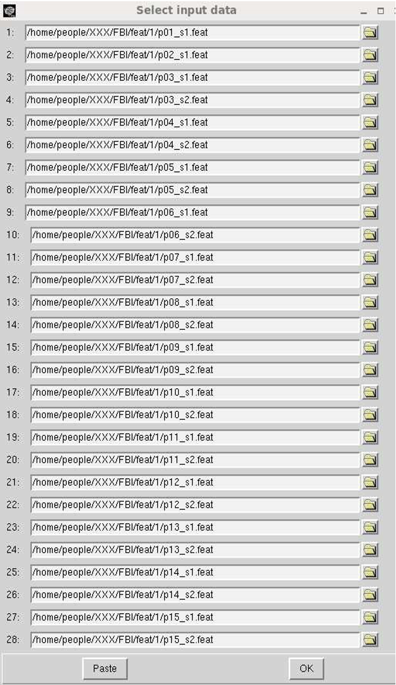
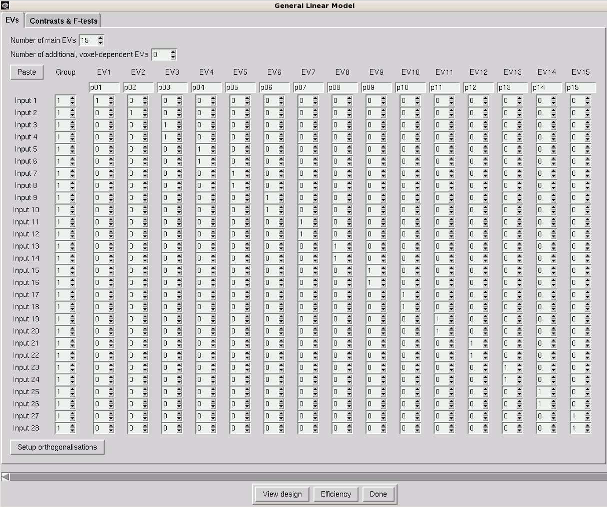
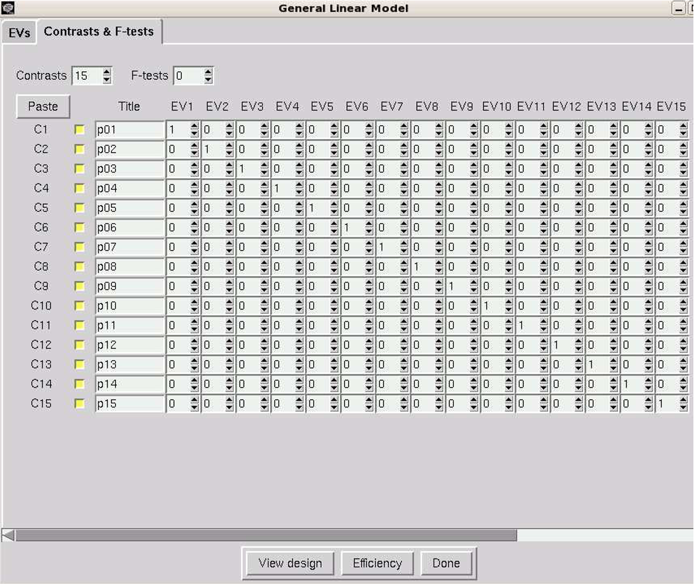
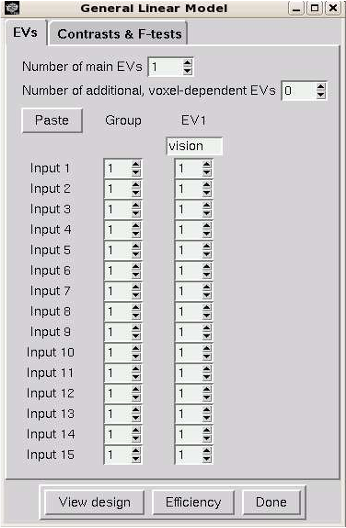

# Running the higher-level fMRI analysis

If you have correctly followed the instructions from the previous workshop, you should now have 29 FEAT directories arising from each fMRI scan of each participant, e.g.,

```bash
/rds/projects/c/chechlmy-chbh-mricn/xxx/feat/1/p01_s1.feat	← Participant 1 scan 1
/rds/projects/c/chechlmy-chbh-mricn/xxx/feat/1/p02_s1.feat	← Participant 2 scan 1
/rds/projects/c/chechlmy-chbh-mricn/xxx/feat/1/p03_s1.feat	← Participant 3 scan 1
/rds/projects/c/chechlmy-chbh-mricn/xxx/feat/1/p03_s2.feat	← Participant 3 scan 2
(…)
/rds/projects/c/chechlmy-chbh-mricn/xxx/feat/1/p15_s2.feat	← Participant 15 scan 2
```

(where XXX = your particular login (ADF) username).

For participants 1 and 2 you should have only one FEAT directory. For participants 3-4 and 6-15 you should have 2 FEAT directories. For participant 5 you should have 3 FEAT directories. <b>You should therefore have 29 complete first level feat directories.</b>

If you haven’t done so already, please check that the output of each and all of these first level analyses looks ok either through the FEAT Report or through FSLeyes.
If you would like to use the FEAT Report, select the report (called `report.html`) from within each FEAT directory from your analysis, e.g.,: 

`/rds/projects/c/chechlmy-chbh-mricn/xxx/feat/1/p03_s1.feat/report.html`

and either open it in a new tab or in a new window. 

<p align="center">
 
</p>
<p align="center"><i style="font-size: 1.2em;">Selecting a participant's first-level FEAT output (left) and examining the FEAT Report (right).</i></p>

Check all of the reports and click on each of the sub-pages in turn:

1. Check that the analysis ran ok by checking the 'Log' page. 
2. Check that the 'Registration' looks ok. 
3. Check how much they moved on the 'Pre-Stats' page. 
4. Have a quick look at the 'Post-Stats' page. 

!!! example "Motion correction"
    Participant 5 was scanned three times. In one of these scans they moved suddenly. <b>Use the motion correction results to decide which scan this was.</b> We will ignore this scan for the rest of this workshop.
    <b>If you have not completed this stage of the analysis, you should do this now before continuing on.</b> Refer to the worksheet from previous workshops.

## Second-level analysis - averaging across runs within participants

Most of our participants did the experiment twice – a repeated measurement. How do we model this data? There are different ways we can do this. 

<b>The simplest way is to combine the data within participant before generating group statistics across the entire group of participants.</b> This corresponds with what you might do if you are analysing data as you go along. 
Here, we will average their data over the two fMRI runs so that we can benefit from the extra power. Participant 5 did the experiment 3 times. 
For the moment, for this participant, we will <b>choose only the two scans where they moved less for further analysis.</b> 

Choose one of the participants that did the experiment twice (not participant 1 or 2), such as participant 3. Open a terminal and load FSL:

```bash
module load bear-apps/2022b
module load FSL/6.0.7.6
source $FSLDIR/etc/fslconf/fsl.sh
```

Then navigate to the folder where your first-level directories are located and open FEAT:

```bash
/rds/projects/c/chechlmy-chbh-mricn/xxx/feat/1
Feat &
```

At the top left of the GUI you will see a pull down menu labelled 'First-level analysis'. Click here to pull down this menu and choose 'Higher-level analysis' The options available will change.

Now fill out the tabs as below:

<h3>Stats</h3>

Choose 'Fixed effects' from the pull down menu at the top.

It is necessary to select this now in order to reduce the number of inputs on the 'Data' tab to be only 2 (the default for all other higher level model types is a minimum no of 3 inputs). 
Note that choosing 'Fixed effects' will ignore cross scan variance, which is fine to do here because these are scans from the same person at the same time. 

<h3>Data</h3>

<p align="center">
 
</p>

- On the data tab select 'Inputs are lower-level FEAT directories’. 
- Make sure the 'Number of inputs' is set as 2. 
- Click on the 'Select FEAT directories' button. 
- In the form that appears fill in the top line with the `.feat` directory from the first scan and the second line with the `.feat` directory from the second scan. (Hint: you can use the little folder icon to browse)


<p align="center">
 
</p>

<br>

Once you have selected the FEAT directories for input, the GUI will update to show what COPE files (contrasts) are available for analysis. 

- There is only one COPE (contrast) in this data so leave the 'Use lower level copes' line as it is (with the single COPE 1 selected).
- You should now enter a name for the output analysis directory. Use the Output directory option to choose a directory to put the results in. 

<b>The naming scheme here (as with your raw data directories, reconstruction directories and your first level analysis directories) needs to be clear and logical. </b>

It is therefore sensible to use a directory structure like:

`/rds/projects/c/chechlmy-chbh-mricn/xxx/feat/2` (directory for all FEAT 2nd level analyses)

For example, you can then put the second level analysis for participant 3 in the subdirectory and so on.

`/rds/projects/c/chechlmy-chbh-mricn/xxx/feat/2/p03`

<h3>Stats (again)</h3>

- Click the Full model setup button
- On the EVs tab put 1 in all rows of the EV1 column (see picture below) [this averages both inputs together]
- On the Contrasts and F-tests tab, check that there is one contrast, titled 'group mean', weighted 1 for EV1 (see picture below)

<p align="center">
 
</p>

Click the 'Done' button. This will produce a schematic of your design. Check it makes sense and close its window.

<h3>Post-Stats</h3>

As with the first-level analysis, select the 'Thresholding' pull down option and type 'Uncorrected' and leave the P-threshold value at p<0.05. 

!!! note "Thresholding and processing time"
    Note this is not the correct thresholding that you will want at the final (third stage) of processing (where you will probably want Cluster thresholding) but at the first and second level stages it will speed up the processing per person. 

Click the 'Go' button. Repeat for the other participants. 

In the web browser look at the results in the FEAT report (i.e., by opening the `report.html`). <b>Note that the output folder is called `p03.gfeat`.</b> You will have to click on the link marked 'Results' and then on the link labelled 'Lower-level contrast 1 (vision)' on that page and then on the 'Post-stats' link. 

!!! question "Comparing second-level and first-level results"
    Are the results better than for just one scan from `p03`? 

## Third-level analysis - combining data across participants from the second level 

In FSL, the procedure for setting up an analysis across participants is very similar to averaging within a participant. The main difference is that we specifically need to set up the analysis to model the inter-subject variance. <b>This allows us to generalise beyond our specific group of participants and to interpret the results as being typical of the wider population.</b>

In this demonstration experiment, 12 participants did the scan twice, 1 was scanned three times, and 2 did the scan only once. (Note that it should be rather obvious that this is not an ideal design for a real experiment). In our case, we have averaged within participants and <b>now we will combine these second level analyses with the first level analyses from those participants who were only scanned once.</b>

Close FEAT if you still have it open. Then open it again by typing `Feat &`

!!! note "Don't close the terminal if you don't have to!"
    Please note that if you close the terminal here you will first need to load FSL again and navigate back to your folder!

At the top left of the GUI select the pull down menu labelled 'First-level analysis’ and choose 'Higher-level analysis'.

Now complete each of the tabs as described below:

<h3>Data</h3>

We have 13 participants who did the experiment at least twice (who we combined via a second-level analysis) and 2 who did the experiment only once (who we only analysed at first-level). 
<b>Therefore, for this next (third level) analysis we will need to combine over first and second level analyses.</b>

- On the top button check that 'Inputs are lower-level FEAT directories' is selected.
- Change 'Number of inputs' to be 15
- Press the button marked 'Select Feat Directories'

In the dialogue that appears you need to add in the path to the `.feat` directory for each person. For the first-level analyses this is something like:

```bash
/rds/projects/c/chechlmy-chbh-mricn/xxx/feat/1/p01_s1.feat
/rds/projects/c/chechlmy-chbh-mricn/xxx/feat/1/p02_s1.feat
```

For the participants where you did a second level analysis this will be:
```bash
/rds/projects/c/chechlmy-chbh-mricn/xxx/feat/2/p03.gfeat/cope1.feat
/rds/projects/c/chechlmy-chbh-mricn/xxx/feat/2/p04.gfeat/cope1.feat
/rds/projects/c/chechlmy-chbh-mricn/xxx/feat/2/p05.gfeat/cope1.feat
...
/rds/projects/c/chechlmy-chbh-mricn/xxx/feat/2/p15.gfeat/cope1.feat
```

!!! note "Subdirectory location"
    Note that the actual feat subdirectories of interest for the second-level analyses are hidden inside the `.gfeat` directories. 

You should now enter a name for the output analysis directory. Use the 'Output' directory entry to choose a directory to put the results in. 
As with your second-level analyses, <b>the naming scheme here needs to be clear and logical.</b>

It is therefore sensible to use a structure like:

`/rds/projects/c/chechlmy-chbh-mricn/xxx/feat/3` (directory for all FEAT 3rd level analyses)

For example, you can then put this current 3rd level output in the subdirectory:

`/rds/projects/c/chechlmy-chbh-mricn/xxx/feat/3/GroupAnalysis1`

<h3>Stats</h3>

- On the Top Pull down menu, Select 'Mixed Effects: Flame 1'. (Remember, mixed effects means that we can generalise beyond our participants)
- Click on the 'Full model setup' button
- For all the inputs, set 'EV1' to 1 (see the left picture below) and name it 'vision’
- On the Contrasts and F-tests tab set EV1 to 1 and name the contrast 'group mean' (as on the right image below)
- Click the Done button. Check and dismiss the pop-up window

<p align="center">
 
</p>

<h3>Post-Stats</h3>

Accept the defaults.   

Now click the 'Go' button!

<b>When the group analysis has finished, check through the output (using the FEAT Report) and try to work out what each page means.</b>
For example, the 'Registration Summary' page will highlight areas where the registrations are not aligned between scans/participants. 
A few missing voxels are ok, but any more than that is a problem as you won't get results from areas where there are missing data.

## Second-level analysis - the 'all-in-one' method

<b>A more complicated modelling approach at the second-level is to use one single second-level model (instead of separate models per participant) which incorporates all of the information available about participants and runs.</b>

This corresponds with what you might do if you are analysing all the data after it has been collected, all in one go. 
Depending on the design of the particular experiment, <b>this has the potential to be an improved approach as it allows a better estimate of both the between-run and the between-subject variance.</b>

Close FEAT if you still have it open. Then open it again by clicking on the FEAT button in the FSL GUI (or type `Feat &` in the terminal window to directly open the FEAT GUI).

- At the top left of the GUI select the pull down menu labelled 'First-level analysis'.
- Click here to pull down this menu and choose 'Higher-level analysis'

Now complete the tabs following the instructions below:

<h3>Data</h3>

- On the 'Data' tab select 'Inputs are lower-level FEAT directories'
- Change “Number of inputs” to be 28

(Note that there are only 28 inputs here as we are going to use all of the first level feat dirs as inputs except for the worst run of the three that participant 5 did).

- Click on Select FEAT directories button. 

- In the form that appears fill in the lines with the `.feat` directory from the first level analysis from the first participant (scan 1), followed by the second participant (scan 1), followed by the third participant (scan 1, and then scan 2) and so on down to participant 15, scan 2. It is important that you enter these in strict logical order, starting with `p01` as in this example below:

<p align="center">
 
</p>

- When this is done, hit the OK button. 

As always you should now enter a name for the output analysis directory. Use the 'Output' directory entry to choose a directory to put the results in. 

As this is a second-level model it should go under the directory:

`/rds/projects/c/chechlmy-chbh-mricn/xxx/feat/2` (directory for all FEAT 2nd level analyses)

and should be meaningfully named. For example, you could call it:

`/rds/projects/c/chechlmy-chbh-mricn/xxx/feat/2level2all`

<h3>Stats</h3>

- Choose 'Fixed Effects' from the pull down menu at the top.
- Click the 'Full model setup' button.
- On the 'EVs' tab set the “Number of main EVs” to be 15 (This corresponds to the 15 participants in the experiment).
- Going across the columns, label each EV as participant `p01` to `p15` as per below.
- Going down the columns, for each participant, put a 1 in any row of the EV column for which the participant has a matching scan. Each EV should pick out the scans that correspond to a particular participant. There are 28 rows, corresponding to the 28 first level feat inputs. There should therefore be 28 ones in the design matrix overall (as below).

<p align="center">
 
</p>

On the 'Contrasts and F-tests' tab, we also need 15 contrasts to represent the 15 subject means. Fill in the tab as below: 

<p align="center">
 
</p>

!!! caution "Check boxes in FSL"
    In the older versions of FSL after selecting an option you will see a yellow checkbox, however in the newer versions of FSL such as the one we are using, the checkbox is yellow to start with, and after selecting option you will see a tick ✔️ inside the yellow checkbox.

Click the Done button. This will produce a schematic of your new second level design. 

<p align="center">
 
</p>

Check it makes sense, and that you understand what it is showing, then close its window.

<h3>Post-Stats</h3>

Accept the defaults.

Now click the Go button!

Wait for the analysis to complete and then look at the results. <b>Note that the output folder is called `level2all.gfeat` if you named it as above.</b>
You will have to click on the link marked 'Results' and then on the link labelled 'Lower-level contrast 1 (vision)' on that page and then on the 'Post-stats' link. 
This will then show you a contrast (rendered stats image) for each of the participants.

!!! question "Comparing the second-level results"
    Are the results from this bigger model better than the simple fixed effects model for the same participant? For example, with participant `p09`? 

## Third-level analysis - combining participant data from the 'all-in-one' second-level

We can now estimate the mean group effect by combining across participants from the better second-level analysis we have just calculated above.

- First, close FEAT if you still have it open, then open it again by clicking on the FEAT button in the FSL GUI (or typing `Feat &` in the terminal window to directly open the FEAT GUI)
- Then at the top left of the GUI select the pull down menu labelled 'First-level analysis' and choose 'Higher-level analysis’

<h3>Data</h3>

In the second-level analysis we just performed we combined data over both participants and runs, effectively collapsing across runs, and the output analyses were then the summary data for each of the 15 participants.
<b>Therefore, for this next (third-level) analysis we will again need to combine over the 15 participants.</b>

To do this, follow the steps below:

- On the top button change the default setting from 'Inputs are lower-level FEAT directories' and select 'Inputs are 3D cope images from FEAT directories'.
- Change 'Number of inputs' to be 15 (because we have 15 participant data sets we want to combine)
- Press the button marked 'Select cope images'
- In the dialogue that appears you need to add in the path to the COPE image for each of the participants in the second level analysis we have just performed. 

If you have used the correct naming convention above, this is:

```bash
/rds/projects/c/chechlmy-chbh-mricn/xxx/feat/2/level2all.gfeat/cope1.feat/stats/cope1.nii.gz 
/rds/projects/c/chechlmy-chbh-mricn/xxx/feat/2/level2all.gfeat/cope1.feat/stats/cope2.nii.gz 
...
/rds/projects/c/chechlmy-chbh-mricn/xxx/feat/2/level2all.gfeat/cope1.feat/stats/cope15.nii.gz
```

As before, you should now enter a name for the output analysis directory. As this is a third level model it should go under the directory:

`/rds/projects/c/chechlmy-chbh-mricn/xxx/feat/3` (for all FEAT 3rd level analyses)

and should be meaningfully named. For example, you can then put this current 3rd level output in the subdirectory:

`/rds/projects/c/chechlmy-chbh-mricn/xxx/feat/3/GroupAnalysis2`

<h3>Stats</h3>

- On the top pull down menu, Select 'Mixed Effects: Flame 1'
- Click on the 'Full model setup' button (Remember, mixed effects means that we can generalise beyond our participants)
- For all the inputs, set EV1 to 1 (see picture below) and name it 'vision'.

<p align="center">
 
</p>

- On the 'Contrasts and F-tests' tab set EV1 to 1 and name the contrast 'group mean'
- Click the 'Done' button
- Check and dismiss the pop-up window

<h3>Post-Stats</h3>

- Accept the defaults

Now click the 'Go' button!

!!! question "Comparing the third-level results"
    Check through the output when the group analysis has finished. Is the result better than the simple third level analysis above?

If you followed the instructions in workshop materials, you should be able to replicate and see the results as above in the `report.html` file inside the respective third level analysis folders ('GroupAnalysis1' and 'GroupAnalysis2').

<p align="center">
 
</p>

As always, help and further information is also available on the relevant section of the [FSL Wiki](https://fsl.fmrib.ox.ac.uk/fsl/docs/#/task_fmri/feat/index).