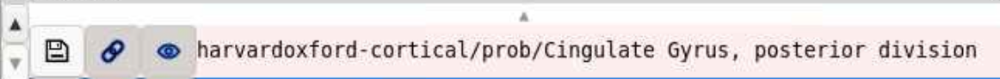
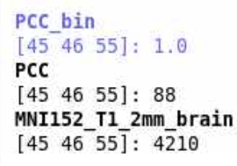
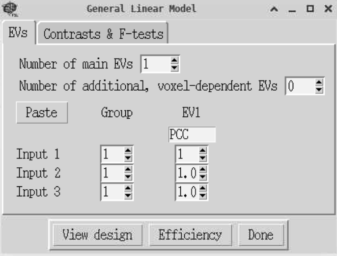
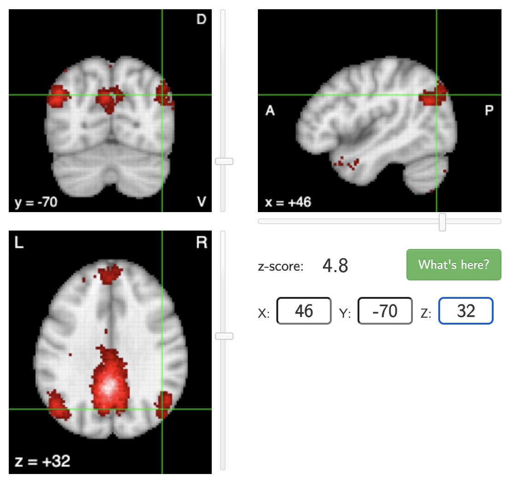

# Functional connectivity analysis of resting-state fMRI

This bonus workshop is based upon the excellent [FSL fMRI Resting State Seed-based Connectivity](https://neuroimaging-core-docs.readthedocs.io/en/latest/pages/fsl_fmri_restingstate-sbc.html) tutorial, which has been adapted to run on the BEAR systems at the University of Birmingham, with some additional content covering [Neurosynth](https://neurosynth.org/).

We will run a group-level functional connectivity analysis on resting-state fMRI data of three participants, specifically examining the functional connectivity of the posterior cingulate cortex (PCC), a region of the default mode network (DMN) that is commonly found to be active in resting-state data. 

To do this, we will:

- extract a mean-timeseries for a PCC seed region for each participant,
- run single-subject level analyses, one manually and bash scripting the other two, 
- run a group-level analysis using the single-level results 
- figure out which brain regions our active voxels are in, using atlases in FSL, and Neurosynth.

## Preparing the data

Navigate to your shared directory within the MRICN folder and copy the data over:

```
cd /rds/projects/c/chechlmy-chbh-mricn/xxx
cp -r /rds/projects/c/chechlmy-chbh-mricn/aamir_test/SBC .
cd SBC
ls
```

You should now see the following:

```
sub1 sub2 sub3
```

Each of the folders has a single resting-state scan, called `sub1.nii.gz`,`sub2.nii.gz` and `sub3.nii.gz` respectively. 

We will now create our seed region for the PCC. To do this, firstly load FSL and `fsleyes` in the terminal by running: 

```
module load FSL/6.0.5.1-foss-2021a
module load FSLeyes/1.3.3-foss-2021a
```

Check that we are in the correct directory (`blah/your_username/SBC`):

```
pwd
```
and create a new directory called `seed`:

```
mkdir seed
```

Now when you run `ls` you should see:

```
seed sub1 sub2 sub3
```

Lets open FSLeyes:

```
fsleyes &
```

<h3>Creating the PCC mask in FSLeyes</h3>

<b>We need to open the standard MNI template brain, select the PCC and make a mask.</b>

Here are the following steps: 
    
1. Navigate to the top menu and click on `File ➜ Add standard` and select `MNI152_T1_2mm_brain.nii.gz`.
2. When the image is open, click on `Settings ➜ Ortho View 1 ➜ Atlases`. An atlas panel then opens on the bottom section.
3. Select `Atlas information` (if it already hasn't loaded).
4. Ensure Harvard-Oxford Cortical Structural Atlas is selected.
5. Go into 'Atlas search' and type `cing` in the search box. Check the Cingulate Gyrus, posterior division (lower right) so that it is overlaid on the standard brain. (The full name may be obscured, but you can always check which region you have loaded by looking at the panel on the bottom right).

<p align="center">
  
</p>
<br>
At this point, your window should look something like this:
<br>
<p align="center">
  
</p>
<br>
To save the seed, click the save symbol which is the first of three icons on the bottom left of the window. 
<br>
<p align="center">
  
</p>

The window that opens up should be your project SBC directory. Open into the `seed` folder and save your seed as `PCC`. 

<h3>Extracting the time-series</h3>

We now need to binarise the seed and to extract the mean timeseries. To do this, **leaving FSLeyes open**, go into your terminal (you may have to press Enter if some text about `dc.DrawText` is there) and type:

```
cd seed
fslmaths PCC -thr 0.1 -bin PCC_bin
```

In FSLeyes now click File ➜ Add from file, and select `PCC_bin` to compare `PCC.nii.gz` (before binarization) and `PCC_bin.nii.gz` (after binarization). You should note that the signal values are all 1.0 for the binarized PCC.

<p align="center">
  
</p>

You can now close FSLeyes.

<b>For each subject, you want to extract the average time series from the region defined by the PCC mask.</b> To calculate this value for `sub1`, do the following: 

```
cd ../sub1
fslmeants -i sub1 -o sub1_PCC.txt -m ../seed/PCC_bin
```

This will generate a file within the `sub1` folder called `sub1_PCC.txt`. 

We can have a look at the contents by running `cat sub1_PCC.txt`. The terminal will print out a list of numbers with the last five being:

```
20014.25528
20014.919
20010.17317
20030.02886
20066.05141
```

<b>This is the mean level of 'activity' for the PCC at each time-point.</b>

Now let's repeat this for the other two subjects. 

```
cd ../sub2
fslmeants -i sub2 -o sub2_PCC.txt -m ../seed/PCC_bin
cd ../sub3
fslmeants -i sub3 -o sub3_PCC.txt -m ../seed/PCC_bin
```

Now if you go back to the SBC directory and list all of the files within the subject folders:

```
cd ..
ls -R
```
You should see the following: 

<p align="center">
  
</p>

<b>This is all we need to run the subject and group-level analyses using FEAT.</b>

## Running the FEAT analyses

### Single-subject analysis 

Close your terminal, open another one, move to your `SBC` folder, load FSL and open FEAT: 

```
cd /rds/projects/c/chechlmy-chbh-mricn/xxx/SBC
module load bear-apps/2022b
module load FSL/6.0.7.6
source $FSLDIR/etc/fslconf/fsl.sh
Feat &
```

We will run the first-level analysis for `sub1`. Set-up the following settings in the respective tabs:

**Data**

Number of inputs:

- Click 'Select 4D data', then click the folder icon, go into the `sub1` folder and choose `sub1.nii.gz`. Click OK. You will see a box saying that the 'Input file has a TR of 1...' this is fine, just click OK again.

Output directory: 

- Click into the `sub1` folder and click OK. Nothing will be in the right hand column, but that is because there are no folders within `sub1`. We will create our `.feat` folder within `sub1`. 

This is what your data tab should look like (with the input data opened for show).

<p align="center">
  
</p>

**Pre-stats**

The data has already been pre-processed, so just set 'Motion correction' to 'None' and uncheck BET. Your pre-stats should look like this: 

<p align="center">
  
</p>

**Registration**

Nothing needs to be changed here. 

**Stats**

Click on 'Full Model Setup' and do the following: 

1. Keep the 'Number of original EVs' as 1.
2. Type PCC for the 'EV' name.
3. Select 'Custom (1 entry per volume)' for the 'Basic' shape. Click into the `sub1` folder and select `sub1_PCC.txt`. This is the mean time series of the PCC for sub-001 and is the statistical regressor in our GLM model. This is different from analyses of task-based data which will usually have an `events.tsv` file with the onset times for each regressor of interest.
4. Select 'None' for 'Convolution', and uncheck both 'Add temporal derivate' and 'Apply temporal filtering'. 

!!! info "What are we doing specifically?"
    The first-level analysis will subsequently identify brain voxels that show a significant correlation with the seed (PCC) time series data.

Your window should look like this: 

<p align="center">
  
</p>

In the same General Linear Model window, click the 'Contrast & F-tests' tab, type PCC in the title, and click 'Done'. 

A blue and red design matrix will then be displayed. You can close it.

**Post-stats** 

Nothing needs to be changed here.

You are ready to run the first-level analysis. Click 'Go' to run. On BEAR, this should only take a few minutes. 

<h3>Examining the FEAT output</h3>

To actually examine the output, go to the BEAR Portal and at the menu bar select `Files ➜ /rds/projects/c/chechlmy-chbh-mricn/`
<br>
<br>
<p align="center">
  
</p>
<br>
<br>
Then go into `SBC/sub1.feat`, select `report.html` and click 'View' (top left of the window). Navigate to the 'Post-stats' tab and examine the outputs. It should look like this:
<br>
<p align="center">
  
</p>

<h3>Scripting the other two subjects</h3>

We can now run the second and third subjects. As we only have three subjects, we could manually run the other two by just changing three things: 

1. The fMRI data path
2. The output directory
3. The `sub_PCC.txt` path

Whilst it would probably be quicker to do it manually in this case, it is not practical in other instances (e.g., more subjects, subjects with different number of scans etc.). <b>So, instead we will be scripting the first level FEAT analyses for the other two subjects.</b>

!!! note "The importance of scripting"
    Scripting analyses may seem challenging at first, but it is an essential skill of modern neuroimaging research. It enables you to automate repetitive processing steps, dramatically reduces the chance of human error, and ensures your research is reproducible.

To do this, go back into your terminal, you don't need to open a new terminal or close FEAT.

The setup for each analysis is saved as a specific file, the `design.fsf` file within the FEAT output directory. We can see this by opening the `design.fsf` file for `sub1`:

```
pwd # make sure you are in your SBC directory e.g., blah/xxx/SBC
cd sub1.feat
cat design.fsf
```

FEAT acts as a large 'function' with its many variables corresponding to the options that we choose when setting up in the GUI. We just need to change three of these (the three mentioned above). In the `design.fsf` file this corresponds to:

```
set fmri(outputdir) "/rds/projects/c/chechlmy-chbh-mricn/xxx/SBC/sub1"
set feat_files(1) "/rds/projects/c/chechlmy-chbh-mricn/xxx/SBC/sub1/sub1/"
set fmri(custom1) "/rds/projects/c/chechlmy-chbh-mricn/xxx/SBC/sub1/sub1_PCC.txt"
```

To run the script, please copy the `run_feat.sh` script into your own `SBC` directory:

```
cd ..
pwd # make sure you are in your SBC directory
cp /rds/projects/c/chechlmy-chbh-mricn/axs2210/SBC/run_feat.sh .
```

!!! tip "Viewing the script"
    If you would like, you can have a look at the script yourself by typing `cat run_bash.sh`

The first line `#!/bin/bash` is always needed to run `bash` scripts. The rest of the code just replaces the 3 things we wanted to change for the defined subjects, `sub2` and `sub3`.

Run the code (from your SBC directory) by typing `bash run_feat.sh`. (It will ask you for your University account name, this is your ADF username (axs2210 for me)).

<b>The script should take about 5-10 minutes to run on BEAR.</b>

After it has finished running, have a look at the `report.html` file for both directories, they should look like this:

<div style="display: flex; justify-content: center; gap: 20px;">
   <div style="text-align: center;">
       <p><strong>sub2</strong></p>
       
   </div>
   <div style="text-align: center;">
       <p><strong>sub3</strong></p>
       
   </div>
</div>

### Group-level analysis

<b>Ok, so now that we have our FEAT directories for all three subjects, we can run the group level analysis.</b> Close FEAT and open a new FEAT by running `Feat &` in your `SBC` directory. 

Here are instructions on how to setup the group-level FEAT:

**Data** 

1. Change 'First-level analysis' to 'Higher-level analysis'
2. Keep the default option for 'Inputs are lower-level FEAT directories'.
3. Keep the 'Number of inputs' as 3.
4. Click the 'Select FEAT directories'. Click the yellow folder on the right to select the FEAT folder that you had generated from each first-level analysis.

Your window should look like this (before closing the 'Input' window):

<p align="center">
  
</p>
<br>

&nbsp;&nbsp;&nbsp;&nbsp;5\. Keep 'Use lower-level COPEs' ticked.

&nbsp;&nbsp;&nbsp;&nbsp;6\. In 'Output directory' stay in your current directory (SBC), and in the bottom bar, type in `PCC_group` at the end of the file path. 

Don't worry about it being empty, FSL will fill out the file path for us. 

If you click the folder again, it should look similar to this (with your ADF username instead of `axs2210`): 

<p align="center">
  
</p>
<br>
**Stats**

1. Leave the 'Mixed effects: FLAME 1' and click 'Full model setup'. 
2. In the 'General Linear Model' window, name the model 'PCC' and make sure the 'EVs' are all 1s. 

The interface should look like this:

<p align="center">
  
</p>

After that, click 'Done' and close the GLM design matrix that pops up (you don't need to change anything in the 'Contrasts and F-tests' tab).

**Post-stats**

1. Change the Z-threshold from 3.1 to 2.3.

!!! question "Lowering our statistical threshold"
    Why do you think we are lowering this to 2.3 in our analysis instead of keeping it at 3.1? The reason is because we only have three subjects, we want to be relatively lenient with our threshold value, otherwise we might not see any activation at all! 
    For group-level analyses with more subjects, we would be more strict.

Click 'Go' to run! 

<b>This should only take about 2-3 minutes.</b> 

While this is running, you can load the `report.html` through the file browser as you did for the individual subjects. 

Click on the 'Results' tab, and then on 'Lower-level contrast 1 (PCC)'. When the analysis has finished, your results should look like this: 

<p align="center">
  
</p>

<b>These are voxels demonstrating significant functional connectivity with the PCC at a group-level (Z > 2.3).</b>

<h3>Examining the output</h3>

So, we have just ran our group-level analysis. Let's have a closer look at the outputted data. 

Close FEAT and your terminal, open a new terminal, go to your `SBC` directory and open FSLeyes: 

```
cd /rds/projects/c/chechlmy-chbh-mricn/xxx/SBC
module load FSL/6.0.5.1-foss-2021a
module load FSLeyes/1.3.3-foss-2021a
fsleyes &
```

In FSLeyes, open up the standard brain (Navigate to the top menu and click on 'File ➜ Add standard' and select `MNI152_T1_2mm_brain.nii.gz`). 

Then add in our contrast image (File  ➜ Add from file, and then go into the `PCC_group.gfeat` and then into `cope1.feat` and open the file `thresh_zstat1.nii.gz`). 

When opened, change the colour to 'Red-Yellow' and the 'Minimum' up to 2.3 (The max should be around 3.12). If you set the voxel location to **[42, 39, 52]** your screen should look like this:

<p align="center">
  
</p>

This is the map that we saw in the `report.html` file. In fact we can double check this by changing the voxel co-ordinates to **[45, 38, 46]**.

**Our thresholded image in fsleyes**
<br>
<br>
<p align="center">
  
</p>
<br>
**The FEAT output**
<br>
<br>
Our image matches the one on the far right below: 
<br>
<p align="center">
  
</p>

## Bonus: Identifying regions of interest with atlases and Neurosynth

<b>So we know which voxels demonstrate significant correlation with the PCC, but what region(s) of the brain are they located in? </b>

Let's go through two ways in which we can work this out. 

Firstly, as you have already done in the course, we can simply just overlap an atlas on the image and see which regions the activated voxels fall under. 

To do this:

1. Navigate to the top menu and click on 'Settings ➜ Ortho View 1 ➜ Atlases'. 
2. Then at the bottom middle of the window, select the 'Harvard-Oxford Cortical Structural Atlas' and on the window directly next to it on the right, click 'Show/Hide'. 
3. The atlas should have loaded up but is blocking the voxels. Change the 'Opacity' to about a quarter. 

<p align="center">
  
</p>
<br>
By having a look at the 'Location' window (bottom left) we can now see that significant voxels of activity are mainly found in the: 

<div style="display: flex; justify-content: center; gap: 20px;">
   <div style="text-align: center;">
       <p><strong>Right superior lateral occipital cortex</strong></p>
       
   </div>
   <div style="text-align: center;">
       <p><strong>Posterior cingulate cortex (PCC) / precuneus</strong></p>
       
   </div>
</div>

Alternatively, we can also use [Neurosynth](https://neurosynth.org/), a website where you can get the resting-state functional connectivity of any voxel location or brain region. It does this by extracting data from studies and performing a meta-analysis on brain imaging studies that have results associated with your voxel/region of interest.

!!! info "About Neurosynth"
    While Neurosynth has been superseded by [Neurosynth Compose](https://compose.neurosynth.org/) we will use the original Neurosynth in this tutorial.

If you click the following [link](https://neurosynth.org/analyses/terms/posterior%20cingulate/), you will see regions demonstrating significant connectivity with the posterior cingulate.

If you type **[46, -70, 32]** as co-ordinates in Neurosynth, and then into the MNI co-ordinates section in FSLeyes, **not into the voxel location, because Neurosynth works with MNI space**, you can see that in both cases the right superior lateral occipital cortex is activated. 

!!! warning "Image orientation"
    Note that the orientations of left and right are different between Neurosynth and FSLeyes!

<div style="display: flex; justify-content: center; gap: 20px;">
   <div style="text-align: center;">
       <p><strong>Neurosynth</strong></p>
       
   </div>
   <div style="text-align: center;">
       <p><strong>FSLeyes</strong></p>
       
   </div>
</div>
<br>
This is a great result given that we only have three subjects!